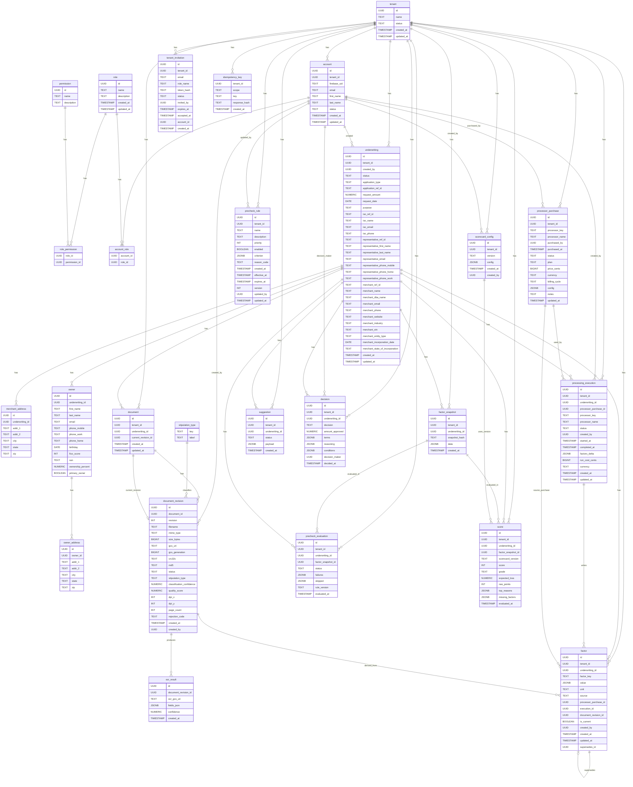

## Entities & Schema ER Diagram

The following Mermaid ER diagram reflects the entities and relationships defined in `docs/entities_and_schema.md`.

```mermaid
erDiagram
  tenant {
    UUID id
    TEXT name
    TEXT status
    TIMESTAMP created_at
    TIMESTAMP updated_at
  }

  account {
    UUID id
    UUID tenant_id
    TEXT firebase_uid
    TEXT email
    TEXT first_name
    TEXT last_name
    TEXT status
    TIMESTAMP created_at
    TIMESTAMP updated_at
  }

  role {
    UUID id
    TEXT name
    TEXT description
    TIMESTAMP created_at
    TIMESTAMP updated_at
  }

  permission {
    UUID id
    TEXT name
    TEXT description
  }

  role_permission {
    UUID role_id
    UUID permission_id
  }

  account_role {
    UUID account_id
    UUID role_id
  }

  tenant_invitation {
    UUID id
    UUID tenant_id
    TEXT email
    TEXT role_name
    TEXT token_hash
    TEXT status
    UUID invited_by
    TIMESTAMP expires_at
    TIMESTAMP accepted_at
    UUID account_id
    TIMESTAMP created_at
  }

  idempotency_key {
    UUID tenant_id
    TEXT scope
    TEXT key
    TEXT response_hash
    TIMESTAMP created_at
  }

  underwriting {
    UUID id
    UUID tenant_id
    UUID created_by
    TEXT status
    TEXT application_type
    TEXT application_ref_id
    NUMERIC request_amount
    DATE request_date
    TEXT purpose
    TEXT iso_ref_id
    TEXT iso_name
    TEXT iso_email
    TEXT iso_phone
    TEXT representative_ref_id
    TEXT representative_first_name
    TEXT representative_last_name
    TEXT representative_email
    TEXT representative_phone_mobile
    TEXT representative_phone_home
    TEXT representative_phone_work
    TEXT merchant_ref_id
    TEXT merchant_name
    TEXT merchant_dba_name
    TEXT merchant_email
    TEXT merchant_phone
    TEXT merchant_website
    TEXT merchant_industry
    TEXT merchant_ein
    TEXT merchant_entity_type
    DATE merchant_incorporation_date
    TEXT merchant_state_of_incorporation
    TIMESTAMP created_at
    TIMESTAMP updated_at
  }

  merchant_address {
    UUID id
    UUID underwriting_id
    TEXT addr_1
    TEXT addr_2
    TEXT city
    TEXT state
    TEXT zip
  }

  owner {
    UUID id
    UUID underwriting_id
    TEXT first_name
    TEXT last_name
    TEXT email
    TEXT phone_mobile
    TEXT phone_work
    TEXT phone_home
    DATE birthday
    INT fico_score
    TEXT ssn
    NUMERIC ownership_percent
    BOOLEAN primary_owner
  }

  owner_address {
    UUID id
    UUID owner_id
    TEXT addr_1
    TEXT addr_2
    TEXT city
    TEXT state
    TEXT zip
  }

  stipulation_type {
    TEXT key
    TEXT label
  }

  document {
    UUID id
    UUID tenant_id
    UUID underwriting_id
    UUID current_revision_id
    TIMESTAMP created_at
    TIMESTAMP updated_at
  }

  document_revision {
    UUID id
    UUID document_id
    INT revision
    TEXT filename
    TEXT mime_type
    BIGINT size_bytes
    TEXT gcs_uri
    BIGINT gcs_generation
    TEXT crc32c
    TEXT md5
    TEXT status
    TEXT stipulation_type
    NUMERIC classification_confidence
    NUMERIC quality_score
    INT dpi_x
    INT dpi_y
    INT page_count
    TEXT rejection_code
    TIMESTAMP created_at
    UUID created_by
  }

  ocr_result {
    UUID id
    UUID document_revision_id
    TEXT ocr_gcs_uri
    JSONB fields_json
    NUMERIC confidence
    TIMESTAMP created_at
  }

  processor_purchase {
    UUID id
    UUID tenant_id
    TEXT processor_key
    TEXT processor_name
    UUID purchased_by
    TIMESTAMP purchased_at
    TEXT status
    TEXT plan
    BIGINT price_cents
    TEXT currency
    TEXT billing_cycle
    JSONB config
    TEXT notes
    TIMESTAMP updated_at
  }

  processing_execution {
    UUID id
    UUID tenant_id
    UUID underwriting_id
    UUID processor_purchase_id
    TEXT processor_key
    TEXT processor_name
    TEXT status
    UUID created_by
    TIMESTAMP started_at
    TIMESTAMP completed_at
    JSONB factors_delta
    BIGINT run_cost_cents
    TEXT currency
    TIMESTAMP created_at
    TIMESTAMP updated_at
  }

  factor {
    UUID id
    UUID tenant_id
    UUID underwriting_id
    TEXT factor_key
    JSONB value
    TEXT unit
    TEXT source
    UUID processor_purchase_id
    UUID execution_id
    UUID document_revision_id
    BOOLEAN is_current
    UUID created_by
    TIMESTAMP created_at
    TIMESTAMP updated_at
    UUID supersedes_id
  }

  factor_snapshot {
    UUID id
    UUID tenant_id
    UUID underwriting_id
    TEXT snapshot_hash
    JSONB data
    TIMESTAMP created_at
  }

  precheck_rule {
    UUID id
    UUID tenant_id
    TEXT name
    TEXT description
    INT priority
    BOOLEAN enabled
    JSONB criterion
    TEXT reason_code
    TIMESTAMP created_at
    TIMESTAMP effective_at
    TIMESTAMP expires_at
    INT version
    UUID updated_by
    TIMESTAMP updated_at
  }

  precheck_evaluation {
    UUID id
    UUID tenant_id
    UUID underwriting_id
    UUID factor_snapshot_id
    TEXT status
    JSONB failures
    JSONB skipped
    TEXT rule_version
    TIMESTAMP evaluated_at
  }

  scorecard_config {
    UUID id
    UUID tenant_id
    TEXT version
    JSONB config
    TIMESTAMP created_at
    UUID created_by
  }

  score {
    UUID id
    UUID tenant_id
    UUID underwriting_id
    UUID factor_snapshot_id
    TEXT scorecard_version
    INT score
    TEXT grade
    NUMERIC expected_loss
    INT raw_points
    JSONB top_reasons
    JSONB missing_factors
    TIMESTAMP evaluated_at
  }

  suggestion {
    UUID id
    UUID tenant_id
    UUID underwriting_id
    TEXT status
    JSONB payload
    TIMESTAMP created_at
  }

  decision {
    UUID id
    UUID tenant_id
    UUID underwriting_id
    TEXT decision
    NUMERIC amount_approved
    JSONB terms
    JSONB reasoning
    JSONB conditions
    UUID decision_maker
    TIMESTAMP decided_at
  }

  %% Relationships
  tenant ||--o{ account : has
  tenant ||--o{ idempotency_key : has
  tenant ||--o{ underwriting : has
  tenant ||--o{ document : has
  tenant ||--o{ processor_purchase : has
  tenant ||--o{ processing_execution : has
  tenant ||--o{ factor : has
  tenant ||--o{ factor_snapshot : has
  tenant ||--o{ precheck_rule : has
  tenant ||--o{ precheck_evaluation : has
  tenant ||--o{ scorecard_config : has
  tenant ||--o{ score : has
  tenant ||--o{ suggestion : has
  tenant ||--o{ decision : has
  tenant ||--o{ tenant_invitation : has

  account ||--o{ underwriting : created
  account ||--o{ processor_purchase : purchased_by
  account ||--o{ processing_execution : created_by
  account ||--o{ document_revision : created_by
  account ||--o{ scorecard_config : created_by
  account ||--o{ precheck_rule : updated_by
  account ||--o{ decision : decision_maker
  account ||--o{ account_role : has
  role   ||--o{ account_role : has
  role   ||--o{ role_permission : has
  permission ||--o{ role_permission : has

  underwriting ||--o{ merchant_address : has
  underwriting ||--o{ owner : has
  owner ||--o{ owner_address : has

  underwriting ||--o{ document : has
  document ||--o{ document_revision : has
  stipulation_type ||--o{ document_revision : classifies
  document_revision ||--o{ ocr_result : produces
  document ||--o| document_revision : current_revision

  underwriting ||--o{ processing_execution : has
  processor_purchase ||--o{ processing_execution : used_by

  underwriting ||--o{ factor : has
  processing_execution ||--o{ factor : writes
  processor_purchase ||--o{ factor : source_purchase
  document_revision ||--o{ factor : derived_from
  factor ||--o| factor : supersedes

  underwriting ||--o{ factor_snapshot : has
  factor_snapshot ||--o{ precheck_evaluation : evaluated_in
  underwriting ||--o{ precheck_evaluation : has

  underwriting ||--o{ score : has
  factor_snapshot ||--o{ score : evaluated_in
  scorecard_config ||--o{ score : uses_version

  underwriting ||--o{ suggestion : has
  underwriting ||--o{ decision : has
```

