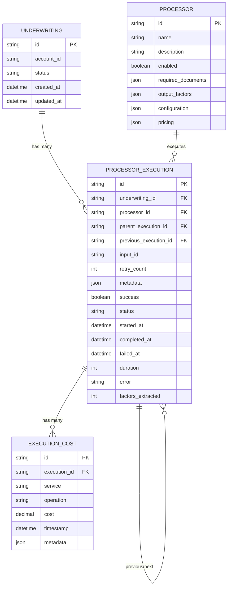

# AURA Processing Engine API Reference

## Overview

APIs for listing available processors, managing processor executions, and retrieving execution details.

## Table of Contents

1. [Processor Management](#1-processor-management)
2. [Processor Execution Management](#2-processor-execution-management)
3. [Data Transfer Objects](#3-data-transfer-objects)
4. [Database Schema](#4-database-schema)

---

## 1. Processor Management

### List All Available Processors

Retrieves a list of all available processors in the system.

```http
GET /api/v1/processors
```

**Response:**
```json
{
  "processors": [
    {
      "id": "clear_business_search_processor",
      "name": "CLEAR Business Search",
      "description": "Retrieves business background reports from Thomson Reuters CLEAR",
      "enabled": true,
    },
    {
      "id": "bank_statement_processor",
      "name": "Bank Statement Analysis",
      "description": "Analyzes bank statements for revenue and cash flow patterns",
      "enabled": true,
    }
  ]
}
```

### Get Processor Details

Retrieves detailed information about a specific processor including its capabilities.

```http
GET /api/v1/processors/{processor_id}
```

**Response:**
```json
{
  "id": "clear_business_search_processor",
  "name": "CLEAR Business Search",
  "description": "Retrieves business background reports from Thomson Reuters CLEAR",
  "enabled": true,
  "required_documents": ["business_registration", "business_address"],
  "output_factors": [
    "ucc_filings",
    "business_type",
    "criminal_records",
    "liens_and_judgments",
    "npi_records",
    "ssn_records",
    "world_check_records"
    //#... other output factors
  ],
  "configuration": {
    "rate_limit": 100, // requests/hour
    "timeout": 30
    //#... other configuration
  },
  "pricing": {
    "cost": 0.10,
    //#... pricing details
  }
}
```

### List All Processor Executions

Retrieves a list of all processor executions across all underwritings.

```http
GET /api/v1/processors/executions
```

### Get Processor Execution Details

Retrieves detailed information about a specific processor execution instance.

```http
GET /api/v1/processors/executions/{execution_id}
```

---

## 2. Processor Execution Management

### Execute Processors

Manually runs all or multiple specific available processors for this underwriting. This is the main execution command that processes all the documents and extracts factors.

```http
POST /api/v1/underwritings/{underwriting_id}/processors/execute
```

**Request Body:**
```json
{
  "processors": ["clear_processor", "bank_statement_processor"],
}
```

**Response:**
```json
{
  "underwriting_id": "underwriting_123",
  "status": "started",
  "started_at": "2024-12-19T10:30:00Z",
  "executions": [
    {
      "id": "exec_123",
      "processor_id": "clear_processor",
      "status": "pending",
    },
    {
      "id": "exec_456",
      "processor_id": "bank_statement_processor",
      "status": "pending",
    }
  ]
}
```

### List Processor Executions for Underwriting

Retrieves all processor executions for a specific underwriting.

```http
GET /api/v1/underwritings/{underwriting_id}/processors/executions
```

**Response:**
```json
{
  "underwriting_id": "underwriting_123",
  "account_id": "account_123",
  "total_executions": 2,
  "progress": {
    "completed_executions": 1,
    "failed_executions": 0,
    "running_executions": 1,
    "pending_executions": 0
  },
  "executions": [
    {
      "id": "exec_123",
      "processor_id": "clear_person_search_processor",
      "parent_execution_id": null,
      "previous_execution_id": null,
      "retry_count": 0,
      "metadata": {},
      "success": true,
      "status": "completed",
      "started_at": "2024-12-19T10:30:00Z",
      "completed_at": "2024-12-19T10:31:30Z",
      "failed_at": null,
      "duration": 90,
      "cost": {
        "total": 10.10,
        "breakdown": [
          // the base processor cost entry
          {
            "id": "cost_122",
            "execution_id": "exec_123",
            "service": "processor",
            "operation": "execution",
            "cost": 0.10,
            "timestamp": "2024-12-19T10:30:00Z",
            "metadata": {}
          },
          // the individual cost entry of the person search
          {
            "id": "cost_123",
            "execution_id": "exec_123",
            "service": "clear",
            "operation": "person_search",
            "cost": 5,
            "timestamp": "2024-12-19T10:30:00Z",
            "metadata": {
              "input_count": 1,
              "page_count": null
            }
          },
          // the individual cost entry of the business search
          {
            "id": "cost_124",
            "execution_id": "exec_123",
            "service": "clear",
            "operation": "person_search",
            "cost": 5,
            "timestamp": "2024-12-19T10:30:00Z",
            "metadata": {
              "input_count": 1,
              "page_count": null
            }
          }
        ]
      },
      "error": null,
      "factors_extracted": 15,
    },
    {
      "id": "exec_456",
      "processor_id": "bank_statement_processor",
      "parent_execution_id": null,
      "previous_execution_id": null,
      "retry_count": 0,
      "metadata": {},
      "success": false,
      "status": "running",
      "started_at": "2024-12-19T10:31:30Z",
      "completed_at": null,
      "failed_at": null,
      "duration": null,
      "cost": {
        "total": 0.10,
        "breakdown": [
          // the base cost of the processor
          {
            "id": "cost_125",
            "execution_id": "exec_456",
            "service": "processor",
            "operation": "execution",
            "cost": 0.10,
            "timestamp": "2024-12-19T10:31:30Z",
            "metadata": {}
          }
        ]
      },
      "error": null,
      "factors_extracted": 0,
    }
  ],
  "costs": {
    "total": 10.20,
    "summary": {
      "clear_person_search_processor": 10.10,
      "bank_statement_processor": 0.10
    }
  }
}
```

### Get Processor Execution Details

Retrieves detailed information about a specific processor execution.

```http
GET /api/v1/underwritings/{underwriting_id}/processors/executions/{execution_id}
```

### Retry Failed Processor Execution

Retries a failed processor execution.

```http
POST /api/v1/underwritings/{underwriting_id}/processors/executions/{execution_id}/retry
```

**Response:**
```json
{
  "id": "exec_789",
  "processor_id": "bank_statement_processor",
  "status": "started",
  "started_at": "2024-12-19T10:35:00Z",
  "parent_execution_id": "exec_456",
  "previous_execution_id": "exec_456",
  "retry_count": 1
}
```


## 3. Data Transfer Objects

### Processor

```json
{
  "id": "string",
  "name": "string",
  "description": "string",
  "enabled": "boolean",
  "required_documents": ["string"],
  "output_factors": ["string"],
  "configuration": {
    "api_endpoint": "string",
    "rate_limit": "number",
    "timeout": "number"
  },
  "pricing": "object"
}
```

### Underwriting Processor Executions Summary

```json
{
  "id": "string",
  "account_id": "string",
  "total_executions": "number",
  "progress": {
    "completed_executions": "number",
    "failed_executions": "number",
    "running_executions": "number",
    "pending_executions": "number"
  },
  "executions": ["ProcessorExecution"],
  "costs": {
    "total": "number",
    "summary": "object"
  }
}
```

### ProcessorExecution

```json
{
  "id": "string",
  "processor_id": "string",
  "parent_execution_id": "string | null",
  "previous_execution_id": "string | null",
  "retry_count": "number",
  "metadata": "object",
  "success": "boolean",
  "status": "pending | running | completed | failed | cancelled",
  "started_at": "string (ISO 8601)",
  "completed_at": "string (ISO 8601) | null",
  "failed_at": "string (ISO 8601) | null",
  "duration": "number (seconds)",
  "cost": {
    "total": "number",
    "breakdown": ["ExecutionCost"]
  },
  "error": "string | null",
  "factors_extracted": "number",
}
```

### ExecutionCost (Fact Table)

```json
{
  "id": "string",
  "execution_id": "string",
  "service": "string",
  "operation": "string",
  "cost": "number",
  "timestamp": "string (ISO 8601)",
  "metadata": "object"
}
```

---

## 4. Database Schema

### Entity Relationship Diagram

> This diagram is provided for illustration purposes only.



### Key Relationships

#### 1. Underwriting → Processor Executions (1:Many)
- One underwriting can have multiple processor executions
- Each execution belongs to exactly one underwriting

#### 2. Processor → Processor Executions (1:Many)
- One processor can be executed multiple times
- Each execution runs exactly one processor

#### 3. Processor Execution → Execution Costs (1:Many)
- One execution can have multiple cost entries
- Each cost entry belongs to exactly one execution

#### 4. Processor Execution Self-References (1:Many)
- **Parent/Child**: For retry relationships (parent_execution_id)
- **Previous/Next**: For execution chains (previous_execution_id)
