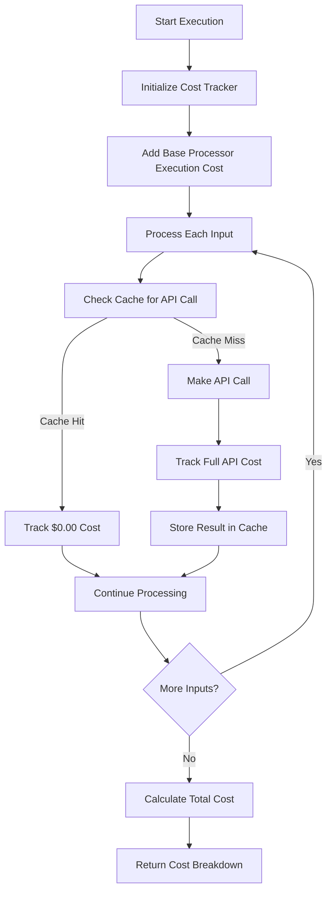

# Cost Tracking

**Applies to:** Processor execution cost tracking and management.

**Purpose:** Define how processor execution costs are tracked, calculated, and managed with a simplified context-only approach.

> ⚠️ NOTE: This document covers only cost tracking for processor executions. It does NOT include orchestration, manual triggers, external integrations, or factor management systems. Processor execution logic is handled separately in the Processor Execution Logic document.

---

## 1) Overview & Architecture

The cost tracking system provides:

- **Simplified Cost Management**: Basic cost tracking
- **Execution-Level Tracking**: Each underwriting lists all processor executions with costs
- **Cache-First Strategy**: Cost optimization through intelligent caching

### Key Components

1. **`CostTracker`**: Basic cost tracking and calculation
2. **`ExecutionCost`**: Individual cost entry representation
3. **`ProcessorExecution`**: Execution context with cost breakdown
4. **Cache Strategy**: Cost optimization through result caching

---

## 2) Cost Structure

### Processor Execution Costs

Each processor execution has a simple cost structure:

- **Processor Execution Cost**: Fixed processor execution cost (from processor configuration)
- **Usage Costs**: Variable costs from external API calls and processing activities
- **Total Cost**: Sum of processor execution cost and all usage costs

### Cost Entry Structure

**ExecutionCost Fields:**
- `id`: Unique cost entry ID
- `execution_id`: Associated processor execution ID
- `service`: Service name (e.g., 'processor', 'clear', 'experian')
- `operation`: Operation performed (e.g., 'execution', 'business_search')
- `cost`: Cost amount
- `timestamp`: ISO 8601 timestamp
- `metadata`: Additional cost metadata

### Cost Categories

#### 1. Processor Execution Cost
- **Service**: `"processor"`
- **Operation**: `"execution"`
- **Cost**: Fixed cost from processor settings configuration
- **Metadata**: Processor-specific information

#### 2. External API Costs
- **Service**: External service name (e.g., `"clear"`, `"experian"`, `"equifax"`)
- **Operation**: API operation (e.g., `"business_search"`, `"person_search"`)
- **Cost**: Variable cost per API call
- **Metadata**: API-specific information (input count, page count, etc.)

#### 3. Processing Costs
- **Service**: Processing service name (e.g., `"ocr"`, `"document_ai"`)
- **Operation**: Processing operation (e.g., `"text_extraction"`, `"analysis"`)
- **Cost**: Variable cost per processing operation
- **Metadata**: Processing-specific information

---

## 3) Cost Tracking Implementation

### Basic Cost Tracker

The CostTracker is responsible for managing all costs associated with a processor execution. It provides a simple interface for tracking different types of costs and generating comprehensive cost breakdowns.

**CostTracker Responsibilities:**
- Initialize cost tracking for an execution
- Add processor execution cost
- Add usage costs for external API calls and other processing
- Calculate total costs
- Generate detailed cost breakdowns

**Key Methods:**

The CostTracker provides a clean, intuitive API for cost management:

- **`add_processor_cost()`**: Records the base processor execution cost - the fixed cost associated with running the processor itself, regardless of the number of inputs or operations performed
- **`add_usage_cost()`**: Records variable costs from external API calls, processing operations, or any other cost-generating activities during execution
- **`get_total_cost()`**: Calculates and returns the sum of all recorded costs (processor cost + all usage costs)
- **`get_cost_breakdown()`**: Generates a comprehensive breakdown showing all cost entries with their details, formatted according to the ExecutionCost schema


---

## 4) Cache-First Cost Optimization

### Cache Strategy

The system uses a cache-first approach to optimize costs:

1. **Check Cache**: Before making external API calls, check if results are cached
2. **Cache Hit**: Use cached results with $0.00 additional cost
3. **Cache Miss**: Make API call and track full cost
4. **Cache Store**: Store successful results for future use

### Cache Implementation

**CacheManager Responsibilities:**
- Generate cache keys from service, operation, and parameters
- Retrieve cached results if available
- Store results in cache with TTL

**Cost Optimization Process:**
1. **Check Cache**: Before making external API calls, check if results are cached
2. **Cache Hit**: Use cached results with $0.00 additional cost
3. **Cache Miss**: Make API call and track full cost
4. **Cache Store**: Store successful results for future use

---

## 5) Cost Tracking Flow

### Execution Cost Tracking



### Cost Tracking Integration

1. **Execution Start**: Initialize cost tracker with execution ID
2. **Processor Execution Cost**: Add processor execution cost immediately
3. **Input Processing**: For each input, check cache before API calls
4. **Cost Tracking**: Track costs for cache hits ($0.00) and cache misses (full cost)
5. **Cache Storage**: Store successful results for future use
6. **Cost Calculation**: Calculate total cost after all processing
7. **Cost Breakdown**: Return detailed cost breakdown

---

## 6) Cost Examples

### Cost Schema Reference

The cost examples follow the ExecutionCost schema defined in the API reference:

| Field | Type | Description | Example |
| --- | --- | --- | --- |
| `id` | string | Unique cost entry ID | `"cost_123"` |
| `execution_id` | string | Associated processor execution ID | `"exec_123"` |
| `service` | string | Service name | `"processor"`, `"clear"`, `"experian"` |
| `operation` | string | Operation performed | `"execution"`, `"person_search"`, `"business_search"` |
| `cost` | number | Cost amount | `0.10`, `5.00` |
| `timestamp` | string (ISO 8601) | Timestamp of cost entry | `"2024-12-19T10:30:00Z"` |
| `metadata` | object | Additional cost metadata | `{"search_count": 1, "cache_hit": false}` |

### Example 1: Successful Execution with Cache Miss

**Execution Cost Entries:**

| ID | Service | Operation | Cost | Timestamp | Metadata |
| --- | --- | --- | --- | --- | --- |
| cost_122 | processor | execution | $0.10 | 2024-12-19T10:30:00Z | processor_id: bank_statement_processor |
| cost_123 | ocr | page_processing | $1.50 | 2024-12-19T10:30:00Z | pages: "1-15", cost_per_page: 0.10, cache_hit: false |
| cost_124 | ocr | page_processing | $0.50 | 2024-12-19T10:30:05Z | pages: "16-20", cost_per_page: 0.10, cache_hit: false |

**Total Cost:** $2.10

```json
{
  "execution_id": "exec_123",
  "total": 2.10,
  "breakdown": [
    {
      "id": "cost_122",
      "execution_id": "exec_123",
      "service": "processor",
      "operation": "execution",
      "cost": 0.10,
      "timestamp": "2024-12-19T10:30:00Z",
      "metadata": {"processor_id": "bank_statement_processor"}
    },
    {
      "id": "cost_123",
      "execution_id": "exec_123",
      "service": "ocr",
      "operation": "page_processing",
      "cost": 1.50,
      "timestamp": "2024-12-19T10:30:00Z",
      "metadata": {
        "pages": "1-15",
        "cost_per_page": 0.10,
        "cache_hit": false
      }
    },
    {
      "id": "cost_124",
      "execution_id": "exec_123",
      "service": "ocr",
      "operation": "page_processing",
      "cost": 0.50,
      "timestamp": "2024-12-19T10:30:05Z",
      "metadata": {
        "pages": "16-20",
        "cost_per_page": 0.10,
        "cache_hit": false
      }
    }
  ]
}
```

### Example 2: Execution with Cache Hits

**Execution Cost Entries:**

| ID | Service | Operation | Cost | Timestamp | Metadata |
| --- | --- | --- | --- | --- | --- |
| cost_125 | processor | execution | $0.10 | 2024-12-19T10:35:00Z | processor_id: clear_person_search_processor |
| cost_126 | clear | person_search | $0.00 | 2024-12-19T10:35:00Z | search_count: 1, cache_hit: true |
| cost_127 | clear | person_search | $0.00 | 2024-12-19T10:35:00Z | search_count: 1, cache_hit: true |

**Total Cost:** $0.10

```json
{
  "execution_id": "exec_456",
  "total": 0.10,
  "breakdown": [
    {
      "id": "cost_125",
      "execution_id": "exec_456",
      "service": "processor",
      "operation": "execution",
      "cost": 0.10,
      "timestamp": "2024-12-19T10:35:00Z",
      "metadata": {"processor_id": "clear_person_search_processor"}
    },
    {
      "id": "cost_126",
      "execution_id": "exec_456",
      "service": "clear",
      "operation": "person_search",
      "cost": 0.00,
      "timestamp": "2024-12-19T10:35:00Z",
      "metadata": {
        "search_count": 1,
        "cache_hit": true
      }
    },
    {
      "id": "cost_127",
      "execution_id": "exec_456",
      "service": "clear",
      "operation": "person_search",
      "cost": 0.00,
      "timestamp": "2024-12-19T10:35:00Z",
      "metadata": {
        "search_count": 1,
        "cache_hit": true
      }
    }
  ]
}
```

### Example 3: Failed Execution

**Execution Cost Entries:**

| ID | Service | Operation | Cost | Timestamp | Metadata |
| --- | --- | --- | --- | --- | --- |
| cost_128 | processor | execution | $0.10 | 2024-12-19T10:40:00Z | processor_id: bank_statement_processor |

**Total Cost:** $0.10

```json
{
  "execution_id": "exec_789",
  "total": 0.10,
  "breakdown": [
    {
      "id": "cost_128",
      "execution_id": "exec_789",
      "service": "processor",
      "operation": "execution",
      "cost": 0.10,
      "timestamp": "2024-12-19T10:40:00Z",
      "metadata": {"processor_id": "bank_statement_processor"}
    }
  ]
}
```

---

## 7) Cost Tracking Best Practices

### Implementation Guidelines

**BaseProcessor Responsibilities:**
1. **Initialize Cost Tracking** (in `__init__`):
   - Create CostTracker instance
   - Set up cost tracking components
   - Prepare cost tracking for execution
2. **Track Processor Execution Cost** (in `execute` method):
   - Add base processor execution cost at execution start
   - Record fixed cost for running the processor
   - Ensure processor cost is always tracked
3. **Calculate Totals** (in `execute` method):
   - Aggregate all cost entries
   - Calculate total execution cost
   - Generate final cost breakdown

**Subclass Responsibilities:**
1. **Cache First**: Check cache before making external API calls
2. **Track All Costs**: Record costs for both cache hits and misses
3. **Store Results**: Cache successful results for future use

### Cost Optimization

1. **Cache Strategy**: Implement intelligent caching for expensive operations
2. **Cache TTL**: Set appropriate cache expiration times

### Error Handling

1. **Cost Preservation**: Preserve cost tracking even on failures
2. **Partial Costs**: Track costs up to the point of failure
3. **Error Metadata**: Include error information in cost metadata
4. **Retry Costs**: Consider cost implications of retries

---

## 8) Monitoring and Analytics

### Cost Metrics

- **Total Cost per Execution**: Sum of all costs for an execution
- **Cost per Processor**: Average cost by processor type
- **Cache Hit Rate**: Percentage of cache hits vs misses
- **Cost Savings**: Amount saved through caching
- **Cost Trends**: Cost patterns over time
