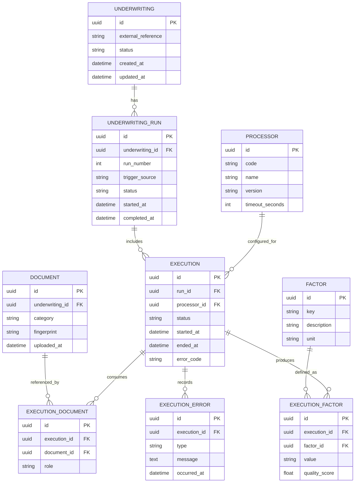

# Processing Engine ERD: Underwriting Runs and Executions

## Scope
Sample, non-comprehensive ERD for underwriting runs and processor executions.

## Diagram

## Notes
- Relationships and attributes are illustrative and may be incomplete.
- Aligns to processing engine terminology for underwriting runs and executions.
