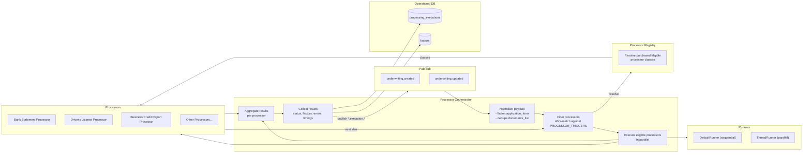
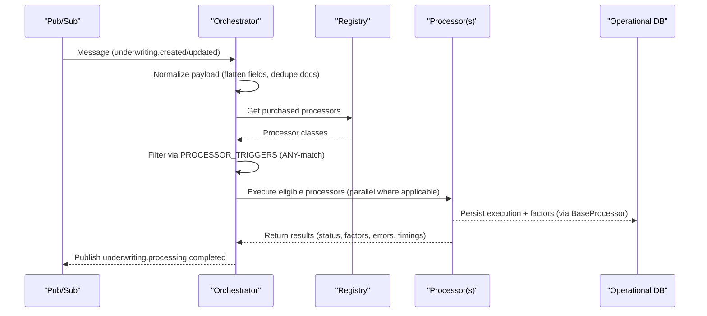
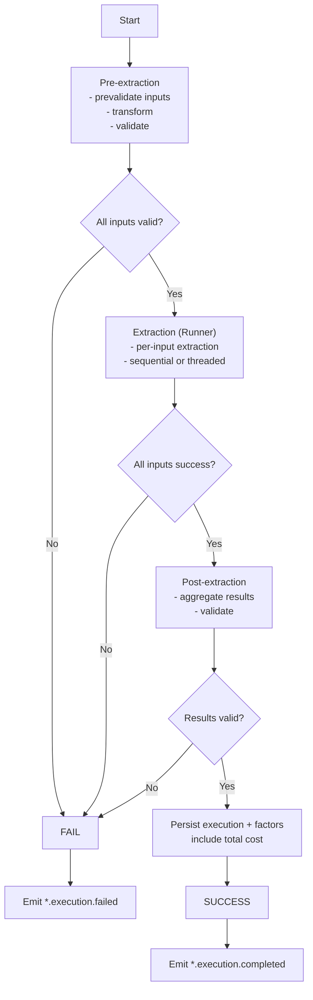
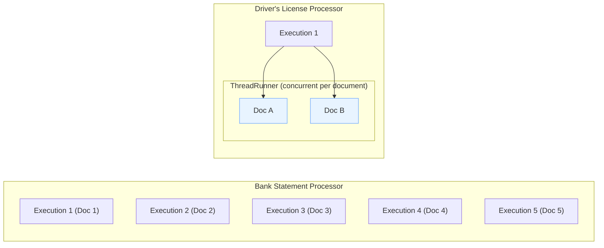

## Processing Engine – High-Level Design

This document summarizes the core architecture and flows for the Processing Engine using the Processor Orchestrator and Processor Execution Logic (v5) as references.

### Core Components

- **Processor Orchestrator**: Subscribes to `underwriting.created` and `underwriting.updated`, normalizes payloads, evaluates `PROCESSOR_TRIGGERS`, and coordinates execution.
- **Processor Registry**: Maps processor names to concrete classes and resolves eligible/purchased processors.
- **BaseProcessor + Concrete Processors**: Implements v5 three‑phase execution (pre‑extraction → extraction → post‑extraction), event emission, cost tracking, and persistence.
- **Runners**: `DefaultRunner` (sequential) and `ThreadRunner` (parallel) for extraction concurrency.
- **Persistence Layer**: Stores `processing_execution` records and upserts `factors`.
- **Eventing**: Emits `{processor_id}.execution.started|completed|failed` to Pub/Sub.

### Architecture Overview

### Orchestration Flow (Detailed)

### Processor Execution (v5) – Three‑Phase Pipeline

### Concurrency Strategy

- **DefaultRunner**: Sequential processing for simple operations.
- **ThreadRunner**: Parallel per independent input unit (e.g., owners, monthly chunks).

#### Runners – Execution Examples

### Eventing & Cost

- **Events**: `.execution.started`, `.execution.completed`, `.execution.failed` published to Pub/Sub.
- **Cost Tracking**: Accumulate per-operation costs during extraction; persist as `run_cost_cents` in execution record.

### Persistence Summary

- Insert into `processing_executions` with status, timings, duration, processor name, run cost.
- Upsert `factors`: mark previous as not current, insert new values linked to execution.
