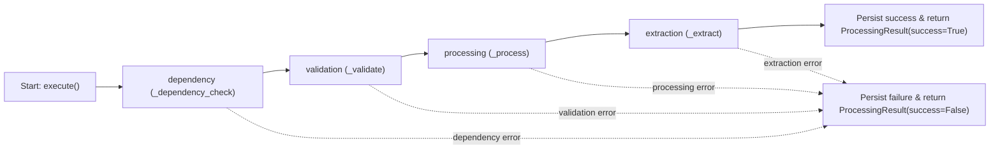
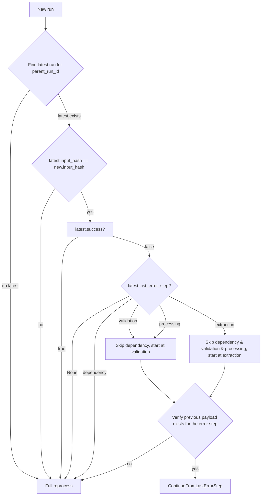

# Processor Execution Logic

**Applies to:** `BaseProcessor`
**Purpose:** Define how a processor run is executed, how dependencies/context are handled, and how results/errors are returned.

---

## 1) Scope & Guarantees

- A **processor** is a unit that consumes one or more `ProcessorInput` items and returns a `ProcessingResult`.
- Each call to `execute(...)` is a **single attempt** with a **new** `run_id` (`uuid4`).
- The execution is **sequential** across four pipeline steps:
  1. `dependency`
  2. `validation`
  3. `processing`
  4. `extraction`
- On the **first failing step**, execution **stops** and a failure `ProcessingResult` is returned.
- **Context** (retry lineage / metadata) may be passed in and is merged into the processor's internal `ExecutionContext` for this run.

---

## 2) Key Types (Contract)

### `ExecutionContext`
Fields expected/used by `BaseProcessor`:
- `parent_run_id: str | None` — root run of a retry chain
- `previous_run_id: str | None` — immediate predecessor run
- `last_error_step: str | None` — pipeline step that failed previously (e.g., `"validation"`)
- `retry_count: int` — number of retries attempted so far
- `execution_metadata: dict[str, Any]` — arbitrary K/V metadata (merged)

**Merge semantics in `execute(...)`:**
- If a `context` arg is provided, the processor copies:
  - `parent_run_id`, `previous_run_id`, `last_error_step`, `retry_count`
  - `execution_metadata` is **updated** (shallow merge) into the processor's default context.

### `ProcessorInput`
- An input item consumed by a processor. For dependency checks, items may be:
  - `DocumentStipulation` → must expose `.stipulation_name` and `.underwriting_id`
  - `ProcessingResult` → must expose `.processor_name` and `.underwriting_id`
  - Any other type is ignored for dependency identification.

### `ProcessingResult`
Returned by `execute(...)`:
- `underwriting_id: str`
- `run_id: str` (uuid4 for this attempt)
- `processor_name: str` (see naming below)
- `extraction_output: dict` (from `_extract`)
- `success: bool`
- `context: ExecutionContext`
- `error: dict | None` — only on failure:
  ```json
  {
    "step": "<pipeline-step>",
    "exception": "<ExceptionClassName>",
    "message": "<stringified exception>",
    "payload": "<current-result-state>"
  }
  ```
- `timestamp: datetime` (start time)
- `duration: int` (milliseconds from start to completion/failure)

---

## 3) Naming & Invariants

- Subclasses must define:
  - `PROCESSOR_NAME: str` (non-empty)
  - `REQUIRED_DEPENDENCIES: tuple[str, ...]` (non-empty)
- Optional: `OPTIONAL_DEPENDENCIES: tuple[str, ...]`
- `processor_name` is computed as: `f"p_{self.PROCESSOR_NAME}"`
- Dependencies considered valid only if they start with `"p_"` (processor) or `"s_"` (stipulation). Any other strings are ignored by filters.

On bad subclass configuration:
- Missing/empty `PROCESSOR_NAME` → `SubclassImplementationError`
- Empty `REQUIRED_DEPENDENCIES` → `SubclassImplementationError`

---

## 4) Dependency Validation (Step: dependency)

Inputs are normalized to a list: `[data]` if a single item, otherwise `data` if already a list.

**Identification rule per item:**
- `DocumentStipulation` → `(stipulation_name, underwriting_id)`
- `ProcessingResult` → `(processor_name, underwriting_id)`
- Other → `(None, None)` (ignored)

**Checks:**
- **Presence** — Every dependency in `REQUIRED_DEPENDENCIES` must be present among identified names → else `DependencyNotFoundError`.
- **Underwriting match** — For all declared dependencies (required ∪ optional), if an identified item shares the same name but has a different `underwriting_id` → `DependencyUnderwritingMismatchError`.

On success, the input passes through unchanged.

---

## 5) Execution Pipeline

### Overview:
```
dependency  →  validation  →  processing  →  extraction
      (fail fast with structured error if any step raises)
```

### Step Contracts:

- `_validate(data) -> Any`
    - Ensure structure/semantics of input are correct.
    - On failure, raise a domain validation exception (e.g., `ValidationError`).
    - Return normalized/validated data for next step.

- `_process(validated) -> Any`
    - Perform the main business transformation.
    - Return a processed representation ready for extraction.

- `_extract(processed) -> dict[str, dict]`
    - Return a dict shaped like:
    ```json
    {
        "payload": {},        # (the raw processed data if needed)
        "stipulations": {},   # (the stipulations data)
        "flags": {},          # (the flags data)
        ...                   # (any other relevant data)
    }
    ```

---

## 6) Error Handling

### Error Handling Strategy
- **Exception Isolation**: All exceptions are caught and converted to `ProcessingResult` with `success=False`
- **Pipeline Protection**: Each step is wrapped in try/except to prevent pipeline failures
- **Structured Errors**: Errors include step context, exception details, and current state

**Error Response Format:**
```json
{
    "step": "<pipeline-step>",
    "exception": "<ExceptionClassName>",
    "message": "<stringified exception>",
    "payload": "<current-result-state>"
}
```

---

## 7) Run IDs & Lineage

- `run_id` — unique per attempt (always a fresh uuid4).
- Use `ExecutionContext` to capture lineage:
  - `parent_run_id` — ID of the first attempt in a chain.
  - `previous_run_id` — ID of the immediate prior attempt.

### Recommended lineage policy:
- **On first attempt (no previous runs):**
  - `parent_run_id = run_id` (this run is the parent)
  - `previous_run_id = None` (no previous run exists)
  - `retry_count = 0`

- **On retry N (after previous failures):**
  - `parent_run_id = first run's ID` (unchanged, always points to original attempt)
  - `previous_run_id = the last run's ID` (points to immediate predecessor)
  - `retry_count = N` (incremented from previous attempt)

---

## 8) Retry & Reprocessing

**Core Principles:**
1. **Efficient Recovery**: Skip successfully completed steps on retry
2. **Input Change Detection**: Full reprocessing when inputs change
3. **Idempotent Operations**: Safe to re-run steps multiple times
4. **State Preservation**: Maintain execution context across retries

**Step Execution Order:**
```python
EXECUTION_STEPS = ["dependency", "validation", "processing", "extraction"]
```

**Input Hash Computation:**
```python
def _compute_input_hash(self, data: ProcessorInput | list[ProcessorInput]) -> str:
    """Compute stable hash of processor inputs, excluding volatile fields."""
    import hashlib
    import json

    def _hash_processor_input(item: ProcessorInput) -> dict:
        if isinstance(item, DocumentStipulation):
            # For documents, hash the actual content
            return {
                "content_hash": hashlib.sha256(item.content).hexdigest(),
            }
        else:
            # For other inputs, exclude volatile fields
            volatile_fields = {
                'run_id', 'timestamp', 'duration', 'context',
            }
            return {
                k: v for k, v in item.__dict__.items()
                if k not in volatile_fields
            }

    if isinstance(data, list):
        data_dict = [_hash_processor_input(item) for item in data]
    else:
        data_dict = _hash_processor_input(data)

    data_str = json.dumps(data_dict, sort_keys=True, default=str)
    return hashlib.sha256(data_str.encode()).hexdigest()
```

**Step Skipping Logic:**
```python
def _should_skip_step(self, step: str, context: ExecutionContext, input_hash: str) -> bool:
    """Determine if a step should be skipped based on previous execution."""
    if not context.last_error_step:
        return False

    # Don't skip if inputs have changed
    previous_hash = context.execution_metadata.get("input_hash")
    if previous_hash != input_hash:
        return False

    # Apply step skipping logic based on error type
    error_step = context.last_error_step

    if error_step == "dependency":
        # No skipping for dependency errors (full reprocessing)
        return False
    elif error_step in ["validation", "processing"]:
        # Skip dependency check only
        return step == "dependency"
    elif error_step == "extraction":
        # Skip dependency, validation, and processing
        return step in ["dependency", "validation", "processing"]
    else:
        # Unknown error step, no skipping
        return False

def _get_resume_step(self, context: ExecutionContext, input_hash: str) -> str:
    """Determine which step to resume from on retry."""
    if not context.last_error_step:
        return "dependency"

    # Full reprocessing if inputs changed
    previous_hash = context.execution_metadata.get("input_hash")
    if previous_hash != input_hash:
        return "dependency"

    # Apply step skipping logic based on error type
    error_step = context.last_error_step

    if error_step == "dependency":
        # Dependency error requires full reprocessing
        return "dependency"
    elif error_step in ["validation", "processing"]:
        # Skip dependency check, start at validation
        return "validation"
    elif error_step == "extraction":
        # Skip all previous steps, start at extraction
        return "extraction"
    else:
        # Unknown error step, default to full reprocessing
        return "dependency"
```

**Pipeline Integration:**
```python
def execute(self, data: ProcessorInput | list[ProcessorInput], context: ExecutionContext | None = None) -> ProcessingResult:
    # ... existing setup code ...

    # Compute input hash for change detection
    input_hash = self._compute_input_hash(data)

    # Determine resume point
    resume_step = self._get_resume_step(self.context, input_hash)
    start_index = EXECUTION_STEPS.index(resume_step)

    # Execute pipeline from resume point
    for i in range(start_index, len(EXECUTION_STEPS)):
        step = EXECUTION_STEPS[i]

        # Skip completed steps on retry
        if self._should_skip_step(step, self.context, input_hash):
            self.logger.info(f"Skipping step {step} - already completed successfully")
            continue

        try:
            result = self._execute_step(step, result)
        except Exception as error:
            self._handle_error(error, step)
            self.context.last_error_step = step
            self.context.execution_metadata["input_hash"] = input_hash
            return self._create_error_result(error, step, result)

    return self._create_success_result(result)

def _execute_step(self, step: str, data: Any) -> Any:
    """Execute a single pipeline step."""
    step_functions = {
        "dependency": self._check_dependencies,
        "validation": self._validate,
        "processing": self._process,
        "extraction": self._extract
    }

    if step not in step_functions:
        raise ValueError(f"Unknown step: {step}")

    return step_functions[step](data)
```

**Context Management:**
```python
def _update_execution_context(self, context: ExecutionContext | None) -> None:
    """Update processor context with retry information."""
    if context is not None:
        self.context.parent_run_id = context.parent_run_id
        self.context.previous_run_id = context.previous_run_id
        self.context.last_error_step = context.last_error_step
        self.context.retry_count = context.retry_count + 1
        self.context.execution_metadata.update(context.execution_metadata)

        # Store current run as previous for next retry
        if hasattr(self, 'run_id'):
            self.context.previous_run_id = self.run_id
```

**Idempotency Requirements:**
- **`_validate()`**: Pure function, no side effects, safe to re-run
- **`_process()`**: Pure function, no external persistence, safe to re-run
- **`_extract()`**: No external persistence, all persistence happens after return
- **Dependencies**: External API calls should be idempotent or cached

**Error Recovery Patterns:**
- **Transient Errors** (network, rate limits): Retry with exponential backoff
- **Permanent Errors** (validation failures): Mark step failed, continue if possible
- **Partial Success**: Store intermediate results, resume from failure point
- **Input Changes**: Full reprocessing from start (ignore step-skipping)
- **Resource Exhaustion**: Implement circuit breaker pattern

**Additional Execution Logic:**
- **Step Result Caching**: Cache intermediate results for failed steps
- **Progress Persistence**: Save progress after each successful step
- **Rollback Support**: Ability to revert to previous successful state
- **Timeout Handling**: Configurable timeouts per step with cleanup
- **Resource Cleanup**: Ensure resources are released on failure
- **Dead Letter Queue**: Handle permanently failed executions

**No exception escapes `execute(...)`**; callers get a structured failure.

---

## 9) Observability

- **Logging**: Use `self.logger` where `logger.name == processor_name` (e.g., `p_business_registration`).
- **Timing**: `timestamp` at start; `duration` computed in ms at completion/failure.
- **Auditing**: Put any reconstructable details in `extraction_output["payload"]` if needed, but avoid PII unless required.
- **Metrics**: Track step execution times, success rates, and error patterns
- **Tracing**: Include correlation IDs for distributed tracing

---

## 10) Diagrams (mermaid)

**Execution pipeline:**


**Summary of Execution Pipeline:**

1. **execute()** starts the processing pipeline
2. **Dependency Check (_dependency_check)**:
   - Verifies required dependencies are available
   - Fails fast if dependencies unavailable
3. **Validation (_validate)**:
   - Pure function validating input data
   - No side effects, safe to re-run
4. **Processing (_process)**:
   - Core business logic transformation
   - Pure function with no external persistence
5. **Extraction (_extract)**:
   - Prepares data for persistence
   - No external persistence during extraction
6. **Final Result**:
   - Success: Persists results and returns ProcessingResult(success=True)
   - Failure: Persists error details and returns ProcessingResult(success=False)

Any step failure triggers immediate error handling and pipeline termination.
All errors are caught and wrapped in ProcessingResult to maintain clean interfaces.


**Retry / resume flow:**



**Summary of Retry/Resume Flow:**

1. When a new run starts, check for latest run with same parent_run_id
2. If no previous run exists (meaning it is the first run), do full processing
3. If previous run exists:
   - Compare input hashes between new and latest run
   - If hashes differ, do full reprocessing
   - If hashes match:
     - If latest run was successful, do full reprocessing
     - If latest run failed:
       - Check the `last_error_step` to determine resume point
         - **dependency error**: Full processing (dependency failure requires complete restart)
         - **validation error**: Skip dependency check, start at validation
         - **processing error**: Skip dependency check, start at validation
         - **extraction error**: Skip dependency, validation, and processing, start directly at extraction
       - Verify step outputs exist for the resume point
       - If outputs exist, continue from last error step
       - If outputs missing, do full reprocessing

**Important**:
If an error occurred during processing, we resume at validation to ensure data integrity and re-validate any potentially corrupted state. This prevents cascading failures from corrupted intermediate data.

This ensures idempotency while allowing efficient resumption of failed runs when possible, with intelligent step skipping based on the nature of the previous failure.


---

## 11) Subclass Checklist

- `PROCESSOR_NAME` set (e.g., "business_registration")
- `REQUIRED_DEPENDENCIES` non-empty (e.g., ("s_application_form", "p_bank_statement"))
- (Optional) `OPTIONAL_DEPENDENCIES` set if applicable (e.g., ("p_owner_report", "p_business_report"))
- Implement `_validate`, `_process`, `_extract`
- Raise explicit domain exceptions in `_validate`
- Keep `_process` deterministic and side-effect–free
- Return the required dict shape from `_extract`

---

## 12) Example Subclass

```python

class ClearBusinessReportProcessor(BaseProcessor):
    PROCESSOR_NAME = "clear_business_report"
    REQUIRED_DEPENDENCIES = ("p_application_form",)

    def _validate(self, data):
        # Ensure essential fields are present; raise ValidationError on issues
        return data

    def _process(self, data):
        # Transform/normalize data for extraction
        return {"normalized": data}

    def _extract(self, processed):
        # Build final structured outputs
        return {
            "payload": processed,
            "stipulations": {},
            "flags": {
                "lawsuits": "Low",
                "dockets": "Low",
                "criminal_history": "Low",
                "ucc_filings": "Medium",
                "liens_and_judgments": "Low",
            },
            "factors": {},
            "metadata": {},
        }

```

Usage with retry-aware context:

```python
ctx = ExecutionContext(
    parent_run_id="e8337763-c60d-4b7c-a810-6e39e558a0d9",
    previous_run_id="c60de8337763-4b7c-a810-6e39e558a0d9",
    last_error_step="process",
    retry_count=1,
)

processor = ClearBusinessReportProcessor(underwriting_id="UW-123")

data = ProcessingResult(
    underwriting_id="UW-123",
    run_id="d1458b88-b4cd-4273-a8db-39d30dbf7af5",
    processor_name="p_application_form",
    success=True,
    duration=100,
    error=None,
    timestamp="2025-09-03T07:13:59.334061",
    extraction_output={
        "stipulations": {
            "business_name": "ACME Corp",
            "business_ein": "123456789",
            # ..., other business information
        },
        "flags": {},
        "factors": {},
        "metadata": {}
    }
)

result = processor.execute(data=data, context=ctx)

```

---

## 13) The base processor

```python
class BaseProcessor(ABC):
    """
    Abstract base class for document processing implementations.

    Provides a common interface for all document processors with standardized
    error handling and validation methods.
    """

    PROCESSOR_NAME: str | None = None  # p_business_registration

    REQUIRED_DEPENDENCIES: tuple[
        str, ...
    ] = ()  # (s_application_form, p_bank_statement,)

    OPTIONAL_DEPENDENCIES: tuple[
        str, ...
    ] = ()  # (p_driver_license, p_secretary_of_state, p_voided_check)

    run_id: str
    context: ExecutionContext
    underwriting_id: str

    def __init__(self, underwriting_id: str):
        """
        Initialize the processor with underwriting ID
        and processor name which is defined in the subclass.
        """
        if self.PROCESSOR_NAME is None or self.PROCESSOR_NAME.strip() == "":
            raise SubclassImplementationError(
                "Processor name is expected to be defined.",
            )

        if not self.REQUIRED_DEPENDENCIES:
            raise SubclassImplementationError(
                "Processor dependencies are expected to be defined.",
            )

        self.underwriting_id = underwriting_id
        self.context = ExecutionContext()  # Initialize with default context
        self.logger = logging.getLogger(self.processor_name)

    @property
    def all_dependencies(self) -> tuple[str, ...]:
        """
        Get all the dependencies of the processor.
        """
        return self.required_dependencies + self.optional_dependencies

    @property
    def required_dependencies(self) -> tuple[str, ...]:
        """
        Get the required dependencies of the processor.
        """
        return tuple(
            {dep for dep in self.REQUIRED_DEPENDENCIES if dep.startswith(("p_", "s_"))}
        )

    @property
    def optional_dependencies(self) -> tuple[str, ...]:
        """
        Get the optional dependencies of the processor.
        """
        return tuple(
            {dep for dep in self.OPTIONAL_DEPENDENCIES if dep.startswith(("p_", "s_"))}
        )

    @property
    def processor_name(self) -> str:
        """
        Get the name of the processor.
        """
        return f"p_{self.PROCESSOR_NAME}"

    @final
    def execute(
        self,
        data: ProcessorInput | list[ProcessorInput],
        context: ExecutionContext | None = None,
    ) -> ProcessingResult:
        """
        Execute the main processing logic for the given underwriting id and data.

        Args:
            data: The input data to process according to the processor requirements

        Returns:
            ProcessingResult: The result of the processing operation

        Raises:
            DependencyNotFoundError: If any of the dependencies are not found
            DependencyUnderwritingMismatchError: If any of the dependencies are mismatched
        """
        if context is not None:
            self.context.parent_run_id = context.parent_run_id
            self.context.previous_run_id = context.previous_run_id
            self.context.last_error_step = context.last_error_step
            self.context.retry_count = context.retry_count
            self.context.execution_metadata.update(context.execution_metadata)

        self.run_id = str(uuid.uuid4())
        exceptions: tuple[Exception, ...] = (Exception,)
        pipeline = [
            ("dependency", self._dependency_check),
            ("validation", self._validate),
            ("processing", self._process),
            ("extraction", self._extract),
        ]
        init = datetime.now()
        result = data

        for step, function in pipeline:
            # TODO: Implement reprocessing logic
            # - Check if step should be skipped based on last_error_step
            # - Skip completed steps, process from failure point
            # - Only skip if ProcessorInput hash is the same as the previous run
            #   otherwise reprocess from scratch

            try:
                result = function(result)
            except exceptions as error:
                self._handle_error(error, step)
                # Update context with error information
                self.context.last_error_step = step
                return ProcessingResult(
                    underwriting_id=self.underwriting_id,
                    run_id=self.run_id,
                    processor_name=self.processor_name,
                    extraction_output={},
                    success=False,
                    context=self.context,
                    error={
                        "step": step,
                        "exception": error.__class__.__name__,
                        "message": str(error),
                        "payload": result,
                    },
                    timestamp=init,
                    duration=int((datetime.now() - init).total_seconds() * 1000),
                )

        # TODO: (persistence) Store the result in the database

        return ProcessingResult(
            underwriting_id=self.underwriting_id,
            run_id=self.run_id,
            processor_name=self.processor_name,
            extraction_output=result,
            success=True,
            context=self.context,
            timestamp=init,
            duration=int((datetime.now() - init).total_seconds() * 1000),
        )

    @abstractmethod
    def _validate(self, data: ProcessorInput | list[ProcessorInput]) -> Any:
        """
        Validate the input data.

        This method is used to validate the input data before processing.

        Args:
            data: The input data to validate

        Returns:
            The validated data

        Raises:
            ValidationError: If the input data is not valid
        """

    @abstractmethod
    def _process(self, data: Any) -> Any:
        """
        Process the input data from the validated data.

        This is the step where the main processing logic is implemented transforming
        the validated raw data into a new processed form ready for extraction.

        Args:
            data: The validated data to process from

        Returns:
            The processed data
        """

    @abstractmethod
    def _extract(self, data: Any) -> dict[str, dict]:
        """
        Extract necessary data like stipulations, flags, etc. from the processed data.

        Args:
            data: The processed data to extract from

        Returns:
            The extracted data in the format:
            ```
            {
                "payload": {}, #(the raw processed data if needed)
                "stipulations": {}, #(the stipulations data)
                "flags": {}, #(the flags data)
                ... #(any other relevant data)
            }
            ```
        """

    def _handle_error(self, error: Exception, action: str) -> str:
        """
        Handle an error.

        # TODO: Implement proper error handling
        """

        self.logger.error("Error %s: %s", action, error, exc_info=True)

        return f"Error {self.underwriting_id} - {self.processor_name}: {error}"

    def _dependency_check(
        self,
        data: ProcessorInput | list[ProcessorInput],
    ) -> ProcessorInput | list[ProcessorInput]:
        """
        Check whether all the dependencies of the processor are available and
        are for the same underwriting id.

        Raises:
            DependencyNotFoundError: If any of the dependencies are not found
            DependencyUnderwritingMismatchError: If any of the dependencies are mismatched
        """
        inputs = [data] if not isinstance(data, list) else data

        def identify(item: ProcessorInput) -> tuple[str | None, str | None]:
            match item:
                case DocumentStipulation():
                    return (item.stipulation_name, item.underwriting_id)
                case ProcessingResult():
                    return (item.processor_name, item.underwriting_id)
                case _:
                    return (None, None)

        identifiers = list(map(identify, inputs))

        for dependency in self.required_dependencies:
            if not any(dependency == name for name, _ in identifiers):
                raise DependencyNotFoundError(
                    self.run_id, self.processor_name, self.underwriting_id, dependency
                )

        for dependency in self.all_dependencies:
            if any(
                dependency == name and underwriting_id != self.underwriting_id
                for name, underwriting_id in identifiers
            ):
                raise DependencyUnderwritingMismatchError(
                    self.run_id,
                    self.processor_name,
                    self.underwriting_id,
                    dependency,
                )

        return data
```
