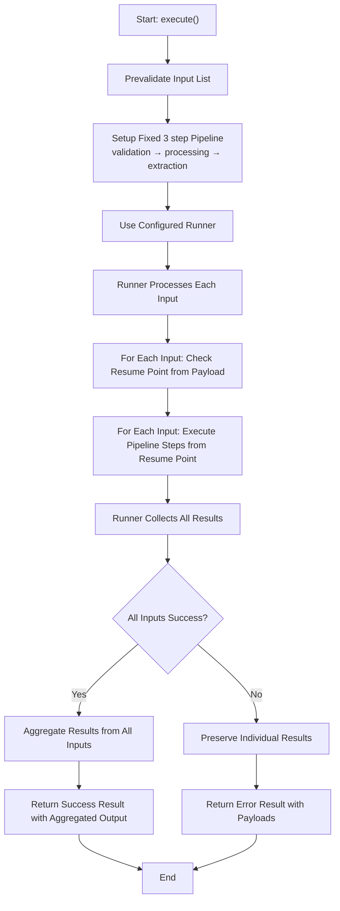
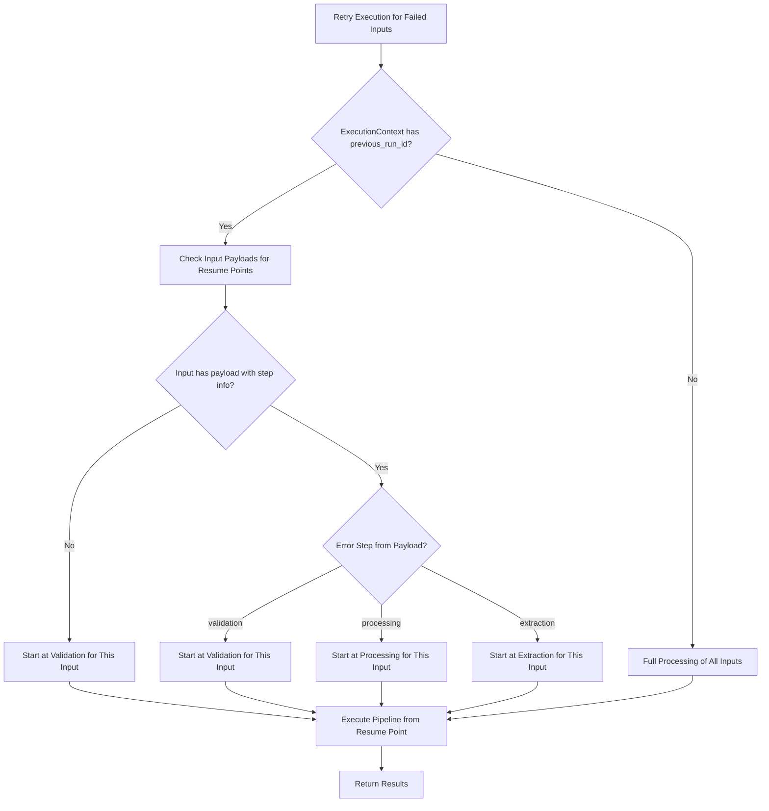

# Processor Execution Logic

**Applies to:** `BaseProcessor` with Runner-based execution
**Purpose:** Define how a processor run is executed with configurable execution strategies, retry mechanisms, and comprehensive error handling.

---

## 1) Overview & Architecture

**Note:** This document covers only the core execution engine for individual processors. It does not include orchestration, manual triggers, external integrations, or factor management systems.

The processor execution system provides:

- **Configurable Execution Strategies**: Sequential, Threaded, or Process-based execution via Runners
- **Intelligent Retry Logic**: Smart step skipping based on previous failures
- **Parallel Processing**: Multiple inputs can be processed concurrently
- **Comprehensive Error Handling**: Detailed error tracking with step-level granularity

### Key Components

1. **BaseProcessor**: Core processing logic with pipeline execution
2. **Runner**: Execution strategy abstraction (Sequential, Thread, Process)
3. **ExecutionContext**: Retry lineage and metadata tracking
4. **ProcessorInput**: Individual input items with unique identifiers
5. **ProcessingResult**: Execution outcome with detailed error information

---

## 2) Execution Pipeline

### Execution Flow

The processor has a 3-step pipeline that gets executed by runners, with pre and post processing steps:

```
input prevalidation → [3-step pipeline] → result aggregation
```

**3-Step Pipeline (executed by runners):**
```
validation → processing → extraction
```

**Step Responsibilities:**

- **Input Prevalidation**: Checks if account_id and underwriting_id match the processor's account_id and underwriting_id (pre-pipeline)
- **`_validate(data)`**: Input validation and structure verification (pipeline step 1)
- **`_process(data)`**: Core business logic transformation (pipeline step 2)
- **`_extract(data)`**: Factor extraction and result formatting (pipeline step 3)
- **Result Aggregation**: Merges the output factors from each input into a single result set (post-pipeline)

### Execution Flow



**Interactive Flowchart:** [View on Mermaid Live](https://mermaid.live/view#pako:eNplk9ty2jAQhl9lR1ftDKFxcQB7OukQDjlBysD0orW5UO3FaGokjw6EBLjtA_QR-ySVZROY1je2tN__72rX2pFEpEhCsszFc7KiUsN4FnOwTy-KyVzbnRBwi4nR-O59TBZwcXENN9FU4obmLKUa4Z4XxuqY0otKeuOgfjRHbQoYsS2m0AKlsYApKzBnHD_9kB-uawcmOPz59RsKKRJUivHMLXGrJU3KaG3bd7aD6KtC6Au-ZJmR1nlmOEdZMwPHDKNqE6aVJSoY0mRVVVqTQ0eOopGQZ8EQ-itMfsIMlVkjTAXjGpZSrGFKX3JB01o9curb_9TDqlVv54S5PbWqHM49a5tbZ3N3LLcv8hwTraCX5w7PtarJO0fe78qIy6VgbpLycJ8PFXFfEvtvqPbwEPWyTGJWTqe2qUo4qRfnoiexh8dypgrlphxoyjYsNfTfIh5cEeNoZgcr-bGAGoJnplfwljiFL0af2v3opJOjdCil7dy5sO7vMdXY8U_RkB9bPql2SINkkqUk1NJgg6xRrmm5JLsSi4le4RpjEtrPFJfU-sck5gcrKyj_LsT6qJTCZCsSLmmu7MoU5b88YDST9IQgT1H2heGahF47cB4k3JEtCTvtph-0uoHvB_bdubLBFxK2Op2m377y2l2_5dnHPzTIq0t62Qz8Vsv7GHiXXsf3gm6nQTBlWshJdQXdTTz8BYWXJjE)

The processor execution follows these linear steps:

1. **Start: execute()** - Begin processing
2. **Prevalidate Input List** - Check account_id and underwriting_id match
3. **Setup Fixed 3 step Pipeline** - validation → processing → extraction
4. **Use Configured Runner** - Runner is initialized at processor instantiation
5. **Runner Processes Each Input** - Execute pipeline on each input
6. **For Each Input: Check Resume Point from Payload** - Determine where to start
7. **For Each Input: Execute Pipeline Steps from Resume Point** - Run validation/processing/extraction
8. **Runner Collects All Results** - Gather all input results
9. **Check: All Inputs Success?** - Determine overall success
10. **If Success: Aggregate Results** - Merge output factors from all inputs
11. **If Failure: Preserve Individual Results** - Keep separate results for failed inputs
12. **Return Result** - Success result with aggregated output or Error result with payloads
13. **End** - Processing complete

### Input Processing Strategy

The **Runner** processes multiple `ProcessorInput` items as follows:

1. **Input List**: The processor receives a list of `ProcessorInput` objects
2. **Input Prevalidation**: All inputs are prevalidated to ensure account_id and underwriting_id match the processor's configuration
3. **Runner Delegation**: The runner takes each prevalidated input and applies the processing function
4. **Individual Processing**: Each input is processed independently with its own:
   - Resume point (from its payload)
   - Pipeline execution (validation → processing → extraction)
   - Success/failure result
5. **Result Collection**: The runner executes the processing function against each input and returns a list of individual results. The BaseProcessor then collects these results, determines overall success, and creates the final ProcessingResult

**Simplified example with 3 inputs:**
```
Input List: [doc1, doc2, doc3]
↓
Runner processes each:
- doc1 → validation → processing → extraction → SUCCESS
- doc2 → validation → processing → FAIL (retry from processing)
- doc3 → SKIP validation → processing → extraction → SUCCESS
↓
Results: [
    (doc1, success, output),
    (doc2, failed, failed_payload),
    (doc3, success, output),
]
```

---

## 3) Runner System

The Runner system provides configurable execution strategies for processing multiple inputs.

### Runner Interface

```python
class Runner(ABC):
    @abstractmethod
    def run(
        self,
        func: Callable[[Any], Any],
        inputs: Iterable[Any],
    ) -> list[dict[str, Any]]:
        """Execute function against inputs and return ordered results."""
```

### Available Runners

#### 1. SequentialRunner
- **Strategy**: Processes inputs one by one in the same thread
- **Use Case**: Simple processing, debugging, or when order matters
- **Performance**: Slower but predictable and easy to debug

```python
runner = SequentialRunner()
results = runner.run(process_func, inputs)
```

#### 2. ThreadRunner
- **Strategy**: Uses ThreadPoolExecutor for concurrent execution
- **Use Case**: I/O-bound operations, external API calls
- **Performance**: Good for I/O-bound tasks, limited by GIL for CPU-bound

```python
runner = ThreadRunner(max_workers=4)
results = runner.run(process_func, inputs)
```

#### 3. ProcessRunner
- **Strategy**: Uses ProcessPoolExecutor for true parallel execution
- **Use Case**: CPU-intensive processing, data transformation
- **Performance**: Best for CPU-bound tasks, true parallelism

```python
runner = ProcessRunner(max_workers=4)
results = runner.run(process_func, inputs)
```

### Runner Selection Process

The runner is selected during processor initialization and can be configured based on the workload:

```python
# Runner selection during processor creation
processor = MyProcessor(
    account_id="acc_123",
    underwriting_id="uw_456",
    runner=SequentialRunner()  # or ThreadRunner(), ProcessRunner()
)
```

### Runner Selection Guide

| Scenario | Recommended Runner | Reason |
|----------|-------------------|---------|
| Debugging/Development | SequentialRunner | Easy to debug, predictable order |
| External API calls | ThreadRunner | I/O-bound, good concurrency |
| Document processing | ThreadRunner | File I/O operations |
| Data transformation | ProcessRunner | CPU-intensive calculations |
| Small datasets (< 10 items) | SequentialRunner | Overhead not worth it |
| Large datasets (> 100 items) | ProcessRunner | Better resource utilization |

---

## 4) Retry & Resume Logic

### Core Principles

1. **Step Skipping**: Skip successfully completed steps on retry
2. **Failure Point Resume**: Resume from the exact failure point
3. **Payload Preservation**: Maintain intermediate results for retry

### Retry Flow Diagram (Failed Attempts)



**Interactive Retry Flowchart:** [View on Mermaid Live](https://mermaid.live/view#pako:eNqNk0lv2zAQhf_KgGfHkGXViw4tEi_Z2sBIggKtHQSENLKISqTAJbEr-7-XImNZh6KoTnrUfDOPj2JNEpEiiUlWiPckp1LD83zDwT6X60fUcg-LHSZGM8EhExKWlBWYwi2vjFYvcHHxGa7qtmQmuMadhpwqqCS-MWHUqzT8laVfjr7tVcMcHsQBZuulKQpYSZGgUoxvQWRwaVc-mnfrf6A6wHw9yzH55b_Diu4LQVPlbD2iMiXCSjDeknPnblH7cmfJI_DOdA5KYwWMZ-LkbNE6W66fdBMF1fCdFiyl7fafc6b8_Jcu5Oxd1wspbc1T0ziTojxZPA24drVvbccD3Pz_IA9XbVgHuD3DnQz_AduTkTTxk-_O8KJd_ju8dDner_0p25BZhQXj6PfYTf4DuPGAF7ddcdcVs664d-Jr888ZyV3Xwp4k6ZGtZCmJtTTYIyXKkjaS1A22ITrHEjcktq8pZtQyG7LhR4tVlP8UojyRUphtTuKMFsoqU9mocc7oVtJzCfIU5UwYrkk8GboWJK7JjsTRdNoPxuMwHEfhJBwGox7Zk3gw6YefoigYDUbTyXA8iIbHHvnthgb96SiMgnA6Gk6iIBiEUY9gyrSQ3_x9c9fu-AdtkB_-)

### Step Skipping Logic

| Previous Error Step | Skipped Steps | Resume Point |
|-------------------|---------------|--------------|
| `validation` | None | Start at validation |
| `processing` | validation | Start at processing |
| `extraction` | validation, processing | Start at extraction |

### Retry Context Management

The system uses ExecutionContext to track retry information:

```python
class ExecutionContext:
    parent_run_id: str | None = None      # Original run ID
    previous_run_id: str | None = None    # Last failed run ID
    last_error_step: str | None = None    # Step that failed
    retry_count: int = 0                  # Number of retries
    execution_metadata: dict[str, str]    # Additional context
```

**Context Usage:**
- Track retry lineage across multiple attempts
- Maintain execution metadata for debugging
- Provide additional context for error handling

### Resume Logic Implementation

The system checks the `payload` attribute of each `ProcessorInput` to determine where to resume:

```python
def _get_resume_step(self, input_item: ProcessorInput) -> str:
    """Determine which step to resume from based on input payload."""
    if not input_item.payload or not isinstance(input_item.payload, dict):
        return "validation"  # Start from beginning

    # Resume from the step that failed previously
    failed_step = input_item.payload.get("step")
    return failed_step if failed_step else "validation"
```

**Resume Behavior:**
- If `payload.step` is `"validation"` → Start at validation
- If `payload.step` is `"processing"` → Start at processing (skip validation)
- If `payload.step` is `"extraction"` → Start at extraction (skip validation & processing)
- If no payload or step → Start at validation (full processing)

---

## 5) Execution Examples

### Example 1: Successful Execution

**Input:** 3 documents to process

```
Input 1: document.pdf → validation → processing → extraction → SUCCESS
Input 2: statement.pdf → validation → processing → extraction → SUCCESS
Input 3: license.pdf → validation → processing → extraction → SUCCESS
```

**Result:** All inputs processed successfully, aggregated results returned.

### Example 2: Partial Failure with Retry

**Initial Execution:**
```
Input 1: document.pdf → validation → processing → extraction → FAIL (extraction error)
Input 2: statement.pdf → validation → processing → extraction → SUCCESS
Input 3: license.pdf → validation → processing → extraction → SUCCESS
```

**Retry Execution (Input 1 payload: step="extraction"):**
```
Input 1: document.pdf → SKIP validation → SKIP processing → extraction → SUCCESS
Input 2: statement.pdf → SKIP (already successful)
Input 3: license.pdf → SKIP (already successful)
```

### Example 3: Processing Step Failure

**Initial Execution:**
```
Input 1: document.pdf → validation → processing → FAIL (processing error)
Input 2: statement.pdf → validation → processing → extraction → SUCCESS
```

**Retry with Payload:**
```
Input 1 payload: step="processing", retry_count=1
Input 1: document.pdf → SKIP validation → processing → extraction → SUCCESS
Input 2: statement.pdf → SKIP (already successful)
```

### Example 4: Validation Step Failure

**Initial Execution:**
```
Input 1: document.pdf → validation → FAIL (validation error)
Input 2: statement.pdf → validation → processing → extraction → SUCCESS
```

**Retry with Payload:**
```
Input 1 payload: step="validation", retry_count=1
Input 1: document.pdf → validation → processing → extraction → SUCCESS
Input 2: statement.pdf → SKIP (already successful)
```

---

## 6) Error Handling & Recovery

### Error Response Format

```json
{
    "input_id": "doc_123",
    "success": false,
    "step": "extraction",
    "exception": "ValidationError",
    "message": "Invalid document format",
    "payload": {
        "step": "extraction",
        "exception": "ValidationError",
        "message": "Invalid document format",
        "data": "processed_data_here"
    }
}
```

### Error Recovery Strategies

| Error Type | Recovery Strategy | Example |
|------------|------------------|---------|
| Validation Error | Retry from validation step | Invalid document format |
| Processing Error | Retry from processing step | API timeout during processing |
| Extraction Error | Retry from extraction step | Factor calculation failure |

### Payload Preservation

When a step fails, the system preserves:
- **Current state**: Data at the point of failure
- **Step information**: Which step failed
- **Error details**: Exception type and message
- **Retry context**: Information needed for resume

---

## 7) Performance Considerations

### Runner Performance Characteristics

| Runner Type | CPU Bound | I/O Bound | Memory Usage | Startup Overhead |
|-------------|-----------|-----------|--------------|------------------|
| Sequential | Poor | Poor | Low | None |
| Thread | Poor (GIL) | Good | Medium | Low |
| Process | Excellent | Good | High | High |

### Optimization Guidelines

1. **Choose Appropriate Runner**: Match runner to workload type
2. **Batch Size**: Balance parallelism with resource usage
3. **Error Handling**: Minimize retry overhead with smart skipping
4. **Memory Management**: ProcessRunner uses more memory per worker

### Monitoring Metrics

- **Execution Time**: Per input and total duration
- **Success Rate**: Percentage of successful inputs
- **Retry Rate**: Frequency of retries needed
- **Step Performance**: Time spent in each pipeline step
- **Runner Efficiency**: Throughput per runner type

---

## 8) Implementation Details

### BaseProcessor.execute() Method

```python
def execute(
    self,
    data: list[ProcessorInput],
    context: ExecutionContext | None = None,
) -> ProcessingResult:
    """
    Execute processing pipeline with configurable runner strategy.

    Args:
        data: List of inputs to process
        context: Optional retry context for resume logic

    Returns:
        ProcessingResult with success/failure and detailed error info
    """
```

### Key Implementation Features

1. **Prevalidation**: Ensures all inputs belong to same account/underwriting
2. **Pipeline Definition**: 3-step pipeline (validation → processing → extraction) with pre/post processing
3. **Runner Integration**: Delegates execution to configured runner
4. **Error Isolation**: Each input processed independently
5. **Result Aggregation**: Combines results from all inputs

### Context Management

```python
# Context merging for retry scenarios
if context is not None:
    for key, value in context.__dict__.items():
        setattr(self.context, key, value)
```

---

## 9) Usage Examples

### Basic Usage

```python
# Create processor with sequential execution
processor = MyProcessor(
    account_id="acc_123",
    underwriting_id="uw_456",
    runner=SequentialRunner()
)

# Process multiple inputs
inputs = [
    ProcessorInput(
        input_id="doc_1",
        account_id="acc_123",
        underwriting_id="uw_456",
        data=document_data
    ),
    # ... more inputs
]

result = processor.execute(inputs)
```

### Retry with Context

```python
# Retry with previous context
retry_context = ExecutionContext(
    parent_run_id="original_run_id",
    previous_run_id="failed_run_id",
    last_error_step="extraction",
    retry_count=1
)

result = processor.execute(inputs, context=retry_context)
```

### Parallel Processing

```python
# Use thread runner for I/O-bound tasks
processor = MyProcessor(
    account_id="acc_123",
    underwriting_id="uw_456",
    runner=ThreadRunner(max_workers=4)
)

result = processor.execute(inputs)
```

---

## 10) Implementation Guidelines

### Processor Development Checklist

- **Define Required Attributes**: Set `PROCESSOR_NAME` and implement abstract methods
- **Choose Runner Strategy**: Select appropriate runner based on workload type
- **Implement Pipeline Steps**: Create `_validate`, `_process`, and `_extract` methods
- **Test with Different Runners**: Ensure compatibility across execution strategies
- **Validate Input Processing**: Test with various input scenarios and edge cases

### Code Structure Requirements

```python
class MyProcessor(BaseProcessor):
    PROCESSOR_NAME = "my_processor"

    def __init__(self, account_id: str, underwriting_id: str, runner: Runner = SequentialRunner()):
        super().__init__(account_id, underwriting_id, runner)

    def _validate(self, data: Any) -> Any:
        # Input validation logic
        pass

    def _process(self, data: Any) -> Any:
        # Core processing logic
        pass

    def _extract(self, data: Any) -> dict[str, str | list | dict]:
        # Factor extraction logic
        pass
```

---

## 11) Best Practices

### Runner Selection

- **Start with SequentialRunner** for development and debugging
- **Use ThreadRunner** for I/O-bound operations (API calls, file processing)
- **Use ProcessRunner** for CPU-intensive tasks (data transformation, calculations)
- **Profile performance** to validate runner choice

### Error Handling

- **Implement idempotent operations** in all pipeline steps
- **Handle transient errors** with appropriate retry strategies
- **Log detailed error information** for debugging
- **Use structured error responses** for consistent handling

### Performance Optimization

- **Batch similar operations** when possible
- **Monitor resource usage** with different runner configurations
- **Implement circuit breakers** for external service calls
- **Cache intermediate results** to avoid recomputation

### Testing

- **Test with different runner types** to ensure compatibility
- **Test retry scenarios** with various failure points
- **Test input change detection** with modified data
- **Test error recovery** with different error types

---

## 12) Troubleshooting

### Common Issues

| Issue | Cause | Solution |
|-------|-------|----------|
| Memory usage high | ProcessRunner with large inputs | Use ThreadRunner or reduce batch size |
| Slow execution | Wrong runner for workload | Profile and choose appropriate runner |
| Retry not working | Context not passed correctly | Ensure context is properly constructed |
| Partial failures | Input validation issues | Check input data format and validation logic |

### Debugging Tips

1. **Use SequentialRunner** for debugging to maintain order
2. **Enable detailed logging** to track execution flow
3. **Check error payloads** for failure point information
4. **Monitor resource usage** during execution
5. **Test with small datasets** first before scaling

---

This documentation provides a comprehensive guide to the processor execution system with configurable runners, intelligent retry logic, and robust error handling capabilities.
