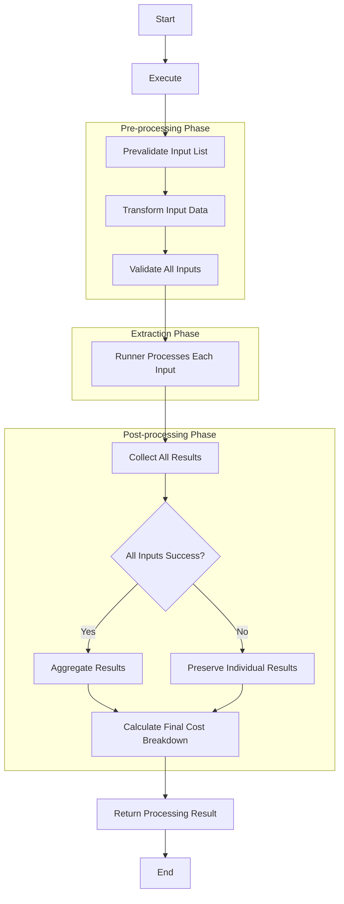
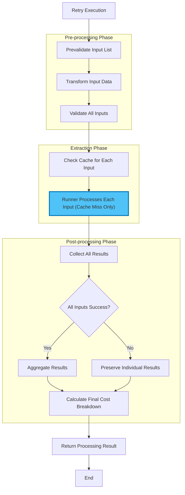
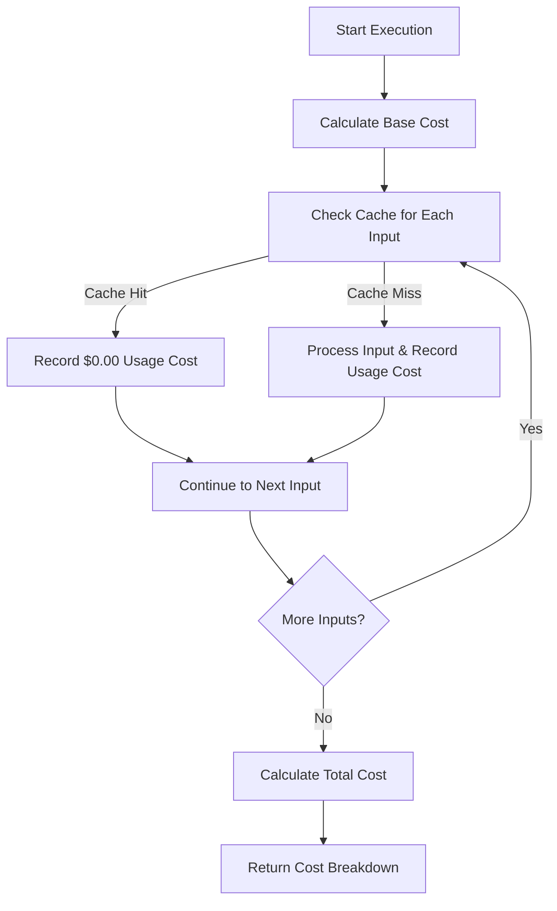
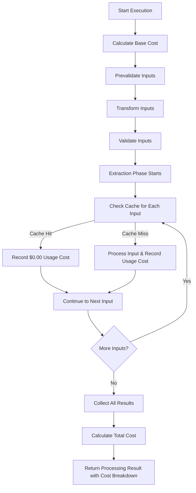

# Processor Execution

# Processor Execution Logic

**Applies to:** `BaseProcessor` abstract class and all implementing processor subclasses.

**Purpose:** Define how a processor run is executed with configurable execution strategies, retry mechanisms, comprehensive error handling, and cost tracking.

> ⚠️ NOTE: This document covers only the core execution engine for individual processors. It does NOT include orchestration, manual triggers, external integrations, or factor management systems.
>

---

## 1) Overview & Architecture

The processor execution system provides:

- **Configurable Execution Strategies**: Sequential, Threaded, or Process-based execution via Runners
- **Parallel Processing**: Multiple inputs can be processed concurrently with runners
- **Cost Tracking**: Complete cost management for processor base costs, external API calls, and processing activities

### Key Components

1. **`BaseProcessor`**: Core processing logic with pipeline execution
2. **`Runner`**: Execution strategy abstraction (Sequential, Thread, Process)
3. **`ExecutionContext`**: Retry lineage and metadata tracking
4. **`ProcessorInput`**: Individual input items with unique identifiers
5. **`ProcessingResult`**: Execution outcome with detailed error information and cost breakdown
6. **`CostTracker`**: Cost tracking and breakdown management

---

## 2) Execution Pipeline

### Execution Flow

The processor has a 3-phase execution structure with runners handling the extraction phase:

```
pre-processing phase → [extraction phase] → post-processing phase

```

### Execution Phases

| Phase | Description |
| --- | --- |
| **Pre-processing Phase** | Input prevalidation, transformation, and validation |
| **Extraction Phase** | Extraction step (executed by runners) |
| **Post-processing Phase** | Result aggregation and cost calculation |

### Phase Responsibilities

### Pre-processing Phase

- **Input Pre-validation**: Checks if `account_id`, `underwriting_id`, and `execution_id` match the processor's configuration
- **Input Transformation**: Transform and normalize input data before validation
- **Validation**: Input validation and structure verification

### Extraction Phase

- **Extraction**: Factor extraction and result formatting

### Post-processing Phase

- **Result Aggregation**: Merges the output factors from each input into a single result set
- **Cost Calculation**: Calculates final cost breakdown after result aggregation

### Execution Flow



The processor execution follows these linear steps:

1. **Start** - Begin processing
2. **Execute** - Execute the processor
3. **Pre-validate Input List** - Check `account_id`, `underwriting_id`, `execution_id` match
4. **Transform Input Data** - Transform and normalize input data before validation
5. **Validate All Inputs** - Input validation and structure verification
6. **Runner Processes Each Input** - Execute extraction step on each input
7. **Collect All Results** - Gather all input results from runner execution
8. **Check: All Inputs Success?** - Determine overall success
9. **Aggregate Results** - Merge output factors from all inputs (if all successful)
10. **Preserve Individual Results** - Keep individual results (if some failed)
11. **Calculate Final Cost Breakdown** - Sum all tracked costs and base costs
12. **Return Processing Result** - Return result with aggregated output and cost breakdown
13. **End** - Processing complete

### Input Processing Strategy

The **3-Phase Execution** processes multiple `ProcessorInput` items as follows:

1. **Input List**: The processor receives a list of `ProcessorInput` objects
2. **Pre-processing Phase**: All inputs are pre-validated (`account_id`, `underwriting_id`, `execution_id`) and validated outside runners to ensure they meet requirements
3. **Extraction Phase**: The runner takes each validated input and applies the extraction function
4. **Individual Processing**: Each input is processed independently with its own:
    - Extraction execution
    - Success/failure result
5. **Post-processing Phase**: The `BaseProcessor` collects runner results, determines overall success, aggregates outputs, calculates final costs, and creates the final `ProcessingResult`

**Simplified example with 3 inputs:**

```
Input List: [doc1, doc2, doc3]
↓
Pre-processing Phase:
- doc1 → prevalidation → transform → validation → SUCCESS
- doc2 → prevalidation → transform → validation → SUCCESS
- doc3 → prevalidation → transform → validation → SUCCESS
↓
Extraction Phase:
- doc1 → extraction → SUCCESS
- doc2 → extraction → SUCCESS
- doc3 → extraction → SUCCESS
↓
Post-processing Phase:
- Success
- Aggregate results
- Cost breakdown

```

**Example with partial processing (extraction phase only):**

```
Input List: [doc1, doc2, doc3]
↓
Pre-processing Phase:
- doc1 → prevalidation → transform → validation → SUCCESS
- doc2 → prevalidation → transform → validation → SUCCESS
- doc3 → prevalidation → transform → validation → SUCCESS
↓
Extraction Phase:
- doc1 → extraction → SUCCESS
- doc2 → extraction → FAIL
- doc3 → extraction → SUCCESS
↓
Post-processing Phase:
- Failed
- Results: [
    (doc1, success, output),
    (doc2, failed, error_info),
    (doc3, success, output),
]
- Cost breakdown

```

**Example with pre-processing phase failure:**

```
Input List: [doc1, doc2, doc3]
↓
Pre-processing Phase:
- doc1 → prevalidation → transform → validation → SUCCESS
- doc2 → prevalidation → transform → validation → FAIL (validation error)
- doc3 → prevalidation → transform → validation → [NOT REACHED]
↓
EXECUTION STOPS - No extraction phase
↓
Result: FAILED - Pre-processing phase validation error
- Failed
- Cost breakdown

```

---

## 3) Runner System

The Runner system provides configurable execution strategies for processing multiple inputs.

### Runner Interface

```python
class Runner(ABC):
    @abstractmethod
    def run(
        self,
        func: Callable[[Any], Any],
        inputs: Iterable[Any],
    ) -> list[dict[str, Any]]:
        """Execute function against inputs and return ordered results."""

```

### Available Runners

### 1. `SequentialRunner`

- **Strategy**: Processes inputs one by one in the same thread
- **Use Case**: Simple processing, debugging, or when order matters
- **Performance**: Slower but predictable and easy to debug

```python
runner = SequentialRunner()
results = runner.run(process_func, inputs)

```

### 2. `ThreadRunner`

- **Strategy**: Uses `ThreadPoolExecutor` for concurrent execution
- **Use Case**: I/O-bound operations, external API calls
- **Performance**: Good for I/O-bound tasks, limited by GIL for CPU-bound

```python
runner = ThreadRunner(max_workers=4)
results = runner.run(process_func, inputs)

```

### 3. `ProcessRunner`

- **Strategy**: Uses `ProcessPoolExecutor` for true parallel execution
- **Use Case**: CPU-intensive processing, data transformation
- **Performance**: Best for CPU-bound tasks, true parallelism

```python
runner = ProcessRunner(max_workers=4)
results = runner.run(process_func, inputs)

```

### Runner Selection Process

The runner is selected during processor initialization and can be configured based on the workload:

```python
# Runner selection during processor creation
processor = MyProcessor(
    account_id="acc_123",
    underwriting_id="uw_456",
    runner=SequentialRunner()  # or ThreadRunner(), ProcessRunner()
)

```

### Runner Selection Guide

| Scenario | Recommended Runner | Reason |
| --- | --- | --- |
| Debugging/Development | `SequentialRunner` | Easy to debug, predictable order |
| External API calls | `ThreadRunner` | I/O-bound, good concurrency |
| Document processing | `ThreadRunner` | File I/O operations |
| Data transformation | `ProcessRunner` | CPU-intensive calculations |
| Small datasets (< 10 items) | `SequentialRunner` | Overhead not worth it |
| Large datasets (> 100 items) | `ProcessRunner` | Better resource utilization |

---

## 4) Retry Logic

### Core Principles

1. **Full Reprocessing**: On retry, re-run the entire execution from the beginning
2. **Context Preservation**: Maintain execution context for debugging and lineage tracking
3. **Error Isolation**: Each retry is a complete, independent execution
4. **Caching Strategy**: Individual processors should cache external API calls and heavy processing results to avoid redundant work during retries

### Retry Flow



> Note: Cache checking logic is implementation-dependent and varies by processor subclass. Each processor defines its own caching strategy for external API calls and heavy processing operations.
>

### Retry Context Management

The system uses `ExecutionContext` to track retry information:

```python
class ExecutionContext:
    parent_run_id: str | None = None      # Original run ID
    previous_run_id: str | None = None    # Last failed run ID
    retry_count: int = 0                  # Number of retries
    execution_metadata: dict[str, str]    # Additional context

```

**Context Usage:**

- Track retry lineage across multiple attempts
- Maintain execution metadata for debugging
- Provide additional context for error handling
- Monitor retry frequency and patterns

---

## 5) Cost Tracking System

### Overview

The cost tracking system manages costs for processor execution, external API calls, and processing activities. It supports dynamic cost calculation based on actual usage and caching to optimize costs.

### Cost Structure

### Processor Base Costs

Processors are stored in the database with their pricing information. Some configurations, including pricing, may also be stored in configuration files. Each processor may have a base cost or be free. Base costs are retrieved from the database or configuration files and can be updated without code changes.

**Charging Patterns:**

*These are example patterns only. The actual charging logic should be dynamically configurable individually for each processor based on business requirements and stakeholder decisions.*

*Example 1 - Per Execution:*

- Run 1: Test Processor - Base cost: $0.10 (charged)
- Run 2: Test Processor (manual re-process) - Base cost: $0.00 (already charged)

*Example 2 - Per Run:*

- Run 1: Test Processor - Base cost: $0.10 (charged)
- Run 2: Test Processor (manual re-process) - Base cost: $0.10 (charged again)

*Example 3 - Per Execution Per Run Per Input:*

- Run 1: Test Processor (input A) - Base cost: $0.10 (charged)
- Run 2: Test Processor (input A re-process) - Base cost: $0.00 (same execution, same input)
- Run 3: Test Processor (input B) - Base cost: $0.10 (charged - different input)

### External API Costs

External APIs like CLEAR, Experian, and Equifax incur costs per API call. Different services have different cost structures.

### Processing Costs

Some processors might have processing costs (e.g., OCR, data transformation). These costs are determined by business rules implemented within each individual processor.

### Caching Strategy

If results are from cached data, additional API or processing costs could be skipped. The system should track whether costs were avoided due to caching.

### Cost Tracking Strategy Pattern

Similar to the Runner pattern, the cost tracking system uses dependency injection for cost calculation strategies:

### Cost Tracker Interface

The system uses an abstract `CostTracker` interface that defines how base costs are calculated based on business rules.

### Cost Tracker Strategies

The specific cost calculation strategies are determined by business stakeholders and can include various approaches such as:

- **Per Execution**: Charge base cost once per execution per processor type
- **Per Run**: Charge base cost for every processor run
- **Per Input**: Charge base cost per unique input processed

*Note: These are example strategies only. The actual cost calculation strategies are subject to business stakeholder decisions and requirements.*

### Cost Tracker Selection

The cost calculator is selected during processor initialization, similar to how runners are configured. This allows different processors to use different cost calculation strategies based on business requirements.

```python
class CostEntry:
    """Represents a single cost transaction."""

    cost_id: str
    run_id: str
    execution_id: str
    service: str
    operation: str
    cost: float
    timestamp: str
    metadata: dict

```

```python
class CostTracker:
    """Manages cost tracking and calculation."""

    def calculate_base_cost(self, processor_id: str, execution_context: ExecutionContext) -> float:
        """Calculate processor base cost."""

    def record_usage_cost(self, cost_entry: CostEntry) -> None:
        """Record processor usage costs (external API calls, heavy processing, etc.)."""

    def get_total_cost(self) -> float:
        """Calculate total cost from all tracked costs."""

    def get_cost_breakdown(self) -> dict:
        """Get detailed cost breakdown."""

```

### Cost Tracking in Pipeline

### Integration Points

1. **Pipeline Initialization**: Initialize cost tracker with injected calculator
2. **Base Cost Calculation**: Use cost calculator to determine processor base cost
3. **Validation Step**: Track any validation-related costs
4. **Extraction Step**: Track external API calls and processing costs
5. **Result Aggregation**: Aggregate results from all inputs
6. **Cost Calculation**: Calculate final cost breakdown after aggregation

### Cost Tracking Flow

The cost tracking system operates during processor execution to record and calculate all costs:

1. **Calculate Base Cost**: Fixed processor cost based on business rules
2. **Check Cache for Each Input**: Determine if input processing can use cached results
3. **Record Usage Costs**:
    - **Cache Hit**: Record $0.00 (no additional processing cost)
    - **Cache Miss**: Record actual usage cost (API calls, processing, etc.)
4. **Loop Through All Inputs**: Process each input with appropriate cost tracking
5. **Calculate Total Cost**: Sum base cost + all usage costs
6. **Return Cost Breakdown**: Provide detailed cost analysis



### Cost Tracking Integration with Execution Flow



### Cache-First Cost Optimization

### Cache Hit Process

```
1. Generate cache key from parameters
2. Check cache for existing result
3. If cached: return result with $0.00 cost tracking
4. Skip external API calls and processing when cache hits

```

### Cache Miss Process

```
1. Track full cost for external API calls and processing
2. Make API call to external service (if applicable)
3. Perform processing operations (if applicable)
4. Store successful results in cache
5. Include cache metadata in cost tracking

```

### Cost Breakdown Example

```json
{
    "run_id": "run_123",
    "execution_id": "exec_456",
    "base_cost": 0.10,
    "total_cost": 10.10,
    "tracked_costs": [
        {
            "cost_id": "cost_123",
            "service": "clear",
            "operation": "business_search",
            "cost": 5.00,
            "timestamp": "2024-12-19T10:30:00Z",
            "metadata": {
                "cache_hit": false
            }
        },
        {
            "cost_id": "cost_124",
            "service": "clear",
            "operation": "person_search",
            "cost": 5.00,
            "timestamp": "2024-12-19T10:30:05Z",
            "metadata": {
                "cache_hit": false
            }
        }
    ]
}

```

---

## 6) Execution Examples

### Example 1: Successful Bank Statement Processor Execution

**Input:** 3 bank statement documents to process

```
Pre-processing Phase:
Input 1: jan_statement.pdf → prevalidate → transform → validate → SUCCESS
Input 2: feb_statement.pdf → prevalidate → transform → validate → SUCCESS
Input 3: mar_statement.pdf → prevalidate → transform → validate → SUCCESS

Extraction Phase (Runner):
Input 1: jan_statement.pdf → extraction → SUCCESS
Input 2: feb_statement.pdf → extraction → SUCCESS
Input 3: mar_statement.pdf → extraction → SUCCESS

Post-processing Phase:
→ Collect results → Aggregate → Calculate costs → SUCCESS
- Base cost: $0.10 (per execution)
- Usage costs: $15.00 (3 API/Processing costs × $5.00)
- Total cost: $15.10

```

**Result:** All bank statement inputs processed successfully, aggregated results returned with cost breakdown.

### Example 2: Partial Failure During Bank Statement Processor Extraction

**Execution:**

```
Pre-processing Phase:
Input 1: jan_statement.pdf → prevalidate → transform → validate → SUCCESS
Input 2: feb_statement.pdf → prevalidate → transform → validate → SUCCESS
Input 3: mar_statement.pdf → prevalidate → transform → validate → SUCCESS

Extraction Phase (Runner):
Input 1: jan_statement.pdf → extraction → FAIL (extraction error)
Input 2: feb_statement.pdf → extraction → SUCCESS
Input 3: mar_statement.pdf → extraction → SUCCESS

Post-processing Phase:
→ Collect results → Aggregate → Calculate costs → PARTIAL SUCCESS
- Base cost: $0.10 (per execution)
- Usage costs: $10.00 (2 successful API/processing calls × $5.00)
- Total cost: $10.10
- Failed inputs: 1 (Input 1)

```

**Result:** 2 inputs successful, 1 failed. Individual results preserved, cost tracking includes all processed inputs.

### Example 3: Bank Statement Processor Pre-processing Phase Failure

**Execution:**

```
Pre-processing Phase:
Input 1: jan_statement.pdf → prevalidate → transform → validate → FAIL (validation error)
Input 2: feb_statement.pdf → SKIP (pre-processing phase failed)

Extraction Phase:
→ SKIP (pre-processing phase failed)

Post-processing Phase:
→ Return failure result
- Base cost: $0.10 (per execution)
- Usage costs: $0.00 (no extraction performed)
- Total cost: $0.10

```

**Result:** Complete failure due to pre-processing validation error. No extraction performed.

### Example 4: Bank Statement Processor Cost Tracking with Cache Optimization

**First Execution:**

```
Pre-processing Phase:
Input 1: jan_statement.pdf → prevalidate → transform → validate → SUCCESS

Extraction Phase:
Input 1: jan_statement.pdf → extraction → SUCCESS (cache miss)
- Base cost: $0.10 (per execution)
- Usage cost: $5.00 (API/processing call, cache miss)
- Total cost: $5.10

```

**Retry Execution (Full Reprocessing):**

```
Pre-processing Phase:
Input 1: jan_statement.pdf → prevalidate → transform → validate → SUCCESS

Extraction Phase:
Input 1: jan_statement.pdf → extraction → SUCCESS (cache hit)
- Base cost: $0.10 (per execution)
- Usage cost: $0.00 (cached result, no API/processing call, cache hit)
- Total cost: $0.10

```

**Cost Savings:** $5.00 saved through caching strategy during retry.

### Example 5: Bank Statement Processor Complete Failure with Retry

**First Attempt:**

```
Pre-processing Phase:
Input 1: jan_statement.pdf → prevalidate → transform → validate → SUCCESS

Extraction Phase:
Input 1: jan_statement.pdf → extraction → FAIL (processing error)

Post-processing Phase:
→ Return failure with cost tracking
- Base cost: $0.10 (per execution)
- Usage cost: $0.00 (failed before API/processing call)
- Total cost: $0.10

```

**Retry Attempt (Full Reprocessing):**

```
Pre-processing Phase:
Input 1: jan_statement.pdf → prevalidate → transform → validate → SUCCESS

Extraction Phase:
Input 1: jan_statement.pdf → extraction → SUCCESS (retry successful)
- Base cost: $0.00 (per execution - already charged on the first run)
- Usage cost: $5.00 (API call successful on retry)
- Total cost: $5.00

```

**Result:** Complete reprocessing from start, successful on retry with full cost tracking.

---

## 7) Error Handling & Recovery

### Processor Execution Exception Types

The system throws specific exceptions for different processor execution phases and error scenarios:

### Pre-processing Phase Exceptions

- **`PrevalidationError`**: General pre-validation failures
- **`ValidationError`**: Input validation failures (invalid format, missing required fields)
- **`TransformationError`**: Input transformation failures (data conversion, normalization errors)

### Extraction Phase Exceptions

- **`ExtractionError`**: General extraction failures
- **`ApiError`**: External API call failures (network, authentication, rate limiting)
- **`ProcessingError`**: Internal processing failures (data analysis, factor calculation)

### Post-processing Phase Exceptions

- **`ResultAggregationError`**: Result collection and aggregation failures
- **`CostCalculationError`**: Cost calculation and aggregation failures

### Error Recovery Strategy

**Caching Strategy**

All retries should use full reprocessing with intelligent caching to eliminate redundant API calls and processing costs.

### Cost Tracking During Errors

When an execution fails, the system preserves:

- **Current cost state**: Costs tracked up to the point of failure
- **Error information**: Phase that failed and error details
- **Retry context**: Information needed for full reprocessing

### Full Reprocessing Approach

All retry attempts use **full reprocessing**:

- **Complete re-execution**: Pre-processing → Extraction → Post-processing
- **Fresh validation**: All inputs are re-validated on retry
- **Caching optimization**: Cached results reduce API costs during retries

---

## 8) Performance Considerations

### Runner Performance Characteristics

| Runner Type | CPU Bound | I/O Bound | Memory Usage | Startup Overhead |
| --- | --- | --- | --- | --- |
| Sequential | Poor | Poor | Low | None |
| Thread | Poor (GIL) | Good | Medium | Low |
| Process | Excellent | Good | High | High |

### Optimization Guidelines

1. **Choose Appropriate Runner**: Match runner to processor workload type
2. **Batch Size**: Balance parallelism with resource usage
3. **Error Handling**: Minimize retry overhead with smart skipping
4. **Memory Management**: `ProcessRunner`uses more memory per worker
5. **Cost Optimization**: Use caching to reduce API costs

### Monitoring Metrics

- **Execution Time**: Per input and total duration
- **Success Rate**: Percentage of successful inputs
- **Retry Rate**: Frequency of retries needed
- **Step Performance**: Time spent in each pipeline step
- **Runner Efficiency**: Throughput per runner type
- **Cost Metrics**: Total costs, cache hit rates, cost savings

---

## 9) Implementation Details

### `BaseProcessor.execute()` Method

```python
def execute(
    self,
    data: list[ProcessorInput],
    context: ExecutionContext | None = None,
) -> ProcessingResult:
    """
    Execute processing pipeline with configurable runner strategy and cost tracking.

    Args:
        data: List of inputs to process
        context: Optional retry context for resume logic

    Returns:
        ProcessingResult with success/failure, cost breakdown, and detailed error info
    """

```

### Key Implementation Features

1. **Pre-validation**: Ensures all inputs belong to same account/underwriting/execution
2. **3-Phase Execution**: Pre-processing → Extraction Phase → Post-processing
3. **Runner Integration**: Delegates only extraction step to configured runner for parallel execution
4. **Error Isolation**: Each input processed independently
5. **Result Aggregation**: Combines results from all inputs in post-processing
6. **Cost Tracking**: Comprehensive cost management throughout execution

---

## 10) Usage Examples

### Basic Usage

```python
# Create processor with sequential execution
processor = MyProcessor(
    account_id="acc_123",
    underwriting_id="uw_456",
    runner=SequentialRunner()
)

# Process multiple inputs
inputs = [
    ProcessorInput(
        input_id="doc_1",
        account_id="acc_123",
        underwriting_id="uw_456",
        data=document_data
    ),
    # ... more inputs
]

result = processor.execute(inputs)

```

### Retry with Context

```python
# Retry with previous context
retry_context = ExecutionContext(
    parent_run_id="original_run_id",
    previous_run_id="failed_run_id",
    last_error_step="extraction",
    retry_count=1
)

result = processor.execute(inputs, context=retry_context)

```

### Parallel Processing with Cost Tracking

```python
# Use thread runner for I/O-bound tasks
processor = MyProcessor(
    account_id="acc_123",
    underwriting_id="uw_456",
    runner=ThreadRunner(max_workers=4)
)

result = processor.execute(inputs)

# Access cost breakdown
cost_breakdown = result.cost_breakdown
total_cost = cost_breakdown["total_cost"]
tracked_costs = cost_breakdown["tracked_costs"]

```

---

## 11) Implementation Guidelines

### Processor Development Checklist

- **Define Required Attributes**: Set `PROCESSOR_NAME` and implement abstract methods
- **Choose Runner Strategy**: Select appropriate runner based on workload type
- **Implement Validation Method**: Create `_validate` method for pre-processing phase
- **Implement Extraction Method**: Create `_extract` method for runner phase
- **Implement Cost Tracking**: Track costs for external API calls and processing
- **Validate Input Processing**: Test with various input scenarios and edge cases

### Code Structure Requirements

```python
class MyProcessor(BaseProcessor):
    PROCESSOR_NAME = "my_processor"

    def __init__(self, account_id: str, underwriting_id: str, runner: Runner = SequentialRunner()):
        super().__init__(account_id, underwriting_id, runner)

    def _validate(self, data: Any) -> Any:
        # Input validation logic (pre-processing phase)
        # Track any validation costs if applicable
        # This runs outside the runner
        pass

    def _extract(self, data: Any) -> dict[str, str | list | dict]:
        # Factor extraction logic (extraction phase)
        # Check cache first for cost optimization
        # Track external API costs
        # Track processing costs
        # This runs inside the runner
        pass

```

---

## 12) Best Practices

### Runner Selection

- **Start with `SequentialRunner`**for development and debugging
- **Use `ThreadRunner`** for I/O-bound operations (API calls, file processing)
- **Use `ProcessRunner`** for CPU-intensive tasks (data transformation, calculations)

### Error Handling

- **Implement idempotent operations** in all execution phases
- **Handle transient errors** with appropriate retry strategies
- **Log detailed error information** for debugging
- **Use structured error responses** for consistent handling

### Performance Optimization

- **Batch similar operations** when possible
- **Monitor resource usage** with different runner configurations
- **Implement circuit breakers** for external service calls
- **Cache intermediate results** to avoid re-computation

### Cost Optimization

- **Always check cache first** before making external API calls
- **Track costs accurately** for all operations
- **Implement cache strategies** to reduce API costs
- **Monitor cost metrics** for optimization opportunities

### Testing

- **Test with different runner types** to ensure compatibility
- **Test retry scenarios** with various failure points
- **Test input change detection** with modified data
- **Test error recovery** with different error types
- **Test cost tracking** accuracy and cache behavior

---

## 13) Troubleshooting

### Common Issues

| Issue | Cause | Solution |
| --- | --- | --- |
| Memory usage high | `ProcessRunner` with large inputs | Use `ThreadRunner` or reduce batch size |
| Slow execution | Wrong runner for workload | Profile and choose appropriate runner |
| Retry not working | Context not passed correctly | Ensure context is properly constructed |
| Partial failures | Input validation issues | Check input data format and validation logic |
| Cost tracking errors | Cost tracker not initialized | Ensure cost tracker is properly set up |
| Cache not working | Cache key generation issues | Check cache key consistency |

### Debugging Tips

1. **Use `SequentialRunner`** for debugging to maintain order
2. **Enable detailed logging** to track execution flow
3. **Check error context** for failure point information
4. **Monitor resource usage** during execution
5. **Test with small datasets** first before scaling
6. **Verify cost tracking** accuracy and cache behavior

---

This documentation provides a comprehensive guide to the processor execution system with configurable runners, intelligent retry logic, robust error handling capabilities, and comprehensive cost tracking.
