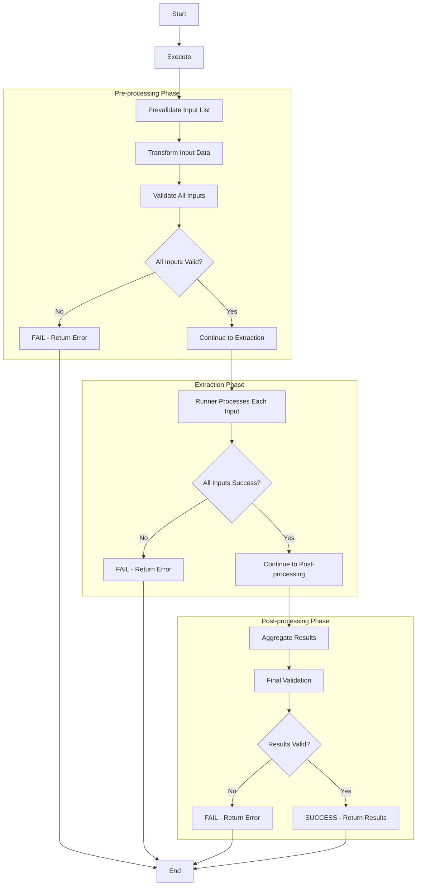

# Processor Execution Logic

**Applies to:** `BaseProcessor` abstract class and all implementing processor subclasses.

**Purpose:** Define how a processor run is executed with configurable execution strategies and comprehensive error handling.

> ⚠️ NOTE: This document covers only the core execution engine for individual processors. It does NOT include orchestration, manual triggers, external API handling logic, or factor management systems. Cost tracking is handled separately in the Cost Tracking v3 document.

---

## 1) Overview & Architecture

The processor execution system provides:

- **Configurable Execution Strategies**: Default, Threaded, or Process-based execution via Runners
- **All or Nothing**: If any input fails, the entire execution fails
- **Parallel Processing**: Multiple inputs can be processed concurrently with runners
- **Event Dispatching**: Real-time communication to Pub/Sub and frontend via WebSocket

### Key Components

1. **`BaseProcessor`**: Core processing logic with complete success or failure execution
2. **`Runner`**: Execution strategy abstraction (Default, Thread, Process)
3. **`ExecutionContext`**: Retry lineage and metadata tracking
4. **`ProcessorInput`**: Individual input items with unique identifiers
5. **`ProcessingResult`**: Execution outcome with detailed error information

---

## 2) Event Dispatching

### Overview

The `BaseProcessor` provides event dispatching capabilities to communicate processor execution status and progress to both the backend event system and frontend clients.

### Event Dispatching Interface

The base class provides two primary methods for event communication:

```python
class BaseProcessor:
    def emit(self, type: str, data: dict[str, Any]) -> None:
        """
        Emit events to Pub/Sub layer.

        Used for major processor lifecycle events:
        - processor_started
        - processor_completed
        - processor_failed
        """

    def broadcast(self, data: dict[str, Any]) -> None:
        """
        Send real-time updates to frontend via WebSocket connections.

        Used for progress updates and status notifications:
        - Progress percentages (10%, 20%, etc.)
        - Intermediate status updates
        - Real-time processing feedback
        """
```

### Method Usage

#### Major Lifecycle Events (via `emit()`)

**Handled by the base class** - no implementation required. You can use them as a reference to implement your own events. You can also use them to trigger other events.

| Event Type | Description | When Triggered |
|------------|-------------|----------------|
| `x_processor_started` | Processor execution begins | At start of `execute()` method |
| `y_processor_completed` | Processor execution succeeds | After successful completion of all phases |
| `z_processor_failed` | Processor execution fails | On any phase failure |

#### Progress Updates (via `broadcast()`)

**To be called by processor subclasses** based on their specific processing logic.

Used for real-time updates during processor execution:
- Progress percentages and status updates
- Custom progress indicators
- Any real-time feedback to frontend

### Event Flow Integration

- **`emit()`**: Publishes to Google Cloud Pub/Sub for system integration, audit logging, and workflow orchestration
- **`broadcast()`**: Sends real-time updates via WebSocket connections for frontend progress bars and status indicators

---

## 3) Execution Pipeline

### Core Principle: All or Nothing

The processor execution ensures that:
- **Success**: All inputs must be processed successfully
- **Failure**: If any input fails, the entire execution fails
- **No Partial Results**: No mixed success/failure states are allowed in the final result

### Execution Flow

The processor has a 3-phase execution structure with runners handling the extraction phase:

```
pre-extraction phase → [extraction phase] → post-extraction phase
```

### Execution Phases

| Phase | Description |
| --- | --- |
| **Pre-extraction Phase** | Input prevalidation, transformation, and validation |
| **Extraction Phase** | Extraction step (executed by runners) |
| **Post-extraction Phase** | Result aggregation and result validation |

### Phase Responsibilities

#### Pre-extraction Phase
- **Input Pre-validation**: Checks if `account_id`, `underwriting_id` match the processor's configuration and returns validated `ProcessorInput`'s data
- **Input Transformation**: Transform and normalize input data before validation
- **Input Validation**: Input validation and structure verification
- **Input Validation Check**: If any input fails validation, the entire execution fails immediately

#### Extraction Phase
- **Extraction**: Factor extraction and result formatting
- **Complete Processing**: All inputs must succeed or the entire execution fails
- **Runner Execution**: Parallel processing of validated inputs

#### Post-extraction Phase
- **Result Aggregation**: Merges the output factors from each input into a single result set
- **Result Validation**: Ensures all results are consistent and complete
- **Complete Success**: Only returns success if all phases completed successfully

### Execution Flow



The processor execution follows these linear steps:

1. **Start** - Begin processing
2. **Execute** - Execute the processor
3. **Pre-validate Input List** - Check `account_id`, `underwriting_id` match and return validated processor input's data
4. **Transform Input Data** - Transform and normalize input data before validation
5. **Validate All Inputs** - Input validation and structure verification
6. **Check: All Inputs Valid?** - If any input fails input validation, entire execution fails
7. **Runner Processes Each Input** - Execute factor extraction step on each input
8. **Check: All Inputs Success?** - If any input fails, entire execution fails
9. **Aggregate Results** - Merge output factors from all inputs
10. **Result Validation** - Ensure aggregated results are consistent
11. **Check: Results Valid?** - Result validation before success
12. **Return Processing Result** - Return result with aggregated output or error
13. **End** - Processing complete

### Input Processing Strategy

The **3-Phase Execution** processes multiple `ProcessorInput` items as follows:

1. **Input List**: The processor receives a list of `ProcessorInput` objects
2. **Pre-extraction Phase**: All inputs are pre-validated and input validated. **If any input fails, the entire execution fails immediately**
3. **Extraction Phase**: The runner takes each validated input and applies the factor extraction function. **If any input fails, the entire execution fails**
4. **Post-extraction Phase**: The `BaseProcessor` aggregates results and performs result validation. **If aggregation fails, the entire execution fails**

**Simplified example with 3 inputs (SUCCESS):**

```
Input List: [doc1, doc2, doc3]
↓
Pre-extraction Phase:
- doc1 → prevalidation → transform → input validation → SUCCESS
- doc2 → prevalidation → transform → input validation → SUCCESS
- doc3 → prevalidation → transform → input validation → SUCCESS
↓
Extraction Phase:
- doc1 → extraction → SUCCESS
- doc2 → extraction → SUCCESS
- doc3 → extraction → SUCCESS
↓
Post-extraction Phase:
- Aggregate results → SUCCESS
- Result validation → SUCCESS
↓
Result: SUCCESS - All inputs processed successfully
```

**Example with failure in pre-extraction phase:**

```
Input List: [doc1, doc2, doc3]
↓
Pre-extraction Phase:
- doc1 → prevalidation → transform → input validation → SUCCESS
- doc2 → prevalidation → transform → input validation → FAIL (input validation error)
- doc3 → [NOT REACHED - Execution stops immediately]
↓
Result: FAILED - Pre-extraction phase input validation error
- No extraction phase executed
- No partial results returned
- Clean failure state
```

---

## 4) Runner System

The Runner system provides configurable execution strategies for processing multiple inputs.

### Runner Interface

```python
class Runner(ABC):
    @abstractmethod
    def run(
        self,
        func: Callable[[Any], Any],
        inputs: Iterable[Any],
    ) -> list[dict[str, Any]]:
        """Execute function against inputs and return ordered results."""

```

### Available Runners

#### 1. `DefaultRunner`

- **Strategy**: Processes inputs one by one in the same thread
- **Use Case**: Simple processing, debugging, or when order matters
- **Performance**: Slower but predictable and easy to debug
- **Complete Success or Failure**: Stops on first failure, returns error immediately

```python
runner = DefaultRunner()
results = runner.run(process_func, inputs)
```

#### 2. `ThreadRunner`

- **Strategy**: Uses `ThreadPoolExecutor` for concurrent execution
- **Use Case**: I/O-bound operations, external API calls
- **Performance**: Good for I/O-bound tasks, limited by GIL for CPU-bound
- **Complete Success or Failure**: Waits for all threads, fails if any thread fails

```python
runner = ThreadRunner(max_workers=4)
results = runner.run(process_func, inputs)
```

#### 3. `ProcessRunner`

- **Strategy**: Uses `ProcessPoolExecutor` for true parallel execution
- **Use Case**: CPU-intensive processing, data transformation
- **Performance**: Best for CPU-bound tasks, true parallelism
- **Complete Success or Failure**: Waits for all processes, fails if any process fails

```python
runner = ProcessRunner(max_workers=4)
results = runner.run(process_func, inputs)
```

### Runner Selection Process

The runner is selected during processor initialization and can be configured based on the workload:

```python
# Runner selection during processor creation
processor = MyProcessor(
    account_id="acc_123",
    underwriting_id="uw_456",
    runner=DefaultRunner()  # or ThreadRunner(), ProcessRunner()
)
```

### Runner Selection Guide

| Scenario | Recommended Runner | Reason |
| --- | --- | --- |
| Debugging/Development | `DefaultRunner` | Easy to debug, predictable order |
| External API calls | `ThreadRunner` | I/O-bound, good concurrency |
| Document processing | `ThreadRunner` | File I/O operations |
| Data transformation | `ProcessRunner` | CPU-intensive calculations |
| Small datasets (< 10 items) | `DefaultRunner` | Overhead not worth it |
| Large datasets (> 100 items) | `ProcessRunner` | Better resource utilization |

---

## 5) Retry Logic

### Core Principles

1. **Full Reprocessing**: On retry, re-run the entire execution from the beginning
2. **Context Preservation**: Maintain execution context for debugging and lineage tracking
3. **Error Isolation**: Each retry is a complete, independent execution
4. **Consistent Behavior**: Retry maintains the same complete success or failure behavior as initial execution

### Retry Context Management

The system uses `ExecutionContext` to track retry information:

```python
class ExecutionContext:
    parent_run_id: str | None = None      # Original run ID
    previous_run_id: str | None = None    # Last failed run ID
    retry_count: int = 0                  # Number of retries
    execution_metadata: dict[str, str]    # Additional context
```

**Context Usage:**

- Track retry lineage across multiple attempts
- Maintain execution metadata for debugging
- Provide additional context for error handling
- Monitor retry frequency and patterns

---

## 6) Error Handling

### Processor Execution Exception Types

The system throws specific exceptions for different processor execution phases and error scenarios:

#### Pre-extraction Phase Exceptions

- **`PrevalidationError`**: General pre-validation failures
- **`InputValidationError`**: Input validation failures (invalid format, missing required fields)
- **`TransformationError`**: Input transformation failures (data conversion, normalization errors)

#### Extraction Phase Exceptions

- **`ExtractionError`**: General extraction failures
- **`ApiError`**: External API call failures (network, authentication, rate limiting)
- **`ProcessingError`**: Internal processing failures (data analysis, factor calculation)

#### Post-extraction Phase Exceptions

- **`ResultAggregationError`**: Result collection and aggregation failures
- **`ResultValidationError`**: Result validation failures

### Error Handling

**Failure Behavior**

All failures result in complete execution failure with caching support:

1. **Immediate Failure**: Stop execution at first failure point
2. **Cached State**: Partial results and intermediate state may be cached for reuse
3. **Error Context**: Preserve error information for debugging
4. **Retry Ready**: System ready for complete retry with potential cache utilization

### Retry Approach

Retry attempts may utilize cached results when available:

- **Smart re-execution**: Reuse cached results where possible, re-execute only failed components
- **Selective validation**: Re-validate only inputs that weren't previously validated or have changed
- **Consistent behavior**: Same complete success or failure behavior as initial execution

---

## 7) Implementation Details

### `BaseProcessor.execute()` Method

```python
def execute(
    self,
    data: list[ProcessorInput],
    context: ExecutionContext | None = None,
) -> ProcessingResult:
    """
    Execute processing pipeline with configurable runner strategy and complete success or failure behavior.

    Args:
        data: List of inputs to process
        context: Optional retry context for resume logic

    Returns:
        ProcessingResult with success/failure, complete results, and detailed error info
    """
```

### Key Implementation Features

1. **Pre-validation**: Ensures all inputs belong to same account/underwriting
2. **3-Phase Execution**: Pre-extraction → Extraction Phase → Post-extraction
3. **Runner Integration**: Delegates only factor extraction step to configured runner for parallel execution
4. **Complete Error Handling**: Each phase fails completely on any input failure
5. **Result Aggregation**: Combines results from all inputs only on complete success

---

## 8) Usage Examples

### Basic Usage

```python
# Create processor with default execution
processor = MyProcessor(
    account_id="acc_123",
    underwriting_id="uw_456",
    runner=DefaultRunner()
)

# Process multiple inputs
inputs = [
    ProcessorInput(
        input_id="doc_1",
        account_id="acc_123",
        underwriting_id="uw_456",
        data=document_data
    ),
    # ... more inputs
]

result = processor.execute(inputs)
```

### Retry with Context

```python
# Retry with previous context
retry_context = ExecutionContext(
    parent_run_id="original_run_id",
    previous_run_id="failed_run_id",
    retry_count=1
)

result = processor.execute(inputs, context=retry_context)
```

### Parallel Processing

```python
# Use thread runner for I/O-bound tasks
processor = MyProcessor(
    account_id="acc_123",
    underwriting_id="uw_456",
    runner=ThreadRunner(max_workers=4)
)

result = processor.execute(inputs)

# Check complete result
if result.success:
    # All inputs processed successfully
    factors = result.output
else:
    # Complete failure - no partial results
    error = result.error
```

---

## 9) Implementation Guidelines

### Processor Development Checklist

- **Define Required Attributes**: Set `PROCESSOR_NAME` and implement required methods
- **Choose Runner Strategy**: Select appropriate runner based on workload type
- **Override Input Transformation (Optional)**: Override `_transform_input` method if data transformation is needed
- **Override Input Validation (Optional)**: Override `_validate_input` method if custom validation is needed
- **Implement Extraction Method**: Create `_extract_factors` method for data extraction and processing
- **Override Result Aggregation (Optional)**: Override `_aggregate_result` method if custom aggregation is needed
- **Override Result Validation (Optional)**: Override `_validate_result` method if custom result validation is needed
- **Test Complete Success or Failure Behavior**: Test with various input scenarios and edge cases

### Code Structure Requirements

```python
class MyProcessor(BaseProcessor):
    PROCESSOR_NAME = "my_processor"

    def __init__(self, account_id: str, underwriting_id: str, runner: Runner = DefaultRunner()):
        super().__init__(account_id, underwriting_id, runner)

    def _transform_input(self, data: Any) -> Any:
        # Optional: Override for custom input transformation logic
        # This runs during pre-extraction phase before validation
        # Return transformed data
        return data

    def _validate_input(self, data: Any) -> Any:
        # Optional: Override for custom input validation logic
        # This runs during pre-extraction phase after transformation
        # Return validated data or raise validation errors
        return data

    def _extract_factors(self, data: Any) -> dict[str, str | list | dict]:
        # Required: Implement data extraction and processing logic
        # This runs inside the runner during extraction phase
        # Must extract all inputs or fail completely
        pass

    def _aggregate_result(self, results: list[dict[str, Any]]) -> dict[str, Any]:
        # Optional: Override for custom result aggregation logic
        # This runs during post-extraction phase
        # Return aggregated result dictionary
        return self._default_aggregate_result(results)

    def _validate_result(self, result: dict[str, Any]) -> dict[str, Any]:
        # Optional: Override for custom result validation logic
        # This runs during post-extraction phase after aggregation
        # Return validated result or raise validation errors
        return result
```
