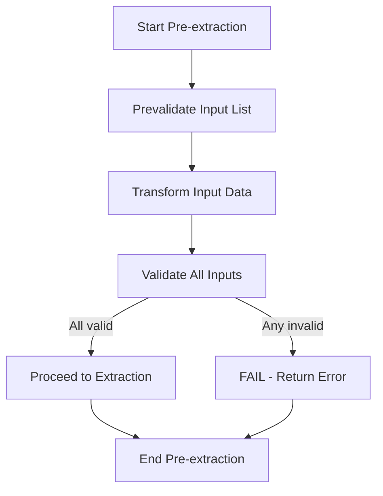
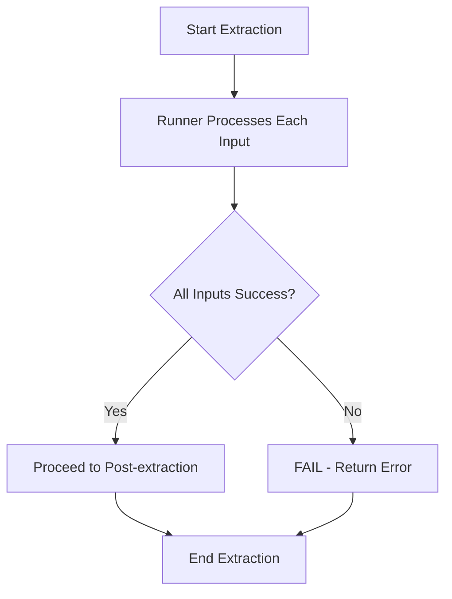
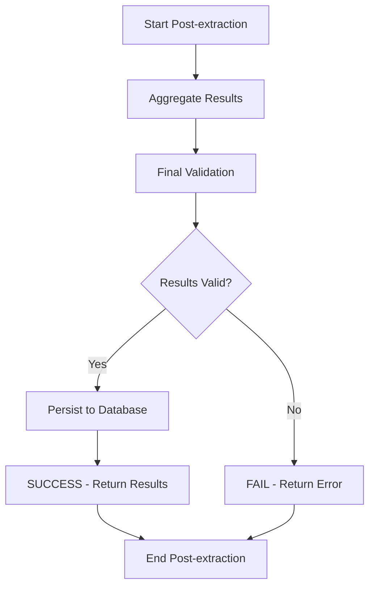
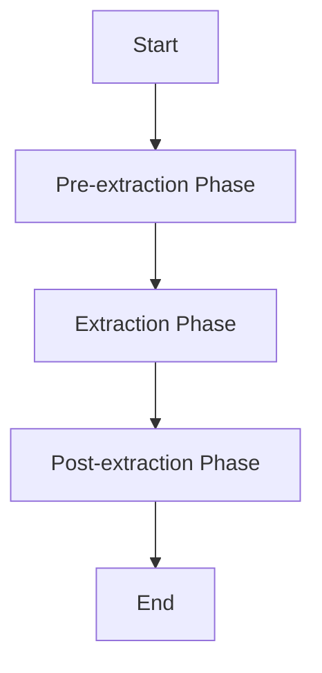

# Processor Execution Logic

**Applies to:** `BaseProcessor` abstract class and all implementing processor subclasses.

**Purpose:** Define how a processor run is executed with configurable execution strategies and comprehensive error handling.

> ⚠️ NOTE: This document covers only the core execution engine for individual processors. It does NOT include orchestration, manual triggers, external API handling logic, or factor management systems.
>

---

## 1) Overview & Architecture

The processor execution system provides:

- **Atomic Execution**: Transactional processing with complete success or failure semantics
- **Concurrent Processing**: Multiple inputs *can* be processed concurrently via thread
- **Event Dispatching**: Real-time communication to Pub/Sub and frontend via WebSocket

### Key Components

1. **`BaseProcessor`**: Core processing engine implementing atomic execution semantics
2. **`Runner`**: Concurrency strategy implementation (Default, Thread)
3. **`ProcessorInput`**: Individual input items with unique identifiers
4. **`ProcessingResult`**: Execution outcome with detailed error information and cost data

### Base Processor Class - Key Responsibilities

- Emit lifecycle events (`{processor}.execution.started|completed|failed`) to Pub/Sub
- Determine eligibility to execute (check triggers against input; skip if not satisfied)
- Input prevalidation checking if document is of correct type and exists
- Execute the 3‑phase pipeline (pre‑extraction, extraction, post‑extraction)
- Coordinate the pipeline and enforce atomic success/failure semantics
- Summarize processing cost
- Handle errors consistently
- Persistence:
    - inserting `processing_execution` record
    - inserting and overwriting `factors` records
    - optionally updating `application fields` when necessary

### Concrete Processor Subclass - Key Responsibilities

- Define `PROCESSOR_NAME` and any `PROCESSOR_TRIGGERS`
- Transform input data when needed
    - document splicing
    - chunking large payloads
    - normalization
- Validate transformed data and inputs for processor-specific requirements
- Implement extraction logic to produce factors from validated inputs
- Aggregate and validate outputs
   - map to canonical factor keys
   - optionally populate application fields
- Track processing costs as applicable
   - (per execution, per page, or per api call)

---

## 2) Event Dispatching

### Overview

The `BaseProcessor` provides event dispatching capabilities to communicate processor execution status across different system layers.

### Event Dispatching Interface

The base class provides emit method for event communication:

```python
class BaseProcessor:
    def emit(
	    self,
	    data: dict[str, Any],
	    event: str,
	    target: list[str]|str = 'pubsub'
	  ) -> None:
        """
        Emit events to specified system layer.

        Args:
            data: Event payload
            event: Event name
            target: Target layer
        """

```

### Event Target Layers

The `target` parameter allows events to be routed to different system layers:

| Layer | Value | Purpose | Use Cases |
| --- | --- | --- | --- |
| **PubSub** | `'pubsub'` | System integration and workflow orchestration | Downstream processing, workflow triggers |

### Major Lifecycle Events

**Handled by the base class** - no implementation required. These events are automatically sent to both `PubSub` and `WebSocket` layers:

| Event | Description | Trigger | Target |
| --- | --- | --- | --- |
| `{p_id}.execution.started` | Processor execution started | At the start of execution | `pubsub` |
| `{p_id}.execution.completed` | Processor execution succeeds | After successful completion of all phases | `pubsub` |
| `{p_id}.execution.failed` | Processor execution fails | On any phase failure | `pubsub` |

**Event Flow**:

- Publishes to `Google Cloud PubSub` topics for system integration
- Triggers downstream processors and workflows
- Enables system-wide event coordination

---

## 3) Cost Tracking

### Overview

The `BaseProcessor` provides cost tracking capabilities to monitor processing costs during execution.

### Cost Tracking Interface

The base class provides a cost tracking method:

```python
class BaseProcessor:
    def __init__(self):
        self._total_cost: float = 0.0  # Track accumulated costs

    def _add_cost(self, cost: float) -> None:
        """
        Add cost for an operation during processing.

        This method adds the cost to the internal _total_cost attribute.

        Args:
            cost: Cost amount to add to the total
        """
        self._total_cost += cost

```

### Cost Calculation Flow

- **During Processing**: Track individual operation costs using `_add_cost(cost)`
- **Cost Accumulation**: Each call to `_add_cost(cost)` adds the cost to `self._total_cost`
- **Access Total**: Use `self._total_cost` directly to get the accumulated total
- **Result Integration**: Total cost information is included in the `ProcessingResult`

### Usage Example

```python
# During processing, add individual costs
self._add_cost(0.05)  # self._total_cost becomes 0.05
self._add_cost(0.10)  # self._total_cost becomes 0.15
self._add_cost(0.02)  # self._total_cost becomes 0.17

# Access total cost directly
total_cost = self._total_cost  # Returns 0.17

```

---

## 4) Execution Pipeline

### Core Principle: Atomic Execution

The processor execution framework implements atomic transaction semantics:

- **Atomic Success**: Complete processing of all inputs constitutes a successful execution
- **Atomic Failure**: Any input processing failure results in complete execution termination
- **Consistent State**: The system maintains transactional integrity with no partial success states in the final output

### Execution Flow

The processor has a 3-phase execution structure with runners handling the extraction phase:

```
pre-extraction phase → [extraction phase] → post-extraction phase

```

### Execution Phases

| Phase | Description |
| --- | --- |
| **Pre-extraction Phase** | Input prevalidation, transformation, and input validation |
| **Extraction Phase** | Extraction step (executed by runners) |
| **Post-extraction Phase** | Result aggregation and result validation |

### Phase Responsibilities

### Pre-extraction Phase

- **Input Pre-validation**:
    - Checks if prerequisite documents exists or triggers are satisfied
    - Check if stipulation is of correct type
- **Input Transformation**: Transform and normalize input data before validation
- **Input Validation**: Input validation and structure verification



### Extraction Phase

- **Extraction**: Factor extraction and result formatting
- **Complete Processing**: All inputs must succeed or the entire execution fails
- **Runner Execution**: Parallel processing of validated inputs



### Post-extraction Phase

- **Result Aggregation**: Merges the output factors from each input into a single result set
- **Result Validation**: Ensures all results are consistent and complete
- **Database Persistence**: Store execution record and factors in the operational DB
- **Complete Success**: Only returns success if all phases completed successfully



### Execution Flow



The processor execution follows these linear steps:

1. **Start** - Begin processing
2. **Execute** - Execute the processor
3. **Pre-validate Input List** - Check prerequisite document existence and `account_id`& `underwriting_id` then return validated processor input's data
4. **Transform Input Data** - Transform and normalize input data before validation
5. **Validate All Inputs** - Input validation and structure verification
6. **Check: All Inputs Valid?** - If any input fails input validation, entire execution fails
7. **Runner Processes Each Input** - Execute factor extraction step on each input
8. **Check: All Inputs Success?** - If any input fails, entire execution fails
9. **Aggregate Results** - Merge output factors from all inputs
10. **Result Validation** - Ensure aggregated results are consistent
11. **Check: Results Valid?** - Result validation before success
12. **Persist Results** - Save execution record and factors; optional application updates
13. **Return Processing Result** - Return result with aggregated output or error
14. **End** - Processing complete

### Input Processing Strategy

The **3-Phase Execution** processes multiple `ProcessorInput` items as follows:

1. **Input List**: The processor receives a list of `ProcessorInput` objects
2. **Pre-extraction Phase**: All inputs are pre-validated and input validated. **If any input fails, the entire execution fails immediately**
3. **Extraction Phase**: The runner takes each validated input and applies the factor extraction function. **If any input fails, the entire execution fails**
4. **Post-extraction Phase**: The `BaseProcessor` aggregates results and performs result validation. **If aggregation fails, the entire execution fails**

**Simplified example with 3 inputs (SUCCESS):**

```
Input List: [doc1, doc2, doc3]
↓
Pre-extraction Phase:
- doc1 → prevalidation → transform → input validation → SUCCESS
- doc2 → prevalidation → transform → input validation → SUCCESS
- doc3 → prevalidation → transform → input validation → SUCCESS
↓
Extraction Phase:
- doc1 → extraction → SUCCESS
- doc2 → extraction → SUCCESS
- doc3 → extraction → SUCCESS
↓
Post-extraction Phase:
- Aggregate results → SUCCESS
- Result validation → SUCCESS
↓
Result: SUCCESS - All inputs processed successfully

```

**Example with failure in pre-extraction phase:**

```
Input List: [doc1, doc2, doc3]
↓
Pre-extraction Phase:
- doc1 → prevalidation → transform → input validation → SUCCESS
- doc2 → prevalidation → transform → input validation → FAIL (input validation error)
- doc3 → [NOT REACHED - Execution stops immediately]
↓
Result: FAILED - Pre-extraction phase input validation error
- No extraction phase executed
- No partial results returned
- Clean failure state

```

---

## 5) Database Persistence (Post-processing)

### Persistence steps

1. Insert `processing_execution` with `status`, timestamps (`started_at`/`completed_at`), `duration`, `processor_name`, and `run_cost_cents`.
2. Upsert factors: for each `factor_key`, set previous `is_current = FALSE` and insert a new `factor` row with `value`, optional `unit`, `source = 'processor'`, and `execution_id`.
3. Optionally update application fields (e.g., `merchant.industry`) when confidently derived.
4. Commit the transaction; on error, rollback and mark the execution as `failed`.

---

## 6) Concurrent Processing

The `BaseProcessor` provides configurable concurrent processing options for multiple inputs, allowing developers to choose between sequential and parallel execution strategies.

### Concurrent Processing Interface

```python
class Runner(ABC):
    @abstractmethod
    def run(
        self,
        func: Callable[[Any], Any],
        inputs: Iterable[Any],
    ) -> list[dict[str, Any]]:
        """Execute function against inputs and return ordered results."""

```

### Available Processing Strategies

### 1. `DefaultRunner`

- **Strategy**: Sequential processing (one input at a time)
- **Use Case**: Default for simple operations

```python
runner = DefaultRunner()
results = runner.run(process_func, inputs)

```

### 2. `ThreadRunner`

- **Strategy**: Concurrent processing (multiple inputs in parallel)
- **Use Case**: When you want faster processing through thread based parallelism

```python
runner = ThreadRunner(max_workers=4)
results = runner.run(process_func, inputs)

```

### Concurrent Processing Configuration

Configure the `BaseProcessor`'s concurrent processing behavior based on your processing requirements:

- **`DefaultRunner`**: Sequential processing (for simple operations)
- **`ThreadRunner`**: Concurrent processing (multiple inputs in parallel)

---

## 7) Error Handling

### Processor Execution Exception Types

The system throws specific exceptions for different processor execution phases and error scenarios:

### Pre-extraction Phase Exceptions

- **`PrevalidationError`**: General pre-validation failures
- **`InputValidationError`**: Input validation failures (invalid format, missing required fields)
- **`TransformationError`**: Input transformation failures (data conversion, normalization errors)

### Extraction Phase Exceptions

- **`FactorExtractionError`**: General extraction failures
- **`ApiError`**: External API call failures (network, authentication, rate limiting)

### Post-extraction Phase Exceptions

- **`ResultAggregationError`**: Result collection and aggregation failures
- **`ResultValidationError`**: Result validation failures

### Error Handling

**Failure Behavior**

All failures result in complete execution failure will immediately the stop execution at first failure point.

---
