# Overview

This module implements the Pub/Sub subscriber for underwriting processing orchestration. It coordinates processor execution across multiple workflows, handling document processing, execution management, and rollback operations. All purchased processors are evaluated, filtered by triggers, executed, and their results are persisted and consolidated into final factors.

## Listened Events

The orchestrator subscribes to the following Pub/Sub topics:

- **`underwriting.created`** - Triggers initial processing for new underwritings
- **`underwriting.updated`** - Triggers processing for underwriting updates
- **`underwriting.processor.execute`** - Manual processor execution requests
- **`underwriting.processor.consolidation`** - Execution consolidation update
- **`underwriting.execution.activate`** - Execution state activation/rollback requests
- **`underwriting.execution.disable`** - Execution deactivation requests

## System Overview

**Inputs and Outputs:**

- **Inputs**: Pub/Sub messages (`underwriting.created`, `underwriting.updated`, `underwriting.processor.execute`, `underwriting.processor.consolidation`, `underwriting.execution.activate`, `underwriting.execution.disable`).
- **Outputs**: Executed processor results, updated factors via database module (which then emits notifications).

**High-Level Processing Flow:**

The orchestrator processes incoming messages through these main stages:

- **Message Received**: Receives and validates incoming Pub/Sub messages with automatic retry for failed messages
- **Normalize Payload**: Converts incoming data into standardized format for processing (flattens nested data, organizes documents by type)
- **Get Purchased Processors**: Loads the list of processors that the tenant has purchased and enabled for this underwriting
- **Filter Processors by Triggers**: Determines which processors should run based on the data present in the message
- **Build Execution List**: Creates the specific execution tasks needed based on each processor's requirements
- **Perform Parallel Execution**: Runs all required processors simultaneously and saves their results
- **Consolidate Results**: Combines results from multiple executions into final factor values
- **Update Existing Factors**: Saves the final computed factors to the database

**Notes:**

- The manual execute path flows via `Message Received (manual)` → `Normalize Payload` → `Build Execution List`.
- The orchestrator emits `underwriting.processing.completed` after successful updates.
- A per-underwriting per-processor consolidation lock is recommended so only one consolidation runs at a time for the same processor, avoiding race conditions when executions complete concurrently.
- Idempotency: consolidation uses only active executions; superseded/failed/deleted executions are excluded.

## Responsibilities

- Subscription & intake
    - Subscribe to Pub/Sub topics: `underwriting.created`, `underwriting.updated`, `underwriting.processor.execute`, `underwriting.processor.consolidation`, `underwriting.execution.activate`, `underwriting.execution.disable`
    - `Ack`/`Nack` handling with retry/backoff for transient failures
- Input normalization
    - Flatten `application_property` to dot paths.
    - Keep `owners_list` as an array with `owner_id`; expand owner-level keys during matching (e.g., `owners_list.ssn` matches if any owner has `ssn`).
    - Keep `documents_list` as an array where each document has `stipulation_type`, `revision_id`, `uri`, and `action` (created/updated/deleted).
    - Owner paths do not require wildcard syntax.
- Processor selection
    - Load purchased processors for the underwriting
    - Evaluate `PROCESSOR_TRIGGERS` using ANY‑match across `application_property` and `documents_list`; for `owners_list` keys, match across any owner without wildcard; allow forced selection and trigger bypass via `underwriting.processor.execute`
- Execution coordination
    - Invoke eligible processors

# Orchestration Workflows

The orchestrator handles five workflows as defined below.

## Workflow 1

Subscribes to `underwriting.created` and `underwriting.updated`.

### **Automatic Processor Execution Flow**

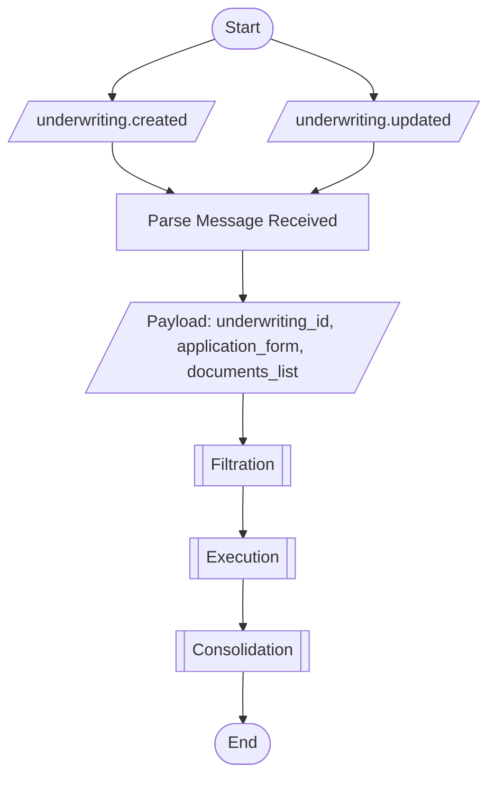

### **Payload**

```json
{
  "underwriting_id": "uw_67890",
  "application_form": {
    "merchant.name": null,
    "merchant.ein": "123456789",
    "merchant.industry": "1342",
    "owners_list": [
      {
        "owner_id": "owner_001",
        "first_name": "John",
        "last_name": "Doe",
        "ssn": "123456789"
      }
    ]
  },
  "documents_list": [
      {
        "stipulation_type": "s_bank_statement",
	      "revision_id": "doc_rev_001",
      "uri": "gs://bucket/path/to/doc_rev_001.pdf",
      "action": "created"
      },
      {
        "stipulation_type": "s_bank_statement",
	      "revision_id": "doc_rev_002",
      "uri": "gs://bucket/path/to/doc_rev_002.pdf",
      "action": "created"
    },
    {
      "stipulation_type": "s_tax_return",
      "revision_id": "doc_rev_005",
      "uri": "gs://bucket/path/to/doc_rev_005.pdf",
      "action": "created"
    }
  ]
}
```

```json
{
  "underwriting_id": "uw_67890",
  "application_form": {
    "merchant.name": "A",
    "merchant.ein": "123456789",
    "merchant.industry": "1342",
    "owners_list": [
      {
        "owner_id": "owner_001",
        "first_name": "John",
        "last_name": "Doe"
      },
      {
        "owner_id": "owner_002",
        "ssn": "123456789"
      }
    ]
  },
  "documents_list": [
    {
      "stipulation_type": "s_bank_statement",
      "revision_id": "doc_rev_006",
      "uri": "gs://bucket/path/to/doc_rev_006.pdf",
      "action": "created"
    },
    {
      "stipulation_type": "s_bank_statement",
      "revision_id": "doc_rev_001",
      "uri": "gs://bucket/path/to/doc_rev_001.pdf",
      "action": "updated"
    },
    {
      "stipulation_type": "s_bank_statement",
      "revision_id": "doc_rev_002",
      "uri": "gs://bucket/path/to/doc_rev_002.pdf",
      "action": "deleted"
    },
    {
      "stipulation_type": "s_license",
      "revision_id": "doc_rev_004",
      "uri": "gs://bucket/path/to/doc_rev_004.pdf",
      "action": "updated"
    },
    {
      "stipulation_type": "s_license",
      "revision_id": "doc_rev_005",
      "uri": "gs://bucket/path/to/doc_rev_005.pdf",
      "action": "deleted"
    }
  ]
}
```

### **Steps**

1. **Receive message** from database module via `underwriting.created` or `underwriting.updated` Pub/Sub topic
2. **Parse and validate** message payload containing:
   - `underwriting_id`: Unique identifier for the underwriting
   - `application_form`: Flattened application data with dot notation (e.g., `merchant.ein`)
   - `documents_list`: Array of document changes, each with `stipulation_type`, `revision_id`, `uri`, and `action` (created/updated/deleted)
3. **Normalize payload** for processing:
   - Flatten nested structures to dot paths
   - Keep `owners_list` as array with special matching rules
   - Organize documents by stipulation type with revision IDs and URIs
4. **Filtration phase** (see Filtration section):
   - Load enabled and automatic processors for the underwriting
   - For each processor, evaluate triggers against normalized payload
   - Generate execution list for matching processors
   - Build list of processors that need execution
5. **Execution phase** (see Execution section):
   - Generate payload hashes for each processor
   - Check for existing executions with matching hashes
   - Create new executions or reactivate existing ones
   - Run all pending executions in parallel
   - Save execution results to database
6. **Consolidation phase** (see Consolidation section):
   - For each processor
   - Load current active executions
   - Run processor-specific consolidation logic
   - Create/update factors in database with `emit: false`
   - Database module emits factor update notifications after all consolidations complete
7. **Complete processing** and acknowledge Pub/Sub message

### **Notes**

- **Message Source**: Listens to Pub/Sub messages emitted by database module, not direct database access
- **Document List Structure**: Array where each document includes `stipulation_type`, `revision_id`, `uri`, and `action` (created/updated/deleted)
- **Null Value Handling**: Application form payload must include fields with `null` values explicitly (e.g., `"merchant.name": null`) to enable proper execution rollback later
- **Hash Consistency**: Payload hash generation must be consistent - decide whether to include null values in hash or exclude them, but apply the rule consistently across all executions
- **No Completion Event**: Does NOT emit completion event after consolidation - database module handles factor update notifications to other modules
- **Concurrent Execution**: Multiple processors run concurrently using thread pools for better performance (processors are I/O-bound)
- **Smart Re-processing**: Hash-based logic prevents redundant processing - only re-runs processors when inputs change
- **Partial Success**: Individual processor failures are isolated - successful processors complete and save results regardless of failures in others
- **Invalidation Handling**: Processes document deletions and hash mismatches before execution to identify superseded executions
- **Automatic Triggers**: Only runs processors with `auto=true` and `disabled=false` whose triggers match available data
- **Factor Updates**: Each processor consolidation updates database directly with `emit: false` flag - database batches updates and emits single notification per processor
- **Idempotency**: Can process same message multiple times safely - hash matching ensures no duplicate executions created

### Filtration

Filters and selects processors that should run based on triggers and configuration, and generate the execution list also.

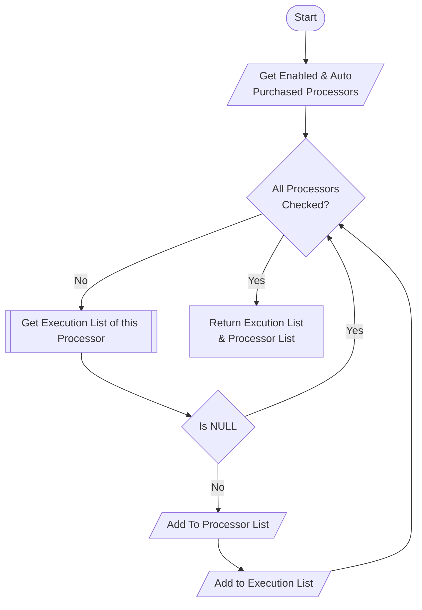

**Steps:**

1. **Query database** for processors subscribed to this underwriting with filters:
   - `enabled = true`: Processor is not disabled by user
   - `auto = true`: Processor runs automatically (not manual-only)
   - Tenant/organization scope: Only processors purchased by this organization
2. **For each processor** in the list:
   - Call **Get Execution List** sub-workflow (see below)
   - If execution list is `NULL`: Skip this processor (triggers don't match)
   - If execution list is returned (even if empty array): Add to processor list and combine execution lists
3. **Build combined execution list** from all matching processors
4. **Build processor list** containing all processors that had non-NULL execution lists
5. **Return both lists** to continue to Execution phase

**Notes:**

- **Tenant Scope**: Only processors purchased by the tenant/organization are considered for filtering
- **NULL vs Empty Array**:
  - `NULL` means no triggers matched - processor is completely skipped
  - Empty array `[]` means triggers matched but no new executions needed - processor still goes to consolidation
- **Automatic Only**: This filtration only applies to automatic processors - manual execution bypasses this (see Workflow 2)
- **Trigger Evaluation**: Each processor's triggers are evaluated against the normalized payload in the Get Execution List sub-workflow

### Get Execution List

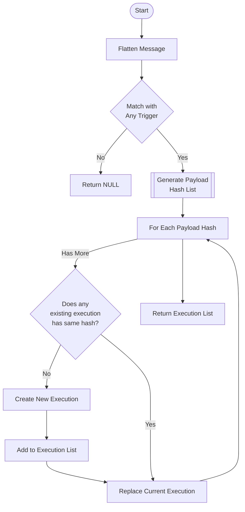

**Steps:**

1. **Flatten and normalize** the incoming message payload:
   - Convert nested structures to dot notation paths
   - Prepare application_form fields for matching
   - Organize documents_list by stipulation codes
2. **Evaluate processor triggers** using `PROCESSOR_TRIGGERS` with ANY-match logic:
   - **Application keys**: Match flattened dot paths (e.g., `merchant.ein`, `merchant.name`)
   - **Owner fields**: Match `owners_list.{property_name}` patterns across any owner in array (e.g., `owners_list.ssn`)
   - **Documents**: Match by stipulation code in `documents_list` (e.g., `s_bank_statement`)
3. **If no triggers match**: Return `NULL` to indicate processor should be completely skipped
4. **If triggers match**: Call **Generate Payload Hash List** sub-workflow
5. **For each payload hash** returned:
   - Query database for existing execution with matching hash
   - **If hash not found**: Create new execution record and add to execution list
   - **If hash found**: Reuse existing execution (don't add to execution list)
   - **Update current execution**: Replace current execution pointer with this hash regardless of new/existing
6. **Return execution list** containing only new executions that need to run

**Notes:**

- **Trigger Evaluation**: Uses ANY-match logic - if ANY condition matches, the processor is selected
- **Document Matching**: Matches on stipulation codes (e.g., `s_bank_statement`) rather than individual document IDs for flexibility
- **Deletion Handling**: Document deletions and null values are handled in Generate Payload Hash List sub-workflow
- **Hash Reuse**: If payload hash already exists from previous execution, reuses that execution instead of creating new one
- **Current Execution Always Updated**: Even when reusing existing execution, current execution pointer is updated to ensure consolidation uses correct execution
- **Execution Status Ignored**: Current execution is updated regardless of whether existing execution is running, completed, or failed
- **Empty Array Return**: Returns empty array `[]` if triggers match but all hashes already exist - processor still goes to consolidation
- **NULL Return**: Returns `NULL` only if no triggers matched - processor is completely skipped

### Generate Payload Hash List

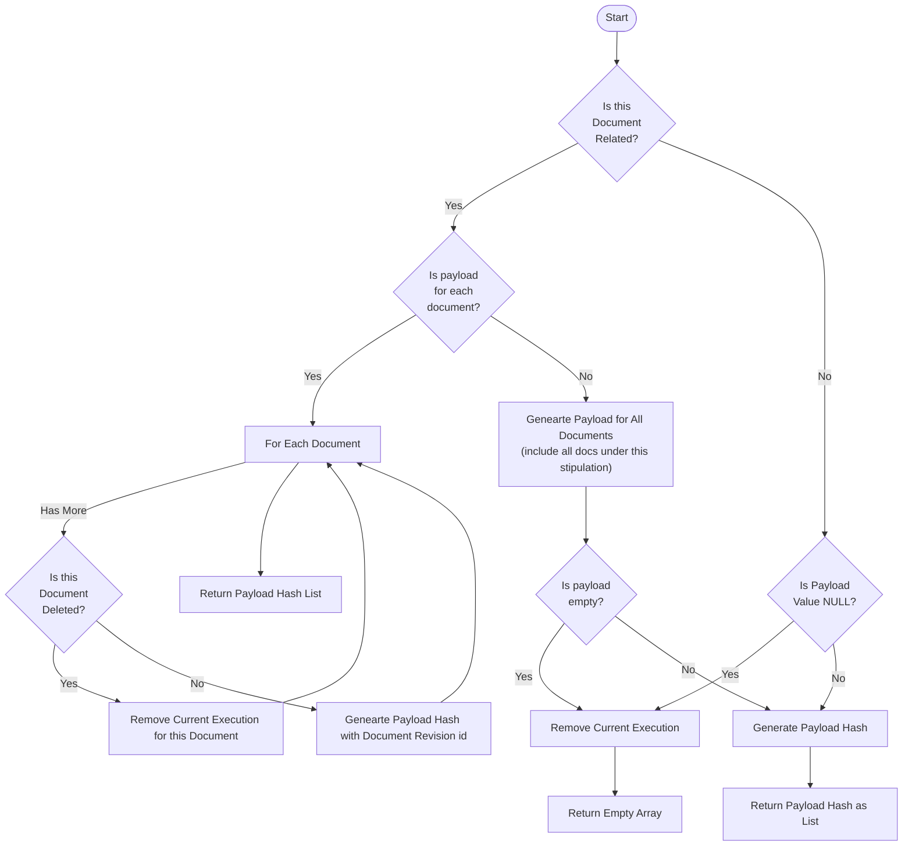

**Steps:**

There are **three** types of processors based on payload type:

#### **Type 1: Application Data Processors** (e.g., CLEAR report, credit bureau)

Uses application form data only, no documents.

1. **Check if payload value is NULL**:
   - If ALL required fields are NULL: Remove current execution, return empty array `[]`
   - If at least one field has value: Continue to step 2
2. **Generate payload** from application form fields:
   - Extract required fields (e.g., EIN, business name, SSN)
   - Include NULL values explicitly as `"field": null` in payload
   - Ensure consistent null handling for hash generation
3. **Generate payload hash** using application form values
4. **Return payload hash as single-item list** `[hash]`

**Special Considerations:**
- If some fields are NULL but others have values, processor can still run (e.g., CLEAR can run with name OR EIN)
- Payload must include NULL values explicitly to enable proper rollback
- Hash must be consistent - always include/exclude nulls the same way

#### **Type 2: Document-Based Processors - Totality** (e.g., driver's license)

Uses ALL documents under a stipulation code as single payload.

1. **Get all documents** under the stipulation code (e.g., all driver's license images)
2. **Check if payload is empty**:
   - If no documents exist OR all documents deleted: Remove current execution, return empty array `[]`
   - If documents exist: Continue to step 3
3. **Generate payload** including ALL document revision IDs:
   - Collect revision IDs from all non-deleted documents
   - Sort revision IDs for consistent hash generation
4. **Generate payload hash** using all document revision IDs combined
5. **Return payload hash as single-item list** `[hash]`

**Special Considerations:**
- Changing ANY document (add, delete, update) changes the hash
- All documents must be included in payload, not just changed ones
- Empty stipulation (all deleted) removes current execution

#### **Type 3: Document-Based Processors - Each Document** (e.g., bank statement)

Creates one execution per document.

1. **Get all documents** under the stipulation code
2. **For each document**:
   - **If document is deleted**: Remove current execution for THIS document, continue to next
   - **If document exists**: Generate payload hash using THIS document's revision ID only
3. **Collect all payload hashes** from non-deleted documents
4. **Return payload hash list** `[hash1, hash2, hash3, ...]`

**Special Considerations:**
- Multiple executions can be current simultaneously (one per document)
- Deleting one document only removes that document's execution
- Each document's hash is independent of others

**Notes:**

- **Consistent Hash Generation**: Must use same algorithm and field ordering for all hash calculations
- **NULL Value Policy**: Decide if NULL values are included in hash or excluded, apply consistently
- **Deletion Handling**: Deletions always remove current execution(s) and return empty array for that payload
- **Empty Array vs NULL**:
  - Empty array `[]` means triggers matched but no executions needed (data deleted/removed)
  - NULL means triggers didn't match (handled in parent workflow)
- **Revision ID Usage**: Always use document revision IDs, never base document IDs, to track specific versions

### Execution

Manages execution scheduling with hash-based lookup and reactivation logic for existing executions.

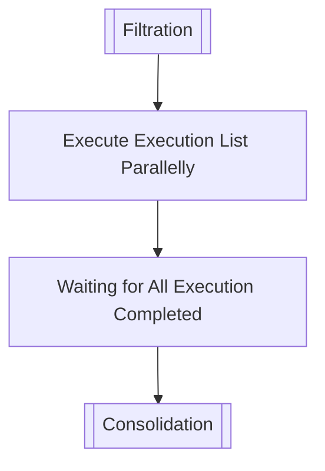

**Steps:**

1. **Receive execution list** from Filtration phase containing new executions to run
2. **Validate execution prerequisites**:
   - Check required documents are available
   - Verify application form data exists for application-based processors
   - Confirm no critical missing data
3. **Prepare for parallel execution**:
   - Group executions by processor type
   - Allocate thread pool resources (processors are I/O-bound)
   - Set up execution monitoring and timeout handlers
4. **Execute all pending executions in parallel**:
   - Call processor's execute method with payload data
   - Process documents through processor logic (OCR, API calls, calculations)
   - Extract factors from processor output
   - Handle processor-specific errors and retries
5. **Save execution results** to database:
   - Store execution output and extracted factors
   - Update execution status (completed, failed, cancelled)
   - Record execution duration and metadata
   - Preserve raw processor output for audit
6. **Wait for all executions to complete**:
   - Track execution completion status
   - Handle timeouts and failures gracefully
   - Ensure all database writes are committed
7. **Pass execution results** to Consolidation phase

**Execution Status Handling:**

- **Pending/Running**: Already handled in Get Execution List - won't be in execution list
- **Completed**: Already handled in Get Execution List - reactivated, not re-executed
- **Failed**: New execution created in Get Execution List - will retry here
- **New Hash**: New execution created in Get Execution List - will execute here

**Notes:**

- **Parallel Execution**: Uses thread pools for concurrent execution - processors are I/O-bound and benefit from parallelization
- **No Factor Writes Yet**: Execution phase saves raw results but does NOT write final factors - Consolidation handles factor creation
- **Transaction Safety**: Each execution's database writes are transactional - failures don't affect other executions
- **Execution Isolation**: Individual processor failures don't prevent other processors from completing
- **Timeout Handling**: Long-running processors have timeout limits to prevent infinite execution
- **Idempotency**: Can safely retry failed executions - processor logic should be idempotent
- **Raw Output Preservation**: Stores complete processor output for debugging and reprocessing
- **No Supersession Here**: Execution supersession via `updated_execution_id` happens during manual execution (Workflow 2), not here
- **Current Execution Already Set**: Get Execution List already updated current execution pointers
- **Status Tracking**: Real-time status updates enable UI progress tracking

### Consolidation

Combines execution results per processor, resolves factor conflicts, and creates final factors.

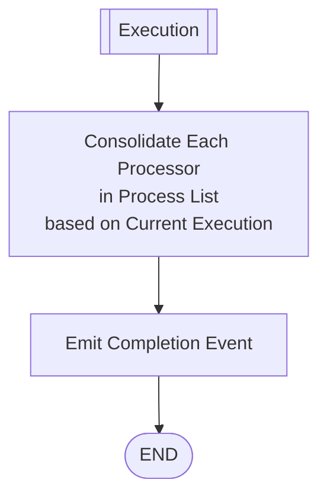

**Steps:**

1. **Load processor list** from Filtration phase (processors with non-NULL execution lists)
2. **For each processor**:
   - **Load current active executions** for this processor from database
   - **Validate consolidation requirements** (e.g., minimum months of bank statements)
   - **Run processor's consolidation logic**:
     - Combine results from multiple executions if needed
     - Apply processor-specific business rules
     - Calculate derived factors and aggregations
     - Resolve conflicts within processor's own executions
   - **Create/update factors** in database:
     - Use `emit: false` flag to prevent immediate notifications
     - Store factor values with metadata (source processor, execution IDs, timestamp)
     - Track factor lineage for audit trail
   - **Handle consolidation failures**:
     - Log errors but continue with other processors
     - Mark processor consolidation status as failed
     - Preserve existing factors if consolidation fails
3. **Database batch completion**:
   - Database module batches all factor updates from this workflow
   - After all consolidations complete, database emits ONE notification per processor
   - Notification includes list of changed factors for downstream modules
4. **Acknowledge Pub/Sub message** to mark workflow complete

**Consolidation Logic Patterns:**

- **Single Execution**: Use execution results directly as factors
- **Multiple Executions (Bank Statement)**: Aggregate across executions (e.g., average revenue, total NSFs)
- **Conflict Resolution**: Apply processor-specific rules (latest, highest, average, etc.)
- **Derived Factors**: Calculate new factors from existing ones (ratios, percentages, trends)

**Notes:**

- **Independent Consolidation**: Can be triggered without new processor executions via Workflows 3, 4, and 5
- **No Re-execution**: Uses existing execution results only - does not create new executions or re-run processors
- **Transaction Safety**: Each processor's consolidation is transactional - failures don't affect other processors
- **Active Executions Only**: Only consolidates from current active executions - ignores superseded/failed/disabled executions
- **Minimum Requirements**: Some processors may require minimum data (e.g., 3 months bank statements) before consolidation
- **No Direct Event Emission**: Processor module does NOT emit completion events - database module handles all notifications
- **Batch Updates**: Database batches updates and emits single notification per processor to reduce message volume
- **Emit Flag Usage**: All database calls use `emit: false` to prevent loops - database controls when notifications are sent
- **Factor Lineage**: Tracks which processor and executions created each factor for transparency and debugging
- **Idempotent**: Can run consolidation multiple times safely - produces same factors from same executions
- **Partial Failures**: If one processor's consolidation fails, others still complete successfully

## Workflow 2

**Subscribes to:** `underwriting.processor.execute`

### **Manual Processor Execution Flow (Forced Execution)**

Handles manual processor execution requests with three scenarios based on provided parameters.

#### **Main Flow: Scenario Selection**

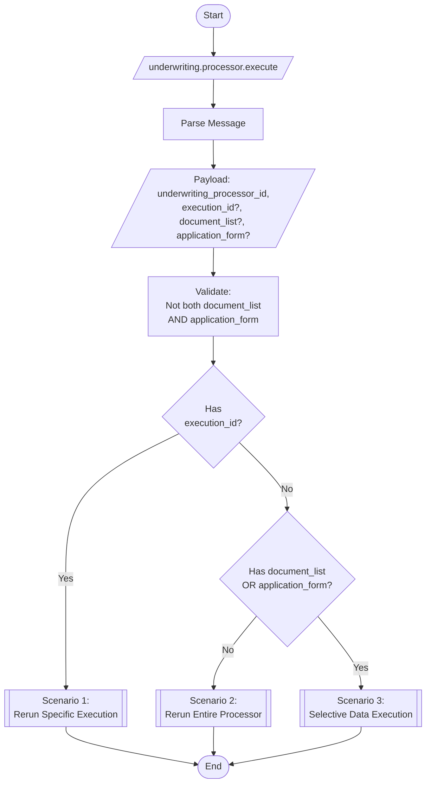

### **Payload**

```json
{
  "underwriting_processor_id": "uwp_123",
  "execution_id": "exec_001",
  "document_list": ["doc_rev_001", "doc_rev_002"],
  "application_form": {
    "merchant.ein": "123456789",
    "merchant.name": "Test Corp"
  }
}
```

**Fields:**
- `underwriting_processor_id` (required): The underwriting processor to execute
- `execution_id` (optional): Specific execution to rerun with same payload (Scenario 1)
- `document_list` (optional): Array of document revision IDs for selective execution (Scenario 3 - document-based)
- `application_form` (optional): Application form data for selective execution (Scenario 3 - application-based)

**Validation Rules:**
- Cannot provide both `document_list` AND `application_form` simultaneously
- Processor type determines which parameter is valid:
  - **Document-based processors**: Use `document_list`
  - **Application-based processors**: Use `application_form`
- If neither `execution_id`, `document_list`, nor `application_form` provided: Scenario 2 (full rerun)

---

### **Scenario 1: With Execution ID**

Reruns a specific execution with its exact payload, creating a new execution linked to the old one.

#### **Flow Diagram**

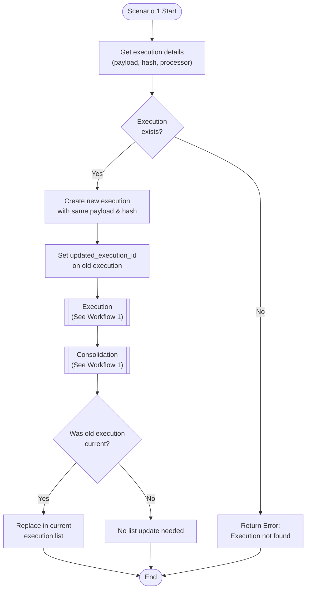

**When:** User wants to rerun a specific execution with its exact payload.

**Steps:**

1. **Load execution** from database using `execution_id`
2. **Validate execution exists** - return error if not found
3. **Extract execution details**:
   - Payload (application form data or document revision IDs)
   - Hash code
   - Processor information
4. **Create new execution** with identical payload and hash
5. **Link executions** by setting `updated_execution_id` on old execution to point to new one
6. **Run execution** - Execute processor with the payload (see Workflow 1 Execution section)
7. **Run consolidation** - Consolidate results for this processor (see Workflow 1 Consolidation section)
8. **Update current execution list** if old execution was current:
   - For non-bank-statement: Replace old with new in current execution list
   - For bank statement: Replace old with new for specific document
   - If old wasn't current: No list update needed

**Use Case:** Retry a failed execution or reprocess with same inputs after system improvements.

**Notes:**
- **Forced Re-execution**: Always creates new execution even if hash already exists with successful result
- **Execution Linking**: Creates chain of execution history via `updated_execution_id`
- **Preserves Payload**: Uses exact same payload from old execution - no regeneration
- **Bypasses Hash Check**: Unlike automatic workflow, doesn't skip if hash already has successful execution

---

### **Scenario 2: Without Execution ID, Without Document List**

Reruns the entire processor with current application form data and all documents.

#### **Flow Diagram**

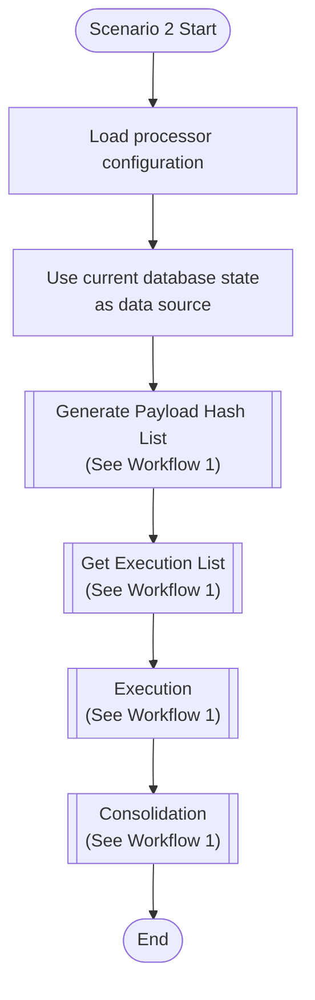

**When:** User wants to rerun the entire processor with current application form and all documents.

**Steps:**

1. **Load processor configuration** from database
2. **Use current database state** as data source (all current application form fields or all documents)
3. **Generate Payload Hash List** (see Workflow 1 - uses appropriate Type 1, 2, or 3 based on processor):
   - **Input difference**: Uses current database state instead of incoming message
   - Everything else follows same logic as Workflow 1
4. **Get Execution List** (see Workflow 1 - same logic):
   - Check for existing executions with matching hash
   - Create new or reuse existing executions
   - Update current execution pointers
5. **Execution** (see Workflow 1 Execution section) - run any new executions in parallel
6. **Consolidation** (see Workflow 1 Consolidation section) - consolidate results for this processor

**Use Case:** First-time manual execution or full processor rerun with latest data.

**Notes:**
- **Same Logic as Workflow 1**: Uses all the same predefined sections, just with different input source
- **Input Source Difference**: Uses current database state instead of incoming message data
- **Reuses Hash**: Unlike Scenario 1, this reuses existing executions if hash matches (same as automatic workflow)
- **Smart Re-processing**: Won't re-execute if same hash already has successful result
- **No Trigger Evaluation**: Like all manual executions, bypasses trigger matching

---

### **Scenario 3: Without Execution ID, With Selective Data**

Processes with selective application form data OR selective documents.

#### **Flow Diagram**

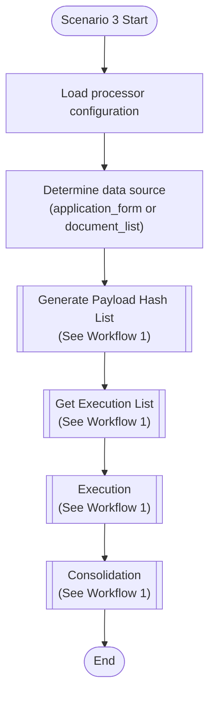

**When:** User wants to process with selective data - either specific application form fields OR specific documents.

**Steps:**

1. **Load processor configuration** from database
2. **Determine data source** from payload:
   - Has `application_form`? Use it as input
   - Has `document_list`? Use it as input
3. **Generate Payload Hash List** (see Workflow 1 - uses appropriate Type 1, 2, or 3 based on processor):
   - **Input difference**: Uses `application_form` or `document_list` from payload instead of current database state
   - Everything else follows same logic as Workflow 1
4. **Get Execution List** (see Workflow 1 - same logic):
   - Check for existing executions with matching hash
   - Create new or reuse existing executions
   - Update current execution pointers
5. **Execution** (see Workflow 1 Execution section) - run any new executions in parallel
6. **Consolidation** (see Workflow 1 Consolidation section) - consolidate results for this processor

**Use Cases:**
- **Application-based**: Test processor with specific EIN or business name without changing database
- **Document-based**: Process only 4 out of 6 driver's license images, or specific bank statement months

**Notes:**
- **Same Logic as Workflow 1**: Uses all the same predefined sections, just with different input source
- **Input Source Difference**:
  - Workflow 1: Uses data from incoming message
  - Scenario 2: Uses current database state
  - Scenario 3: Uses selective data from payload
- **Mutually Exclusive**: Cannot have both `application_form` and `document_list` in same request
- **No Trigger Evaluation**: Like all manual executions, bypasses trigger matching
- **Hash Reuse**: Reuses existing executions if hash matches (same as Scenario 2)
- **Processor Type Validation**: System should validate correct parameter is provided for processor type

---

### **General Notes for Workflow 2**

- **Bypass Triggers**: Manual execution ignores trigger matching - processor runs regardless of available data
- **Three Distinct Behaviors**:
  - Scenario 1: Always creates new execution (forced re-execution)
  - Scenarios 2 & 3: Reuse existing executions when hash matches (smart re-execution)
- **Execution Linking**: Scenario 1 uses `updated_execution_id` field to create execution history chain
- **Reuses Workflow 1 Logic**: All scenarios use appropriate sections from Workflow 1:
  - Generate Payload Hash List (Type 1, 2, or 3 based on processor)
  - Execution
  - Consolidation
- **Bank Statement Special Handling**: Multiple current executions can exist (one per document)
- **Current Execution Management**:
  - For non-bank-statement: Replace entire current execution list
  - For bank statement: Replace only the execution for matching document
- **No Trigger Evaluation**: Unlike Workflow 1, manual execution doesn't check triggers
- **Selective Processing**: Scenario 3 enables:
  - **Application-based**: What-if testing with custom application form values
  - **Document-based**: Processing subset of documents
- **Mutual Exclusivity**: Cannot provide both `application_form` and `document_list` in same request
- **Processor Type Alignment**:
  - Application-based processors only accept `application_form`
  - Document-based processors only accept `document_list`
  - System should validate correct parameter for processor type

## Workflow 3

**Subscribes to:** `underwriting.processor.consolidation`

### **Processor Consolidation Only**

This workflow triggers consolidation without creating or running any processor executions. Used when execution selection changes (activation/deactivation) require factor recalculation.

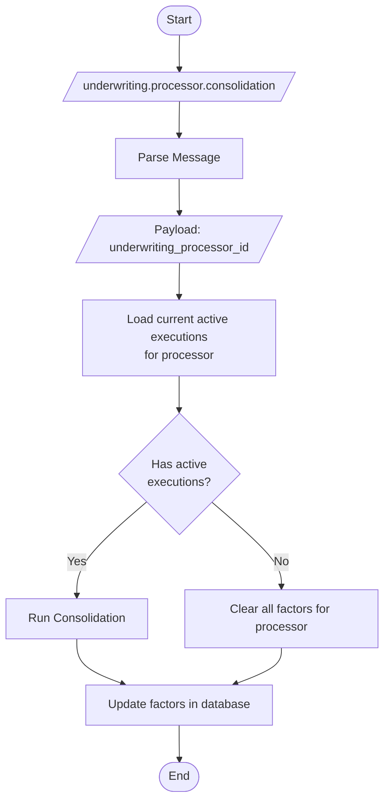

### **Payload**

```json
{
  "underwriting_processor_id": "uwp_123"
}
```

**Fields:**
- `underwriting_processor_id` (required): The underwriting processor to consolidate

### **Steps**

1. **Receive consolidation request** via `underwriting.processor.consolidation` with `underwriting_processor_id`
2. **Load current active executions** for the processor from database
3. **Check execution availability**:
   - If active executions exist: Run consolidation using those executions
   - If no active executions: Clear all factors for this processor
4. **Update factors** in database based on consolidation results
5. Database module emits factor update notifications

### **When This Workflow Triggers**

This workflow is triggered when:
- An execution is activated (after database module updates current execution list)
- An execution is disabled (after database module removes from current execution list)
- Manual consolidation is requested without changing executions

### **Notes**

- **No Execution Creation**: Never creates or runs processor executions
- **Consolidation Only**: Re-consolidates using only current active executions
- **Idempotent**: Can be run multiple times safely with same results
- **Immediate Effect**: Factor changes take effect immediately based on current execution selection
- **Empty State Handling**: If no active executions, clears processor's factors completely
- **Database Coordination**: Database module handles execution list updates before triggering this workflow

## Workflow 4

**Subscribes to:** `underwriting.execution.activate`

### **Execution State Activation (Rollback)**

This workflow restores application form data and/or document states to match a previously executed state. The database module has already activated the execution before this workflow receives the message.

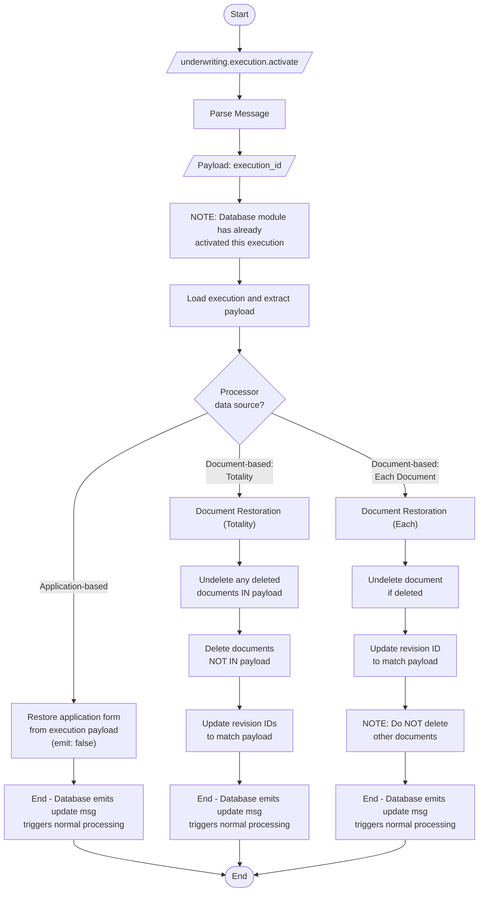

### **Payload**

```json
{
  "execution_id": "exec_456"
}
```

**Fields:**
- `execution_id` (required): The execution to activate and restore state from

### **Steps**

1. **Receive activation message** via `underwriting.execution.activate` with `execution_id`
2. **Note:** Database module has ALREADY updated the `current_executions` list before emitting this message
3. **Load execution** and extract payload (application form values and/or document revision IDs)
4. **Determine processor data source type**: Application-based, Document-based (totality), or Document-based (each)
5. **Restore data** based on processor type (see detailed steps below)
6. **Database calls use `emit: false`** flag to prevent loops
7. **Natural processing**: Database emits update message which triggers Workflow 1, which will:
   - Find existing execution with matching hash
   - Replace current execution (already done by database module)
   - Run consolidation naturally

### **Application-Based Processor Restoration**

For processors that use application form data (e.g., CLEAR report, credit bureau):

1. Extract application form values from execution payload
2. Call database module to update application form with `emit: false`
3. After all updates complete, database emits ONE update message
4. Workflow 1 receives message, finds matching hash, runs consolidation

**Important:** Include `null` values explicitly in payload as `"field": null` to enable proper restoration.

### **Document-Based Processor Restoration: Totality**

For processors that use ALL documents under a stipulation (e.g., driver's license):

1. **Undelete documents in payload:**
   - For each document revision ID in payload
   - If document is marked as deleted, restore it
   - Update to current version (undelete)

2. **Delete documents NOT in payload:**
   - Get all current documents under this stipulation
   - For documents whose revision IDs are NOT in payload
   - Mark them as deleted

3. **Update revision IDs:**
   - For each document in payload
   - Update document to use the specific revision ID from payload
   - May involve changing current revision pointer

**Database Transaction:** All three steps execute in one transaction with `emit: false`, then emit ONE message after commit.

**Example Scenario:**
- Current state: 6 driver's license images
- Activating execution with 4 images in payload
- Result: 4 images from payload restored/active, 2 other images deleted

### **Document-Based Processor Restoration: Each Document**

For processors that create one execution per document (e.g., bank statement):

1. **Undelete document if deleted:**
   - If the specific document is marked deleted
   - Restore it to active state

2. **Update revision ID:**
   - Update document to use the specific revision ID from payload
   - Changes which version of the document is current

3. **Do NOT delete other documents:**
   - Other documents in the stipulation remain unchanged
   - Only affects the specific document in this execution's payload

**Database Transaction:** Both steps execute in one transaction with `emit: false`, then emit ONE message after commit.

**Example Scenario:**
- Current state: Bank statement has 3 documents (Jan, Feb, Mar)
- Activating execution for Feb with older revision
- Result: Feb uses old revision, Jan and Mar unchanged

### **Loop Prevention**

The activation workflow is designed to prevent infinite loops:

1. Database module activates execution BEFORE processor module receives message
2. Processor module restores data with `emit: false` flag
3. Database module emits single update message after all changes
4. Workflow 1 receives update message and processes normally
5. Workflow 1 finds execution with matching hash already exists and is current
6. Workflow 1 replaces current execution (no change, same execution)
7. Workflow 1 runs consolidation (updates factors)
8. No new execution created = no loop

### **Notes**

- **Database Module First**: Activation happens in database module before processor module receives message
- **Processor Module Role**: Only data restoration, NOT execution management
- **No Execution Management**: Does not mark as current, does not disable other executions
- **No Direct Consolidation**: Consolidation happens naturally via Workflow 1 after data restoration
- **Transaction Safety**: All document changes in one transaction to prevent intermediate states
- **Loop Prevention**: Uses `emit: false` flag to prevent re-triggering activation
- **API Response**: API returns success immediately after database activation, before data restoration completes
- **Failed Executions**: Can activate failed executions (frontend can disable button, but backend allows)
- **Payload Requirements**: Application form payloads must include `null` values explicitly for proper restoration

## Workflow 5

**Subscribes to:** `underwriting.execution.disable`

### **Execution Deactivation**

This workflow handles execution deactivation by removing factors without affecting application form or document data. The database module has already removed the execution from the current execution list before this workflow receives the message.

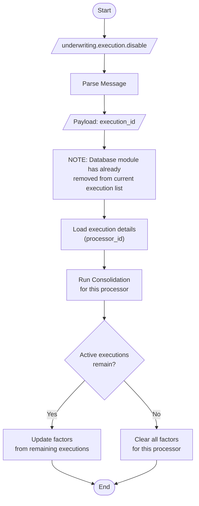

### **Payload**

```json
{
  "execution_id": "exec_456"
}
```

**Fields:**
- `execution_id` (required): The execution to disable/deactivate

### **Steps**

1. **Receive disable message** via `underwriting.execution.disable` with `execution_id`
2. **Note:** Database module has ALREADY removed execution from `current_executions` list before emitting this message
3. **Load execution details** to identify which processor it belongs to
4. **Run consolidation** for the affected processor using remaining active executions
5. **Update factors**:
   - If other active executions exist: Consolidate from remaining executions
   - If no active executions remain: Clear all factors for this processor
6. Database module emits factor update notifications

### **Data Handling**

**What Gets Modified:**
- Factors: Removed or recalculated without this execution
- Current execution list: Already updated by database module

**What Stays Unchanged:**
- Application form data: NOT restored or modified
- Documents: NOT deleted or modified
- Document revisions: NOT changed
- Execution record: Stays in database, just not current anymore

### **Example Scenarios**

**Scenario 1: Driver's License with One Execution**
- Current state: 1 active execution with 4 images
- User disables this execution
- Result: No active executions, all driver's license factors cleared

**Scenario 2: Bank Statement with Three Executions**
- Current state: 3 active executions (Jan, Feb, Mar)
- User disables Feb execution
- Result: 2 active executions remain (Jan, Mar), factors recalculated from those two

**Scenario 3: Multiple Processors**
- Only the specific processor's factors are affected
- Other processors' executions and factors remain unchanged

### **Notes**

- **Database Module First**: Database removes from current execution list before processor module receives message
- **Processor Module Role**: Only factor cleanup/recalculation, NOT execution management
- **No Data Restoration**: Does not modify application form or documents - only factors
- **Consolidation Only**: Uses remaining active executions to recalculate factors
- **Empty State Handling**: If no active executions remain, clears all processor factors
- **Idempotent**: Can be called multiple times safely with same result
- **Separate from Activation**: Disable and activate are separate operations with separate workflows
- **Bank Statement Handling**: For bank statement (each document), removes one execution from array
- **No Loop Risk**: Only updates factors, doesn't trigger Workflow 1

# Execution Triggers

This section defines how processors declare the inputs they care about (the static contract). The Filter rules section explains how the subscriber evaluates an incoming message against these declarations (runtime behavior).

Each processor defines its `PROCESSOR_TRIGGERS` constant that specifies the inputs it cares about. The filter evaluates two categories only:

- `application_form`: keys expected in the message's `application_form` map
- `documents_list`: stipulation type expected in the message's `documents_list`

Evaluation model (ANY-match):

- A processor qualifies when at least one of its declared requirements is present
(one key in `application_form` OR one stipulation in `documents_list`)

Normalization and lookup:

- **Merchant fields**: Flattened to dot paths (e.g., `merchant.ein`, `merchant.name`)
- **List fields** (`owners_list`, `addresses_list`): Special handling for array-based entities
    - Triggers use pattern `{list_name}.{property_name}` without owner/address IDs
    - Matches if ANY item in the list has the property
    - Example: `owners_list.ssn` matches if any owner has an `ssn` field
    - Example: `owners_list.addresses_list.state` matches if any owner has any address with a `state` field
- **Matching rules**:
    - Case-sensitive for keys
    - Missing or null values are treated as absent
- **Documents**: Match by stipulation code only (e.g., `s_bank_statement`), not individual document IDs

**Matching Logic:**

```python
def matches_trigger(trigger_key: str, application_form: dict) -> bool:
    if trigger_key.startswith("owners_list."):
        property_path = trigger_key.replace("owners_list.", "")
        owners = application_form.get("owners_list", [])
        return any(has_nested_property(owner, property_path) for owner in owners)
    else:
        return trigger_key in application_form

def has_nested_property(obj: dict, path: str) -> bool:
    if "." not in path:
        return path in obj and obj[path] is not None

    parts = path.split(".", 1)
    first, rest = parts[0], parts[1]

    if first == "addresses_list":
        addresses = obj.get("addresses_list", [])
        return any(has_nested_property(addr, rest) for addr in addresses)

    return first in obj and has_nested_property(obj[first], rest)

```

### Example Triggers and Matching

**Example 1: Document-Based Trigger**

```python
PROCESSOR_TRIGGERS = {
    "documents_list": [
        "s_bank_statement"
    ]
}

incoming_payload = {
    "documents_list": [
        {
            "stipulation_type": "s_bank_statement",
            "revision_id": "doc_rev_001",
            "uri": "gs://bucket/path/to/doc_rev_001.pdf",
            "action": "created"
        },
        {
            "stipulation_type": "s_bank_statement",
            "revision_id": "doc_rev_002",
            "uri": "gs://bucket/path/to/doc_rev_002.pdf",
            "action": "created"
        }
    ]
}

# Match if any document has stipulation_type "s_bank_statement"
matches_trigger("s_bank_statement", incoming_payload["documents_list"])

```

**Example 2: Application Property - Merchant Fields**

```python
PROCESSOR_TRIGGERS = {
    "application_form": [
        "merchant.ein",
        "merchant.name"
    ]
}

incoming_payload = {
    "application_form": {
        "merchant.ein": "123456789",
        "merchant.name": "ABC Corp",
        "merchant.industry": "1234"
    }
}

matches_trigger("merchant.ein", incoming_payload["application_form"])
matches_trigger("merchant.name", incoming_payload["application_form"])

```

**Example 3: Application Property - Owners List**

```python
PROCESSOR_TRIGGERS = {
    "application_form": [
        "owners_list.ssn",
        "owners_list.first_name"
    ]
}

incoming_payload = {
    "application_form": {
        "owners_list": [
            {
                "owner_id": "owner_001",
                "first_name": "John",
                "ssn": "111-11-1111"
            },
            {
                "owner_id": "owner_002",
                "first_name": "Jane"
            }
        ]
    }
}

matches_trigger("owners_list.ssn", incoming_payload["application_form"])
matches_trigger("owners_list.first_name", incoming_payload["application_form"])

```

**Example 4: Application Property - Nested Addresses List**

```python
PROCESSOR_TRIGGERS = {
    "application_form": [
        "owners_list.addresses_list.state",
        "owners_list.addresses_list.zip_code"
    ]
}

incoming_payload = {
    "application_form": {
        "owners_list": [
            {
                "owner_id": "owner_001",
                "first_name": "John",
                "addresses_list": [
                    {
                        "address_id": "addr_001",
                        "state": "TX",
                        "zip_code": "78701"
                    }
                ]
            },
            {
                "owner_id": "owner_002",
                "first_name": "Jane"
            }
        ]
    }
}

matches_trigger("owners_list.addresses_list.state", incoming_payload["application_form"])
matches_trigger("owners_list.addresses_list.zip_code", incoming_payload["application_form"])

```
