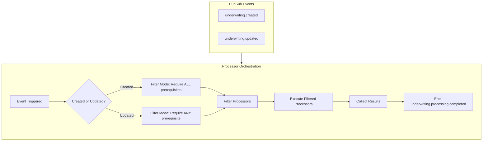
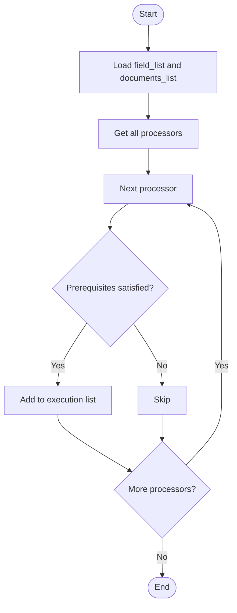

## Overview

The Processor Orchestrator is a simple coordination component that manages processor execution in the AURA Processing Engine. It listens to Pub/Sub events and executes all purchased processors, letting each processor decide whether it should run based on available stipulations.

## **Orchestration Approach**

The orchestrator follows these steps:

1. **Listens to 2 Pub/Sub events** for underwriting changes
2. **Gets all purchased processors** for an underwriting
3. **Executes all processors**
4. **Collects results** from each processor
5. **Emits completion event** with execution details

## Orchestration Flow



## Processor Filter



## Processor Prerequisites

Each processor defines its `processor_prerequisites` constant that specifies the required fields and stipulations needed for execution. The processor filter uses these prerequisites to determine if a processor should run.

### Clear Business Report Processor

```python
PROCESSOR_PREREQUISITES = {
    "fields": [
        "merchant.ein",
        "merchant.name"
    ],
}

```

### Bank Statement Processor

```python
PROCESSOR_PREREQUISITES = {
    "stipulations": [
        "s_bank_statement"
    ]
}

```

### Personal Credit Report Processor

```python
PROCESSOR_PREREQUISITES = {
    "owners": [
      "first_name",
      "last_name",
      "ssn"
    ],
}
```

## Pub/Sub Events

### Event 1: `underwriting.created`

Triggered when a new underwriting is created.

**Event Data Structure:**

```json
{
  "tenant_id": "acc_12345",
  "underwriting_id": "uw_67890",
  "field_list": {
    "merchant.name": "A",
    "merchant.ein": "123456789",
    "merchant.industry": "1342",
  },
  "owner_list": {
    "ids": ["owner_001"],
    "created": [
      {
        "id": "owner_001",
        "first_name": "John",
        "last_name": "Doe",
        "ssn": "123456789"
      }
    ],
  },
  "documents_list": {
    "s_bank_statement": ["doc_001", "doc_002", "doc_004"],
    "s_tax_return": ["doc_005"]
  }
}

```

### Event 2: `underwriting.updated`

Triggered when documents are added or updated for an existing underwriting.

**Event Data Structure:**

```json
{
  "account_id": "acc_12345",
  "underwriting_id": "uw_67890",
  "field_list": {
    "merchant.name": "A",
    "merchant.ein": "123456789",
    "merchant.industry": "1342",
  },
  "owner_list": {
    "ids": ["owner_001"],
    "updated": [
      {
        "id": "owner_001",
        "first_name": "Jane",
        "last_name": "Doe",
        "ssn": "123456789"
      }
    ]
  },
  "document_list": {
    "s_bank_statement": ["doc_001", "doc_002", "doc_004"],
    "s_tax_return": ["doc_005"]
  }
}

```

## Processing Logic

### Event Handling

The orchestrator listens to two types of Pub/Sub events and processes them identically:

1. **`underwriting.created`** - New underwriting with initial stipulations and fields
2. **`underwriting.updated`** - Existing underwriting with new/updated stipulations and fields

### Execution Flow

1. **Event Reception**: Receive Pub/Sub message with `field_list` and `documents_list`
2. **Processor Retrieval**: Get all purchased processors for the tenant for this underwriting
3. **Filter Processors**: Select filter mode by event type, then for each processor read `processor_prerequisites` and evaluate:
   - For `underwriting.created`: ALL required fields exist in `field_list` AND ALL required stipulations exist in `document_list`
   - For `underwriting.updated`: ANY prerequisite is enough (at least one required field OR stipulation exists)
   - Optionally verify specific document IDs within `document_list`
   - Add processors that satisfy the mode to the execution list; mark others as skipped
4. **Execute Filtered Processors**: Execute only processors in the execution list, passing the relevant fields and matched documents
5. **Collect Results**: Capture status, factors, errors, execution time; include skipped processors with reason
6. **Emit Completion Event**: Publish `underwriting.processing.completed` with execution details

### Event-Driven Results

The orchestrator emits a completion event containing:

- Tenant ID
- Underwriting ID
- Detailed execution results for each processor including:
    - Processor name
    - Execution ID
    - Status (completed/failed)
    - Extracted factors and fields (if successful)
    - Error message (if failed)
    - Execution time (start, end, and duration)

### Error Handling

- Individual processor failures don't stop other processors
- All errors are logged and included in the completion event

### Completion Event

After all processors have been executed, the orchestrator emits the event:

**`underwriting.processing.completed`**

**Event Data Structure:**

```json
{
  "account_id": "acc_12345",
  "underwriting_id": "uw_67890",
  "executions": [
    {
      "processor_name": "p_bank_statement_processor",
      "execution_id": "exec_001",
      "status": "completed",
      "factors": {"monthly_revenue": 50000, "nsf_count": 2, ...},
      "execution_time": 45.2
    },
    {
      "processor_name": "p_clear_person_business_processor",
      "execution_id": "exec_002",
      "status": "failed",
      "factors": null,
      "error": "API timeout",
      "execution_time": 180.0
    }
  ]
}

```

The `executions` array contains only the processors that were actually executed during this orchestration.
