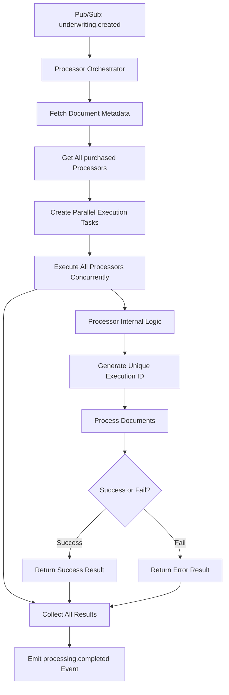

# Processor Orchestrator

## Overview

The Processor Orchestrator is the central coordination component that manages event-driven processor execution in the AURA Processing Engine. It subscribes to `underwriting.created` Pub/Sub events and orchestrates the execution of all available processors, allowing each processor to determine whether it should run based on its own internal logic.

## Core Orchestration Philosophy

**Key Principle**: The orchestrator does NOT validate prerequisites or make execution decisions. Instead, it:
1. **Executes ALL purchased processors** when an underwriting is created
2. **Lets each processor decide** whether it should run based on available documents
3. **Handles all execution results** regardless of processor decisions (run/fail)

## Detailed Orchestration Flow



## Step-by-Step Orchestration Logic

### Step 1: Event Reception and Initialization

When a `underwriting.created` event is received:

```json
{
  "event": "underwriting.created",
  "data": {
    "underwriting_id": "uw_12345",
    "documents": ["doc_001", "doc_002", "doc_003"],
  }
}
```

**Orchestrator Actions:**
- Log execution start
- Initialize execution tracking

### Step 2: Document Metadata Retrieval

**Purpose**: Fetch all document metadata for processors to evaluate

**Process:**
- Parallel fetch of all document IDs from the event
- Retrieve document metadata including:
  - `document_type`
  - `document_id` 
  - `content` (if needed)
  - `metadata`
  - `processing_status`

**Example Result:**
```python
documents = [
    {
        "document_id": "doc_001",
        "document_type": "bank_statement",
        "content": "PDF content...",
        "metadata": {"account_number": "123456789", "statement_month": "2024-01"}
    },
    {
        "document_id": "doc_002", 
        "document_type": "tax_return",
        "content": "PDF content...",
        "metadata": {"tax_year": "2023", "business_type": "LLC"}
    },
    {
        "document_id": "doc_003",
        "document_type": "drivers_license", 
        "content": "PDF content...",
        "metadata": {"license_number": "D1234567", "state": "CA"}
    }
]
```

### Step 3: Processor Registry Lookup

**Purpose**: Get all registered processors for execution

**Process:**
- Query processor registry for all active processors
- Execute processors in parallel

**Note**: Each processor will generate its own unique execution ID (UUID or ULID) during execution

**Example Registered Processors:**
```python
processors = [
    BankStatementProcessor(...),
    SecretaryOfStateProcessor(...),
    ClearBusinessReportProcessor(...)
]
```

### Step 4: Parallel Execution Creation

**Purpose**: Create concurrent execution tasks for all processors

**Process:**
- Create multiprocessing tasks for each purchased processor
- Each task calls `processor.execute(underwriting_id, documents)`
- Apply individual timeouts per processor
- No prerequisite validation at orchestrator level

**Task Creation Logic:**
```python
from multiprocessing import Pool, Process
import concurrent.futures

# Using multiprocessing for parallel execution
with concurrent.futures.ProcessPoolExecutor(max_workers=len(all_purchased_processors)) as executor:
    # Submit all processor execution tasks
    future_to_processor = {
        executor.submit(processor.execute, underwriting_id, documents): processor
        for processor in all_purchased_processors
    }
    
    # Wait for all processors to complete
    for future in concurrent.futures.as_completed(future_to_processor):
        processor = future_to_processor[future]
        try:
            result = future.result()
            # Handle processor result
        except Exception as e:
            # Handle processor failure
```

### Step 5: Concurrent Processor Execution

**Purpose**: Execute all processors in parallel and let each decide internally

**Execution Model:**
- **All processors run concurrently** regardless of prerequisites
- **Each processor internally decides** whether to process or skip
- **No orchestrator intervention** in processor decision-making

**Processor Internal Decision Logic:**
Each processor follows this internal flow:
1. **Generate Unique Execution ID**: Create processor-specific execution identifier
2. **Check Prerequisites**: Does it have required document types?
3. **Validate Data Quality**: Are the documents processable?
4. **Process Documents**: Extract factors or handle errors
5. **Return Structured Result**: Status + factors/error with execution ID

### Step 6: Result Collection and Categorization

**Purpose**: Collect all processor results and categorize by status

**Result Categories:**
- **COMPLETED**: Processor successfully extracted factors
- **FAILED**: Processor encountered an error during execution
- **TIMEOUT**: Processor exceeded execution time limit

**Note**: Skip handling is managed internally by each processor and not exposed to the orchestrator

**Example Result Collection:**
```python
results = [
    ProcessingResult(
        processor_id="bank_stmt_v1",
        execution_id="018c8b2a-7f3d-4a1b-9c2e-5d8f1a3b6c9e",
        status=ProcessorStatus.COMPLETED,
        factors={"monthly_revenue": 50000, "nsf_count": 2},
        execution_time=45.2
    ),
    ProcessingResult(
        processor_id="secretary_of_state_v1",
        execution_id="018c8b2a-7f3d-4a1b-9c2e-5d8f1a3b6c9f", 
        status=ProcessorStatus.COMPLETED,
        factors={"business_registered": True, "registration_date": "2020-01-15"},
        execution_time=32.1
    ),
    ProcessingResult(
        processor_id="clear_business_report_v1",
        execution_id="018c8b2a-7f3d-4a1b-9c2e-5d8f1a3b6ca1",
        status=ProcessorStatus.FAILED,
        factors={},
        execution_time=180.0,
        error_message="External API timeout"
    )
]
```

### Step 7: Event Emission and Cleanup

**Purpose**: Emit processing completion event with comprehensive results

The orchestrator will emit a `processing.completed` event with the following structure:

```json
{
  "event": "processing.completed",
  "underwriting_id": "uw_12345",
  "completed_at": "2024-01-15T10:35:00Z",
  "summary": {
    "total_processors": 3,
    "completed_count": 2,
    "failed_count": 1,
    "total_execution_time": 269.7
  },
  "completed_processors": [
    {
      "processor_id": "bank_stmt_v1",
      "execution_id": "018c8b2a-7f3d-4a1b-9c2e-5d8f1a3b6c9e"
    },
    {
      "processor_id": "secretary_of_state_v1",
      "execution_id": "018c8b2a-7f3d-4a1b-9c2e-5d8f1a3b6c9f"
    }
  ],
  "failed_processors": [
    {
      "processor_id": "clear_business_report_v1",
      "execution_id": "018c8b2a-7f3d-4a1b-9c2e-5d8f1a3b6ca1",
      "error_message": "External API timeout"
    }
  ]
}
```