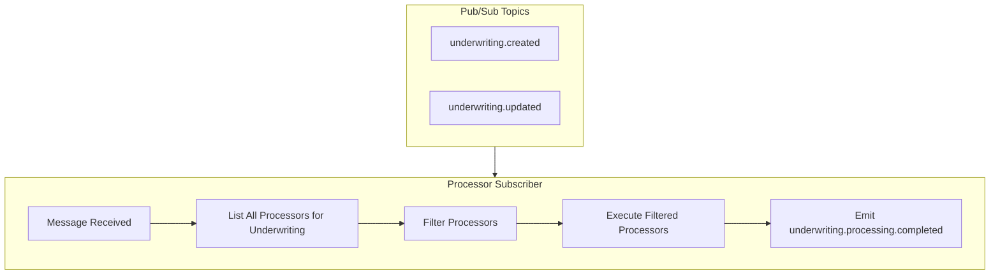
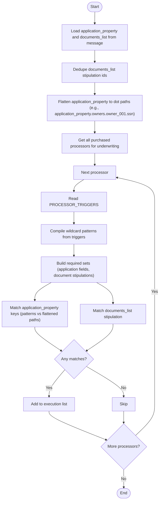

## Overview

This module implements the Pub/Sub subscriber for underwriting creation and update. It listens to two Pub/Sub topics — `underwriting.created` and `underwriting.updated` — and coordinates processor execution for each message. All purchased processors are evaluated, and each processor decides whether it should run based on available stipulations and required fields.

## **Orchestration Approach**

The subscriber follows these steps:

1. **Listens to two Pub/Sub topics**: `underwriting.created` and `underwriting.updated`
2. **Gets all purchased processors** for an underwriting
3. **Executes applicable processors**
4. **Collects and records results**

## Responsibilities

- Subscription & intake
    - Subscribe to Pub/Sub topics: `underwriting.created`, `underwriting.updated`, #forced execution
    - Ack/Nack handling with retry/backoff for transient failures
- Input normalization
    - Flatten `application_property` to dot paths (e.g., `application_property.owners.owner_001.ssn`)
    - Keep `documents_list` as a map of `stipulation_code -> [document_ids]`
    - Compile wildcard trigger patterns (e.g., `owners.*.ssn`) for matching
- Processor selection
    - Load purchased processors for the underwriting
    - Evaluate `PROCESSOR_TRIGGERS` using ANY‑match across `application_property` and `documents_list`
- Execution coordination
    - Invoke eligible processors

## Orchestration Flow



## Processor Filter



### Filter rules

- Inputs
    - `application_property`: flat map; nested fields allowed via dot notation (e.g., `merchant.ein`).
    - `documents_list`: map of stipulation to arrays of document IDs; keys are matched (e.g., `s_bank_statement`).
- Matching
    - ANY requirement is enough: a processor qualifies when at least one required `application_property` key is present in the flattened paths OR one required stipulation (from `PROCESSOR_TRIGGERS.documents_list`) is present in `documents_list`.
    - If a processor defines only one category, only that category is evaluated.
- Trigger evaluation
    - If a subclass defines `application_property`, it is considered when those keys exist in the message.
    - `documents_list` is matched by stipulation code; document ID–level checks are optional and out of scope here.
- Output
    - Execution list entries include processor name, matched keys, matched stipulations, and (for skipped) a reason.

## Processor Trigger Prerequisites

This section defines how processors declare the inputs they care about (the static contract). The Filter rules section explains how the subscriber evaluates an incoming message against these declarations (runtime behavior).

Each processor defines its `PROCESSOR_TRIGGERS` constant that specifies the inputs it cares about. The filter evaluates two categories only:

- `application_property`: keys expected in the message's `application_property` map
- `documents_list`: stipulation type expected in the message's `documents_list`

Evaluation model (ANY-match):

- A processor qualifies when at least one of its declared requirements is present
(one key in `application_property` OR one stipulation in `documents_list`).

Normalization and lookup:

- Keys are flattened to dot paths (e.g., `merchant.ein`, `owners.owner_001.ssn`).
- Owner collections are maps keyed by stable IDs; array indices are not used.
- Wildcard path patterns in triggers (e.g., `owners.*.ssn`) match any owner ID token in the flattened path.
- Matching is case-sensitive for keys.
- Missing or null values are treated as absent.
- `documents_list` remains a map of `stipulation -> [doc_ids...]`; matching is on the stipulation only.

Example format for `PROCESSOR_TRIGGERS`:

- Simple keys list:
    - `{"application_property": ["merchant.ein", "merchant.name"]}`
- Owner requirements via wildcard path patterns:
    - `{"application_property": ["owners.*.first_name", "owners.*.last_name", "owners.*.ssn"]}`
- Stipulations list:
    - `{"documents_list": ["s_bank_statement", "s_tax_return"]}`

Examples:

- If `{"application_property": ["merchant.ein", "merchant.name"]}` is defined and the message contains `merchant.ein` only, the processor qualifies (ANY-match).
- If `{"documents_list": ["s_bank_statement"]}` is defined and the message contains that stipulation, the processor qualifies.

### Clear Business Report Processor

```python
PROCESSOR_TRIGGERS = {
    "application_form": [
        "merchant.ein",
        "merchant.name"
    ],
}
```

### Bank Statement Processor

```python
PROCESSOR_TRIGGERS = {
    "documents_list": [
        "s_bank_statement"
    ]
}
```

### Personal Credit Report Processor

```python
PROCESSOR_TRIGGERS = {
    "application_form": [
		    "owners.*.first_name",
        "owners.*.last_name",
        "owners.*.ssn",
    ]
}
```

## Pub/Sub Topics

### Topic 1: `underwriting.created`

Triggered when a new underwriting is created.

**Message Payload:**

```json
{
  "underwriting_id": "uw_67890",
  "application_property": {
    "merchant.name": "A",
    "merchant.ein": "123456789",
    "merchant.industry": "1342",
	  "owners": {
	    "owner_001": {
	      "first_name": "John",
	      "last_name": "Doe",
	      "ssn": "123456789"
	    },
	  },
  },
  "document_list": {
    "s_bank_statement": {
      "created": ["doc_001", "doc_002", "doc_003"]
    },
    "s_tax_return": {
      "created": ["doc_005"],
    }
  }
}
```

### Topic 2: `underwriting.updated`

Triggered when documents are added or updated for an existing underwriting.

**Message Payload:**

```json
{
  "underwriting_id": "uw_67890",
  "application_property": {
    "merchant.name": "A",
    "merchant.ein": "123456789",
    "merchant.industry": "1342",
  },
  "document_list": {
    "s_bank_statement": {
      "created": ["doc_006"],
      "updated": ["doc_001"],
      "deleted": ["doc_002"],
    },
    "s_tax_return": {
      "deleted": ["doc_005"]
    }
  }
}
```

## Processing Logic

### Topic Handling

The subscriber listens to two Pub/Sub topics and processes them identically:

1. **`underwriting.created`** - New underwriting with initial stipulations and fields
2. **`underwriting.updated`** - Existing underwriting with new/updated stipulations and fields

### Execution Flow

1. **Message Reception**: Receive Pub/Sub message with `application_property` and `document_list` (stipulations)
2. **Processor Retrieval**: Get all purchased processors for the tenant for this underwriting
3. **Filter Processors**: For each processor, evaluate `PROCESSOR_TRIGGERS` using ANY-match across `application_property` and `stipulations`.
    - Optionally verify specific document IDs within `document_list`.
    - Add processors that meet the ANY-match rule to the execution list; mark others as skipped with a reason.
4. **Execute Filtered Processors**: Execute processors in the execution list, passing the relevant fields and matched documents
5. **Collect Results**: Capture status, factors, errors, execution time; include skipped processors with reason

### Error Handling

- Individual processor failures don't stop other processors
- All errors are logged and included in execution records

## Service Layer and File Placement

This orchestrator lives in the processing engine's service layer per the AURA module layout.

### Directory

```
src/
  aura/
    processing_engine/
      services/
        orchestrator_service.py     # Pub/Sub subscriber and execution coordination
        processor_registry.py       # Processor name → class mapping and lookup helpers
```

### File Responsibilities

- `orchestrator_service.py`
    - Subscribe to `underwriting.created` and `underwriting.updated`
    - Normalize payloads (flatten `application_property`, dedupe `document_list`)
    - Filter processors using each processor's `PROCESSOR_TRIGGERS` (ANY-match)
    - Coordinate parallel execution
    - Collect and persist execution results (status, factors, errors, timings)
- `processor_registry.py`
    - Central registry that maps `processor_name` to its concrete class
    - Simple API to register, fetch, and list available processors
    - Helper to resolve "purchased/eligible" processors for an underwriting/tenant
    - Decouples the orchestrator from direct imports of every processor implementation

These two files jointly implement the subscription, selection, and execution flow described above while keeping processor discovery and wiring centralized in the registry.
